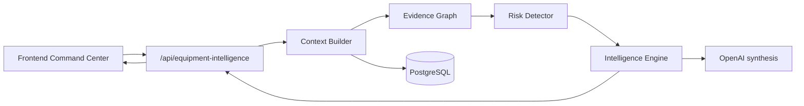

# Equipment Intelligence Engine (MVP)

## Flow

OpenAI receives **only** pre-built findings and metrics — never SQL or raw table access.

## Endpoints

| Method | Path | Purpose |
|--------|------|---------|
| POST | `/api/equipment-intelligence/analyze` | Top 5 operational risks |
| POST | `/api/equipment-intelligence/shift-handover` | Shift equipment summary |
| POST | `/api/equipment-intelligence/recommendations/:id/create-task` | Human-approved task creation |

Auth: `requireAuth` + `requireEffectiveRole("technician")`. Rate limit: 12/min per user.

## Environment

- `OPENAI_API_KEY` — Railway (optional in dev; deterministic risks still run)
- `OPENAI_MODEL` — default `gpt-4o-mini`

## Audit kinds

`equipment_intelligence_analyze_*`, `equipment_intelligence_shift_handover_*`, `equipment_intelligence_recommendation_task_approved`, `equipment_intelligence_task_created`

## Tables

- `vt_equipment_intelligence_runs`
- `vt_equipment_intelligence_recommendations`
