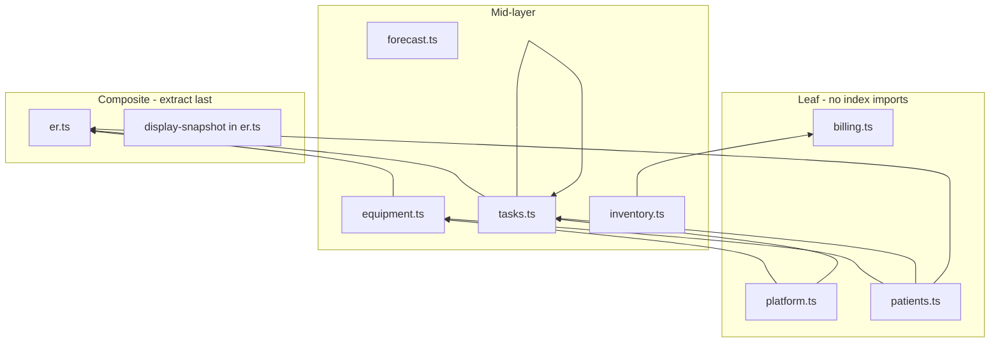

# Slice 6 — `src/types` domain split plan (inventory draft)

**Status:** **6a merged** (`platform.ts`). **6b** (`patients.ts`) in PR — leaf patient/hospitalization types.  
**Baseline:** `main` @ `4397d96c` (post–PR #569 Slice 4 stabilization).  
**Parent:** [modularization-plan.md](./modularization-plan.md) Slice 6.

## Purpose

`src/types/index.ts` is a single ~1,639-line barrel with ~159 exported symbols. Slice 6 will split definitions by clinical/ops domain while **keeping `index.ts` as a compatibility barrel** so existing `import type { … } from "@/types"` paths continue to work until a later migration slice.

This document is the **inventory and risk assessment** required before any file moves.

## Explicit non-goals (this slice / this PR)

| Non-goal | Rationale |
|----------|-----------|
| Runtime behavior changes | Types are erased at compile time; still zero API/UI behavior drift |
| Import migrations (`@/types/equipment` etc.) | Deferred to Slice 6a+ sub-PRs |
| Type renames | Frozen contracts (`Appointment`, `appointmentsPage.*` namespace on UI only) |
| Moving `shared/*` or `server/*` types | Frontend barrel only; server keeps `server/lib/forecast/types.ts` mirror |
| Touching paused equipment routes | Unrelated to types split |

## Current state

| Artifact | Lines / scale | Notes |
|----------|---------------|-------|
| `src/types/index.ts` | 1,639 lines | Single file; only import is `AuthoritySnapshot` from `shared/authority.js` |
| `src/types/realtime-events.ts` | Split already | Used by `event-reducer.ts`, `realtime.ts` — **not** in barrel |
| `src/types/cop-alerts.ts` | Split already | Used by `cop-discrepancy-banner.tsx`, `event-reducer.ts` |
| Importers of `@/types` | **~72** TS/TSX files (+ 1 test) | Almost all frontend; largest fan-in: `src/lib/api.ts` (70 symbols in one import) |
| Madge `src/` cycles | **0** (baselined) | `docs/architecture/baseline-cycles.json` → `"src": []` |

### External dependencies (must preserve)

```ts
import type { AuthoritySnapshot } from "../../shared/authority.js";
export type { … } from "../../shared/patient-handoff-types.js";
```

Leaf domain files should import `shared/*` directly — **never** import from `index.ts` (barrel cycle risk).

---

## Export inventory by domain

Counts include `type`, `interface`, `const`, and re-export blocks. Re-exports from `shared/patient-handoff-types.js` count as **platform/handoff** (21 symbols).

### 1. Equipment (~52 symbols)

Rooms, folders, equipment entities, scan/transfer lifecycle, bulk ops, pilot coverage, equipment-scoped alerts, UI constants.

| Symbol | Kind | Line (approx.) | Notes |
|--------|------|----------------|-------|
| `EquipmentStatus` | type | 3 | Used across equipment + alerts |
| `DeletedEquipment` | interface | 46 | |
| `Folder` | interface | 58 | |
| `RoomSyncStatus` | type | 66 | |
| `Room` | interface | 68 | Embeds optional patient link fields |
| `RoomActivityEntry` | interface | 88 | |
| `CreateRoomRequest` | interface | 100 | |
| `UpdateRoomRequest` | interface | 107 | |
| `BulkVerifyRoomResult` | interface | 115 | |
| `Equipment` | interface | 120 | Large; links `linkedAnimalId` |
| `CreateEquipmentRequest` | interface | 224 | |
| `UpdateEquipmentRequest` | interface | 244 | |
| `EquipmentReturn` | interface | 270 | |
| `CreateReturnRequest` | interface | 285 | |
| `UpdateReturnRequest` | interface | 291 | |
| `EquipmentSeenResponse` | type (union) | 780 | Patient-room billing side effect |
| `ScanEquipmentRequest` | interface | 795 | |
| `ScanLog` | interface | 801 | **offline-db** caches this shape |
| `TransferLog` | interface | 840 | |
| `ActivityFeedItem` | interface | 852 | |
| `AnalyticsSummary` | interface | 866 | Equipment analytics |
| `BulkDeleteRequest` | interface | 886 | |
| `BulkMoveRequest` | interface | 890 | |
| `BulkResult` | interface | 895 | |
| `PilotConfig` | interface | 815 | |
| `PilotCoverageItem` | interface | 820 | |
| `PilotCoverageResponse` | interface | 830 | |
| `AlertType` | type | 14 | Shared with `Alert` — keep with equipment or common |
| `AlertSeverity` | type | 16 | |
| `ALERT_SEVERITY` | const | 18 | |
| `Alert` | interface | 921 | Equipment-centric |
| `AlertAcknowledgment` | interface | 930 | |
| `WhatsAppAlert` | interface | 910 | |
| `EQUIPMENT_CATEGORIES` | const | 998 | |
| `EquipmentCategory` | type | 1010 | |
| `STATUS_LABELS` | const | 1012 | |
| `STATUS_COLORS` | const | 1021 | |
| `ShiftHandoverSummary` | interface | 550 | **Naming trap** — equipment shift revenue summary (`POST …/seen`), not patient handoff |
| `CustodyState` | type | 1559 | Operational State V1/V2 |
| `ReadinessState` | type | 1560 | |
| `UsageState` | type | 1561 | |
| `AssetType` | interface | 1563 | |
| `AssetTypeCondition` | interface | 1570 | |
| `UnitConditionState` | interface | 1579 | |
| `StagingClaim` | interface | 1590 | |
| `DeployabilityResponse` | interface | 1602 | |
| `Dock` | interface | 1618 | |
| `OperationalMetricsSummary` | interface | 1628 | |

**Cross-domain note:** `Equipment` and `Room` reference animals/patients optionally; split file may `import type { Animal }` from `patients.ts` only if patient types are extracted first (see dependency order).

### 2. Tasks / appointments (~24 symbols)

Unified task model (`Appointment`); medication execution extends appointment.

| Symbol | Kind | Line | Notes |
|--------|------|------|-------|
| `AppointmentStatus` | type | 350 | |
| `TaskPriority` | type | 360 | |
| `TaskType` | type | 361 | |
| `Appointment` | interface | 363 | Core task row |
| `MedicationExecutionPayload` | interface | 386 | |
| `MedicationExecutionTask` | interface | 399 | **extends `Appointment`** |
| `DrugFormularyEntry` | interface | 403 | |
| `CreateDrugFormularyRequest` | interface | 424 | |
| `PharmacyForecastExclusion` | interface | 441 | Could live in forecast domain |
| `TaskDashboard` | interface | 450 | Contains `Appointment[]` |
| `HomeDashboardPulse` | interface | 463 | Cross-home; references shift loosely |
| `RecommendationSuggestionType` | type | 474 | |
| `RecommendationSuggestion` | interface | 476 | |
| `RecommendedTask` | interface | 482 | **extends `Appointment`** |
| `TaskRecommendations` | interface | 494 | |
| `CreateAppointmentRequest` | interface | 501 | |
| `UpdateAppointmentRequest` | interface | 517 | |
| `VetShiftWindow` | interface | 533 | Uses `ShiftRole` from platform |
| `AppointmentVetMeta` | interface | 541 | Uses `UserRole` |

### 3. Billing (~8 symbols)

| Symbol | Kind | Line |
|--------|------|------|
| `BillingLedgerEntry` | interface | 624 |
| `BillingItem` | interface | 638 |
| `BillingSummary` | interface | 648 |
| `ManualBillingRequest` | interface | 1507 |
| `LeakageReportItem` | interface | 1232 |
| `LeakageReport` | interface | 1243 |

### 4. Inventory / procurement / containers (~14 symbols)

| Symbol | Kind | Line | Notes |
|--------|------|------|-------|
| `InventoryContainer` | interface | 573 | |
| `RestockSession` | interface | 590 | |
| `RestockContainerLine` | interface | 600 | |
| `RestockContainerView` | interface | 611 | |
| `RestockFinishSummary` | interface | 617 | |
| `INVENTORY_ITEM_CATEGORIES` | const | 663 | |
| `InventoryItemCategory` | type | 674 | |
| `InventoryItem` | interface | 676 | |
| `PurchaseOrderStatus` | type | 688 | |
| `PurchaseOrderLine` | interface | 690 | |
| `PurchaseOrder` | interface | 702 | |
| `InventoryContainerWithItems` | interface | 1256 | **extends `InventoryContainer`** |
| `InventoryJob` | interface | 1362 | Async deduction job status |
| `ConsumablesReportEvent` | interface | 1197 | |
| `ConsumablesReport` | interface | 1218 | Overlaps billing leakage semantics |

### 5. ER / Code Blue / ward display (~18 symbols)

| Symbol | Kind | Line | Notes |
|--------|------|------|-------|
| `CodeBlueStatus` | type | 184 | Ward critical equipment |
| `CriticalEquipment` | interface | 186 | |
| `CodeBlueOutcome` | type | 195 | |
| `StartCodeBlueRequest` | interface | 197 | |
| `StartCodeBlueResponse` | interface | 201 | |
| `EndCodeBlueRequest` | interface | 206 | |
| `CodeBlueEvent` | interface | 212 | |
| `CodeBlueLogCategory` | type | 1379 | |
| `DisplaySnapshotHospitalization` | interface | 1381 | |
| `DisplaySnapshotEquipment` | interface | 1399 | |
| `DisplaySnapshotTask` | interface | 1407 | |
| `DisplaySnapshotCodeBlueSession` | interface | 1416 | |
| `DisplaySnapshot` | interface | 1466 | **Composite** — imports concepts from patients, equipment, tasks, ER |
| `CrashCartItem` | interface | 1441 | |
| `CreateCrashCartItemRequest` | interface | 1452 | |
| `UpdateCrashCartItemRequest` | interface | 1459 | |
| `CodeBlueReconciliationSession` | interface | 1483 | |
| `CodeBlueDispense` | interface | 1497 | |

### 6. Patients / hospitalization (~8 symbols)

| Symbol | Kind | Line | Notes |
|--------|------|------|-------|
| `ActivePatient` | interface | 1266 | |
| `HospitalizationStatus` | type | 1275 | |
| `Animal` | interface | 1283 | |
| `Owner` | interface | 1298 | |
| `Hospitalization` | interface | 1308 | Embeds `Animal`, `Owner` |
| `AdmitPatientRequest` | interface | 1327 | |
| `UpdatePatientRequest` | interface | 1342 | |
| `AnimalSearchResult` | interface | 1354 | |

### 7. Platform / admin / shift ops (~35+ symbols)

Auth, shifts, shift handover (clinical), support, audit logs, metrics, shift completion.

| Symbol | Kind | Line | Notes |
|--------|------|------|-------|
| `UserRole` | type | 11 | |
| `ShiftRole` | type | 12 | |
| `UserStatus` | type | 25 | |
| `User` | interface | 27 | References `Shift`, `AuthoritySnapshot` |
| `Shift` | interface | 296 | |
| `ShiftImport` | interface | 305 | |
| `ShiftCsvRow` | interface | 315 | |
| `ShiftCsvIssue` | interface | 325 | |
| `ShiftImportPreview` | interface | 331 | |
| `ShiftImportResult` | interface | 342 | |
| `ShiftHandoverSession` | interface | 716 | Clinical shift handover API |
| `ShiftHandoverSummaryCounts` | interface | 725 | |
| `ShiftHandoverMedTask` | interface | 732 | |
| `ShiftHandoverEmergencyDispense` | interface | 739 | |
| `ShiftHandoverActiveAlert` | interface | 744 | |
| `ShiftHandoverPatient` | interface | 749 | |
| `ShiftHandoverPatientsResponse` | interface | 761 | |
| `ShiftHandoverSnapshotRecord` | interface | 770 | |
| `ShiftCompletionUser` | interface | 1516 | |
| `ShiftCompletionResult` | interface | 1526 | |
| `UploadUrlRequest` | interface | 899 | |
| `UploadUrlResponse` | interface | 905 | |
| `SupportTicketSeverity` | type | 1030 | |
| `SupportTicketStatus` | type | 1031 | |
| `SupportTicket` | interface | 1033 | |
| `CreateSupportTicketRequest` | interface | 1049 | |
| `AuditLog` | interface | 1058 | Server audit trail — not forecast `AuditState` |
| `AuditLogResponse` | interface | 1071 | |
| `AuditLogFilters` | interface | 1078 | |
| `OfflineSyncMetricsSnapshot` | interface | 940 | PWA telemetry aggregate |
| `SystemMetrics` | interface | 985 | |
| Patient handoff re-exports | type | 1534–1555 | From `shared/patient-handoff-types.js` |

### 8. Pharmacy forecast (~12 symbols)

Mirrors `server/lib/forecast/types.ts` — keep in sync when splitting.

| Symbol | Kind | Line |
|--------|------|------|
| `ForecastDrugType` | type | 1086 |
| `ForecastFlagReason` | type | 1088 |
| `ForecastDrugEntry` | interface | 1103 |
| `ForecastPatientEntry` | interface | 1118 |
| `ForecastResult` | interface | 1134 |
| `ForecastParseResponse` | type | 1148 |
| `ForecastApproveResponse` | interface | 1150 |
| `ForecastKeepaliveResponse` | interface | 1163 |
| `DrugAuditEntry` | interface | 1168 |
| `PatientAuditState` | interface | 1175 |
| `AuditState` | interface | 1184 | **Name collision risk** with audit log domain |
| `ForecastApprovePayload` | interface | 1189 |

### 9. Shared / common (placement TBD)

Symbols used by multiple domains — either a thin `common.ts` or duplicated re-export only from barrel:

| Symbol | Suggested home | Used by |
|--------|----------------|---------|
| `UserRole`, `ShiftRole`, `UserStatus` | `platform.ts` | User, appointments, RBAC helpers |
| `AlertType`, `AlertSeverity`, `ALERT_SEVERITY` | `equipment.ts` or `common.ts` | Equipment alerts |
| `UserActivityEntry` | `inventory.ts` or `billing.ts` | Consumables report |

---

## Internal cross-references (split ordering constraints)



| Relationship | Mechanism | Split implication |
|--------------|-----------|-------------------|
| `User.activeShift?: Shift` | field type | `platform.ts` must export `Shift` before `User` or co-locate |
| `MedicationExecutionTask extends Appointment` | extends | `tasks.ts` single file or `tasks-medication.ts` importing `Appointment` |
| `RecommendedTask extends Appointment` | extends | same file as `Appointment` |
| `InventoryContainerWithItems extends InventoryContainer` | extends | keep in `inventory.ts` |
| `Hospitalization` embeds `Animal`, `Owner` | inline fields | `patients.ts` exports all three |
| `TaskDashboard` / `TaskRecommendations` | `Appointment[]` | import from `tasks.ts` |
| `DisplaySnapshot` | nested hospitalization, equipment, tasks, code blue | **`er.ts` last** |
| `AppointmentVetMeta` | uses `UserRole`, `VetShiftWindow` | import from `platform.ts` |
| `EquipmentSeenResponse` | animal link | equipment imports minimal `{ id, name }` inline or from patients |

---

## High-risk importers

These files touch the most symbols or sit on critical paths (offline, API monolith, display). **Do not migrate imports in Slice 6** — flag for careful 6a+ ordering.

| Priority | File | Risk | Symbols / pattern |
|----------|------|------|-------------------|
| P0 | `src/lib/api.ts` | Single import of **70** types | Cross-domain; any barrel mistake breaks entire API client |
| P0 | `src/lib/offline-db.ts` | IndexedDB schema | `Equipment`, `ScanLog`, `Folder`, `Room` — shape drift breaks PWA cache |
| P1 | `src/lib/api/equipment.ts` | Already partial extract | 15 equipment types — first candidate for `@/types/equipment` pilot |
| P1 | `src/pages/display.tsx` | Ward / Code Blue UI | `DisplaySnapshot*` cluster |
| P1 | `src/hooks/useDisplaySnapshot.ts` | Realtime reconciliation | Display + ER types |
| P1 | `src/lib/event-reducer.ts` | Uses **direct** `@/types/realtime-events` | Pattern to follow for new splits |
| P2 | `src/pages/meds.tsx`, `MedicationCalculator.tsx` | Medication safety | `MedicationExecutionTask`, formulary |
| P2 | `src/components/shift-summary-sheet.tsx` | **Wrong name confusion** | `ShiftHandoverSummary` (equipment) vs handoff re-exports |
| P2 | `src/pages/shift-handover-page.tsx` | Clinical handoff | `ShiftHandoverPatientsResponse`, shared handoff types |
| P3 | ~50 pages/components | 1–5 types each | Low blast radius per file |

**Already split (reference pattern):**

- `src/types/realtime-events.ts` — 2 importers, no barrel
- `src/types/cop-alerts.ts` — 2 importers, no barrel

---

## Circular dependency risk

### Today

| Check | Result |
|-------|--------|
| `madge --circular src/types/index.ts` | No cycles (4 files processed including shared import) |
| `baseline-cycles.json` → `src` | `[]` |
| `index.ts` imports | Only `shared/authority.js`; re-export from `shared/patient-handoff-types.js` |

### Failure modes when splitting

| Anti-pattern | Result |
|--------------|--------|
| `equipment.ts` imports from `@/types` or `./index.ts` | Barrel cycle: `index → equipment → index` |
| `tasks.ts` ↔ `equipment.ts` mutual imports | Domain cycle (madge will fail G1) |
| `display` types in `equipment.ts` with `equipment` types in `er.ts` looping | Composite cycle |
| Re-export order in `index.ts` wrong | TS compile errors only (usually safe) |

### Rules for implementation slices (6a+)

1. **Leaf files never import from `index.ts`.**
2. **Allowed direction:** `platform` → domains → `er` (composite).
3. **Prefer `import type`** only; no runtime values across domain files unless `const` (move `ALERT_SEVERITY`, `STATUS_*` with their domain).
4. **Barrel `index.ts` only re-exports** — no new logic.
5. After each sub-slice: `pnpm architecture:gates` + `npx madge --circular src`.

---

## Proposed file layout

```
src/types/
  index.ts              # compatibility barrel — export * from "./<domain>.js"
  common.ts             # optional: AlertType, shared enums (if not in equipment)
  platform.ts           # User, Shift, roles, audit log, support, metrics, uploads (**merged 6a**)
  patients.ts           # Animal, Owner, Hospitalization, admit/update/search (**6b**)
  equipment.ts          # Equipment, Room, Folder, scan, bulk, pilot, ops state V1/V2
  tasks.ts              # Appointment*, medication, formulary, task dashboard
  billing.ts            # Ledger, leakage
  inventory.ts          # Containers, restock, PO, inventory jobs, consumables report
  forecast.ts           # ICU pharmacy forecast mirror
  er.ts                 # Code Blue session, display snapshot, crash cart, reconciliation
  handoff.ts            # optional: re-export shared/patient-handoff-types only
  realtime-events.ts    # (existing)
  cop-alerts.ts         # (existing)
```

### Barrel shape (future, illustrative)

```ts
// src/types/index.ts — compatibility only; no new types defined here
export * from "./platform.js";
export * from "./patients.js";
export * from "./equipment.js";
export * from "./tasks.js";
export * from "./billing.js";
export * from "./inventory.js";
export * from "./forecast.js";
export * from "./er.js";
export * from "./handoff.js";
```

Order of `export *` lines matters only if two domains exported the same name — **none today** except intentional distinct `ShiftHandover*` families.

---

## Phased implementation roadmap (not started)

| Sub-slice | Action | Validation |
|-----------|--------|------------|
| **6a** | Extract `platform.ts` | **merged** (#571) |
| **6b** | Extract `patients.ts` (leaf) | tsc, architecture:gates |
| **6c** | Extract `equipment.ts` (include alert constants) | + offline-db typecheck, equipment tests |
| **6c** | Extract `tasks.ts` | + medication/appointment tests |
| **6d** | Extract `billing.ts`, `inventory.ts` | + billing/inventory pages |
| **6e** | Extract `forecast.ts` | + compare to `server/lib/forecast/types.ts` |
| **6f** | Extract `er.ts` (display snapshot last) | + phase-9 display tests if touched |
| **6g** | Optional `handoff.ts` wrapper for shared re-exports | shift-handover-page |
| **6h** | Pilot import migration: `api/equipment.ts` → `@/types/equipment` | knip, no unused exports |
| **6i+** | Gradual importer migration; keep barrel until knip clean | per-domain PRs |

**Recommended first importer migration:** `src/lib/api/equipment.ts` (already domain-scoped, 15 types).

---

## Naming traps (do not “fix” in Slice 6)

| Name | Actual meaning | Confused with |
|------|----------------|---------------|
| `ShiftHandoverSummary` | Equipment shift revenue / assets (`POST /api/equipment/:id/seen`) | Patient `ShiftHandover*` clinical handover |
| `AuditState` | Pharmacy forecast audit trace | `AuditLog` server audit trail |
| `Appointment` | Unified **task** row (med + ops tasks) | External calendar “appointment” |
| `TaskType` | Includes `medication` | TanStack Query “task” |

---

## Validation checklist (this planning PR)

```bash
pnpm architecture:gates   # tsc (client + server), dependency-cruiser, madge baseline
npx tsc --noEmit
```

No code changes under `src/types/` except documentation are expected for this inventory PR.

---

## Related documents

- [modularization-plan.md](./modularization-plan.md) — Slice 6 row
- [baseline-cycles.json](./baseline-cycles.json) — `src: []`
- [tooling-syntax-verification.md](./tooling-syntax-verification.md) — G1 gates
- [docs/validation/slice-4-stabilization-report.md](../validation/slice-4-stabilization-report.md) — recommends proceeding to Slice 6
- [adr-002-appointments-service-split.md](./adr-002-appointments-service-split.md) — backend task split (orthogonal)

## Decision log

| Date | Decision |
|------|----------|
| 2026-05-27 | Slice 6 scope limited to planning doc; barrel preserved; no import migrations |
| 2026-05-27 | Split `realtime-events` / `cop-alerts` pattern is precedent for direct subpath imports |
| 2026-05-27 | `DisplaySnapshot*` and `er.ts` extracted after leaf domains to avoid cycles |
| 2026-05-29 | Slice 6a: `platform.ts` extracted; `index.ts` re-exports + internal `ShiftRole`/`UserRole` import for remaining definitions |
| 2026-05-29 | Slice 6a merged (#571); static test `users-me-authority` reads `platform.ts` for `User.authority` |
| 2026-05-29 | Slice 6b: `patients.ts` — `Animal`, `Owner`, `Hospitalization`, admit/update/search, `ActivePatient` |
