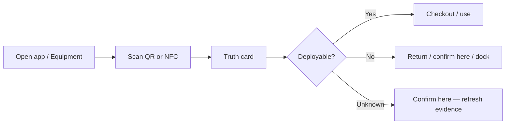

# Equipment Hero — product direction

**Status:** Active (Q2 2026)  
**Owner:** Product + engineering  
**North star:** Staff trust operational truth about equipment with near-zero data entry and full transparency.

---

## Problem

Hospitals lose time and safety margin because nobody knows whether equipment is **actually deployable right now**. Spreadsheets and CMMS answer “where should it be?” or “does it power on?”—not “can I grab this for a critical case in the next five minutes, and why do you believe that?”

VetTrack already models **deployability**, **custody**, and an **evidence graph** (scans, RFID, transfers, dock, room). That depth is buried under a broad hospital OS surface, uneven UX, and a separate “Intelligence” page—so the differentiator does not land at the bedside.

## One-sentence promise

**Scan once → see honest deployability and location with cited evidence → act in one tap.**

## Hero workflow (v1)

### Truth card (atomic UI)

Every equipment detail view leads with:

| Block | Content |
|-------|---------|
| **Deployable** | Yes / No / Unknown + one-line reason |
| **Where** | Summary + confidence from evidence |
| **Who holds it** | Custodian or “not checked out” |
| **Evidence** | Expandable citations (scan, RFID, transfer, room, dock) with timestamps |
| **Unknowns** | Explicit gaps (“no scan in 9 days”) — never fake precision |
| **Primary actions** | Checkout, return, confirm here, dock return (contextual) |

API: `GET /api/equipment/:id/truth` — combines location, deployability, and custodian resolvers with deduplicated citations.

## Near-zero data principle

| Signal | Staff effort | System use |
|--------|--------------|------------|
| Checkout / return / dock NFC | One tap | Custody chain |
| QR scan at bedside | One tap | Location + status evidence |
| Room bulk verify | Occasional sweep | Location prior |
| RFID / gateway | Passive | Nudge location when present |
| Staleness clock | None | Honest “we don’t know anymore” |

**Do not** add forms to “keep the database clean.” **Do** show uncertainty so behavior changes.

## Behavior change (transparency → discipline)

- Surface **staleness** and **never-confirmed** assets on list filters (pilot / recovery UI).
- Truth card shows **why** confidence dropped (citations, not scores alone).
- Weekly clinic metric: % assets confirmed in last N days (pilot coverage)—visible to charge roles.

## In scope (this initiative)

- Equipment list: scan-first entry (`?scan=1`, floating scan FAB).
- Detail: Truth card above legacy tabs.
- API + UI for cited truth.
- Demote clinic-wide “Equipment Intelligence” from main nav; redirect `/equipment/intelligence` → equipment home (insights remain API-backed for later admin surfacing).
- UX polish on equipment list/detail only (skeleton stability, fewer dead ends).

## Out of scope (explicitly frozen or deferred)

- New ER wedge features, medication flows, Code Blue changes.
- Second realtime transport or offline emergency queueing.
- Full native app / App Store (until scan loop is smooth; then Capacitor + NFC only if required).
- Renaming internal `appointments` / routes.

## Deletion / concealment posture

| Keep (platform) | Hide or demote (UX) |
|-----------------|---------------------|
| Multi-tenancy, audit, offline sync | Intelligence as top-level nav |
| SSE / outbox for equipment events | Duplicate equipment sub-routes |
| Meds, ER, Code Blue backends | Non-hero nav prominence |

Remove duplicate paths and ghost routes per [Removal protocol](../../../.cursorrules)—not tenant or safety core.

## Success metrics

| Metric | Target direction |
|--------|------------------|
| Scan-to-truth time | &lt; 3 s on good network |
| Confirm-here rate (pilot) | Up week-over-week |
| Stale asset count | Down week-over-week |
| Support tickets “can’t find X” | Down |
| Staff quote (qualitative) | “I trust what it says” |

## Technical anchors

- Resolvers: `server/domain/equipment/evidence/resolver/*`
- Contracts: `shared/contracts/asset-copilot.v1.ts`, `shared/equipment-truth.ts`
- UI: `src/components/equipment/EquipmentTruthCard.tsx`, `src/pages/equipment-detail.tsx`
- List hero: `src/pages/equipment-list.tsx`

## Phased delivery

1. **Truth card + API** — cite evidence on every detail open. ✅
2. **Scan-first shell** — default entry, FAB, `?scan=1`, denser list cards. ✅
3. **Coverage + clinic insights on equipment home** — attention strip, pilot debt, insights sheet. ✅
4. **Passive location** — RFID highlight on truth card, confirm-in-room API, room sweep from equipment home. ✅
5. **Native wrapper (Capacitor)** — iOS/Android shell + `@capgo/capacitor-nfc` for equipment NFC on iPhone/iPad. See `docs/capacitor-native-app.md`. ✅

---

*This document supersedes ad-hoc feature planning for equipment UX until v1 hero metrics move. Other domains stay in codebase but follow “support, not story” until equipment wins trust.*
