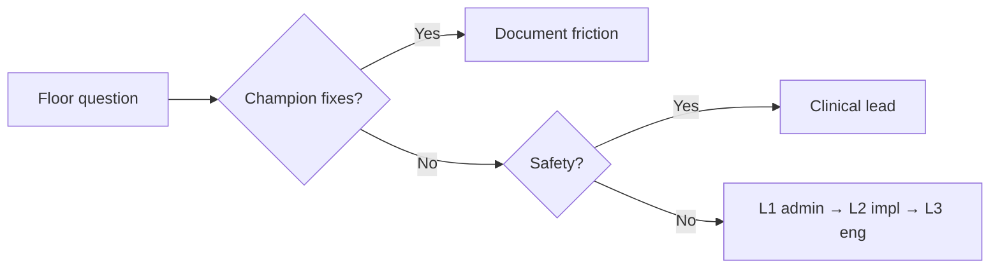

# Hospital Champion — Daily Operations

**Audience:** Champions embedded in **one hospital** during rollout or steady state.  
**Companion docs:** `docs/champion-playbook.md`, `docs/champion-cheat-sheet.md`, `docs/champion-onboarding-guide.md`  
**Do not modify:** Other `docs/champion-*.md` files.

---

## Scope legend

| Label | Use when |
|-------|----------|
| **Pilot-validated** | Real-world **equipment-only** pilot proved these workflows (`docs/pilot.md`). |
| **Platform capability — not pilot validated** | Product supports it; **not** proven in the equipment pilot. Do not teach as “already validated.” |
| **Needs confirmation** | Confirm with clinic lead or implementation before standardizing. |

**Pilot-validated scope:** equipment discovery, scans, checkout, return, return-with-charge, equipment lifecycle visibility, equipment-related notifications.

**Not pilot-validated:** admissions, medication, billing, ER, Code Blue, inventory reconciliation, broader tasks, integrations, reporting.

---

## Start-of-shift checklist

### Champion (10–15 min)

| Step | Action | Scope |
|------|--------|-------|
| 1 | Confirm you are on the **active** account (not shared login) | All |
| 2 | Check connectivity; note if hospital Wi‑Fi is flaky today | **Pilot-validated** |
| 3 | Open **Alerts** — note count vs yesterday | **Pilot-validated** |
| 4 | Glance **sync queue** (cloud icon) on your device — any failed from last shift? | **Pilot-validated** |
| 5 | If pilot deployment: admin **pilot pulse** / **pilot coverage** — never-confirmed trend | **Pilot-validated** |
| 6 | Brief charge nurse or floor lead: one goal for the shift (e.g. “returns before break”) | Process |
| 7 | **Do not** open ER/meds/billing modules as today’s focus unless clinic is in **non-pilot** phase | Scope |

### Floor (first 5 min huddle — 30 sec)

- “Scan when you take it; return when you’re done; cloud icon = waiting to sync.” (**Pilot-validated**)
- Where to find you for the first week.
- **Never say:** “The pilot proved everything works.” (**Scope**)

---

## End-of-shift checklist

### Champion (10 min)

| Step | Action | Scope |
|------|--------|-------|
| 1 | Review **failed** sync items with any staff who had red cloud — resolve or log | **Pilot-validated** |
| 2 | Spot-check **My equipment** empty for staff who left — orphan checkouts? | **Pilot-validated** |
| 3 | Note rooms with **stale** or **audit required** on radar — assign tomorrow follow-up | **Pilot-validated** |
| 4 | Capture 1–3 friction notes (template below) | Process |
| 5 | If non-pilot modules live: **do not** close clinical day only in VetTrack — hospital may use other systems | **Platform capability — not pilot validated** |
| 6 | Hand off open issues to next champion or admin with **request ids** if errors occurred | Process |

### Optional admin (pilot)

- Export mental snapshot: confirmed today vs never-confirmed (**Pilot-validated**)
- **Needs confirmation:** Whether clinic wants daily Slack/email digest.

---

## What to observe during rounds

Walk high-traffic areas twice per shift (quiet observe, minimal interrupt).

### Equipment behavior (**Pilot-validated**)

| Observe | Healthy | Concern |
|---------|---------|---------|
| Scan before use | QR/NFC at bedside | Carrying without checkout |
| Return discipline | Return when leaving bay | Item “available” but in cage |
| Status honesty | Issue/maintenance when real | Hiding broken kit as OK |
| Room radar use | Verify after messy shift | Never opened radar |
| Student role | Equipment only | On meds/tasks screen (**Platform** — redirect expected) |

### Process behavior (mixed)

| Observe | Tag |
|---------|-----|
| Paper parallel sheet growing | **Pilot-validated** — reconcile SOP |
| Champions doing scans for staff | Train, don’t habituate |
| Arguments about plug on return | **Pilot-validated** — coach honesty |
| Code Blue opened during equipment pilot | **Platform capability — not pilot validated** — note, don’t validate as pilot |

### Do not observe as pilot success

- Med pass accuracy, billing totals, ER board time — **Platform capability — not pilot validated**

---

## What to monitor during live usage

### Real-time signals (**Pilot-validated**)

- **Pending sync count** rising on multiple devices → network or server issue
- **Failed sync** not cleared within 1 hour → intervention
- **Alert badge** climbing without acks → staffing or real defects
- Same equipment **409** / “conflict” complaints → version race; teach refresh
- **Never-confirmed** items in ICU/OR paths → QR or training gap

### Dashboards (role-dependent)

| Surface | Who | Scope |
|---------|-----|-------|
| Pilot coverage | Admin | **Pilot-validated** |
| Activity feed | Admin transparency | **Platform capability — not pilot validated** for pilot proof |
| Billing / inventory jobs | Admin | **Platform capability — not pilot validated** |

### Background (**Needs confirmation** per clinic)

- Push notifications for equipment alerts — VAPID/Redis dependency
- Charge alert after unplugged return — **Pilot-validated** path exists; business outcome **not** pilot-validated

---

## Signals that staff are struggling

| Signal | Likely meaning | Champion action |
|--------|----------------|-------------------|
| Avoids opening app | Fear, slow device, pending account | 1:1; check **pending** status (**Platform**) |
| Repeated failed sync | Bad payload, role, or conflict | Open queue together |
| Angry at “Confirm here” vs checkout | Pilot UI wording | **Pilot-validated** — align words with `docs/pilot.md` |
| Says “it lost my scan” | Offline pending not explained | Show cloud + retry |
| Senior staff exempt themselves | Culture | Lead modeling; admin backing |
| Students on wrong pages | Role | **Platform** — redirect normal |
| “App is broken” at ER go-live | ER concealment | **Platform** — not pilot topic |

---

## Adoption warning signs

### Early warning (week 1)

- &lt;50% of targeted staff completed one checkout + return (**Pilot-validated**)
- Never-confirmed list not shrinking (**Pilot-validated**)
- Sync failures recurring same endpoint
- Champion becomes sole scanner

### Critical (escalate to implementation)

- Staff abandon app but leadership thinks go-live succeeded
- Cross-clinic data suspicion (**engineering immediately**)
- Mass 403 after Clerk change (**Platform**)
- Contract dispute: “you said meds work” — scope breach

### False alarm (do not over-escalate)

- Single slow tablet
- One user pending approval
- Hebrew on `/pending` page — **Needs confirmation** i18n gap

---

## Common questions during first week

| Question | Short answer | Tag |
|----------|--------------|-----|
| Do I scan every hour? | Scan when verifying location/status; checkout/return for custody | **P** |
| What if Wi‑Fi dies? | Equipment actions queue; sync when back | **P** |
| Who sees my scans? | Admin on scan log; not all surfaces show names | **P** |
| Can I skip checkout? | No — team visibility | **P** |
| Is this billing? | Equipment pilot ≠ billing proof | Scope |
| When meds? | Separate rollout — **N** | **N** |
| Code Blue offline? | No — **N** | **N** |
| Why 404 on procurement? | Pilot or ER mode hiding routes | Mixed |
| App wants reload? | New version / chunk recovery | **Needs confirmation** frequency |
| Shared login OK? | No | All |

**P** = **Pilot-validated** · **N** = **Platform capability — not pilot validated**

---

## Escalation path

| Level | Trigger | Owner |
|-------|---------|-------|
| **L0 — Coach** | Single user, single item, &lt;15 min fix | Champion |
| **L1 — Admin** | Roles, pending users, pilot staleness config | Clinic admin |
| **L2 — Implementation** | Pilot coverage stall, repeated 409 pattern, scope dispute | VetTrack implementation |
| **L3 — Engineering** | 5xx, wrong clinic data, realtime down | Engineering + request id |
| **Clinical** | Patient harm, dose, dispense block | Vet director — **N** for pilot curriculum |

**Needs confirmation:** Named contacts for L2/L3 at your hospital contract.

---

## When to intervene

**Intervene now**

- Failed sync blocking patient care equipment (**P**)
- Staff about to share passwords
- Wrong patient linked on **N** module if live — clinical
- Code Blue attempted offline — redirect to hospital protocol (**N**)
- Bullying over never-confirmed list

**Intervene same shift (softer)**

- Teach refresh after 409
- Pair slow adopter for 3 scans
- Admin print QR for never-confirmed hot items

**Schedule intervention**

- Staleness threshold tweak (admin)
- Week-2 huddle on returns

---

## When NOT to intervene

| Situation | Why |
|-----------|-----|
| Vet doing med task create (**N**) | Not champion lane unless med phase live |
| Integration sync delay (**N**) | Admin/vendor |
| One typo in floor note | Self-correct |
| Staff venting about “another app” | Listen; don’t argue in hallway |
| ER Mode policy debate | Ops lead — **N** |
| Engineering log diving on healthy pending sync | Normalize wait |

**Do not** take device from staff mid-scan unless safety issue.

**Do not** imply pilot validated **N** modules to stop complaints.

---

## How to collect feedback

### Lightweight (daily)

Friction log — one row per incident:

| Field | Example |
|-------|---------|
| Time | 14:30 |
| Role | Technician |
| Area | ICU |
| Tag | **P** / **N** / **Needs confirmation** |
| What happened | Return failed offline |
| Quote | “It didn’t save” |
| Resolution | Sync retry OK |
| Follow-up? | Y/N |

### Structured (weekly, 15 min)

- 3 staff (high/mid/low adopters): What slowed you? What helped?
- Admin: never-confirmed trend
- **Ask only pilot questions** during equipment phase

### Avoid

- Leading questions: “Don’t you love the app?”
- Promising med/ER dates without implementation commit

---

## How to report friction patterns

### Weekly summary to implementation (template)

1. **Pilot scope reminder** — equipment only  
2. **Metrics:** never-confirmed delta, failed sync count, active users (**P**)  
3. **Top 3 friction patterns** (data from log)  
4. **Training gap vs product gap** — tag each  
5. **Needs confirmation** items escalated  
6. **No false claims** — list **N** modules not evaluated  

### Pattern → action matrix

| Pattern | Likely cause | Report as |
|---------|--------------|-----------|
| Pending sync fear | Training | Training fix |
| 409 on same SKU | Concurrent edit | Process + refresh drill |
| Plug dishonesty | Culture | Clinical ops + return coaching |
| “Can’t find device” | Checkout not returned | **P** — see floor guidance |
| Med access demand | Scope | Contract / phase 2 — **N** |

### Escalate immediately if

- Safety narrative (“wrong dose because of VetTrack”) — **N** only if med live; else clarify scope
- Data in wrong clinic
- Harassment tied to scan attribution

---

## Document control

| Field | Value |
|-------|--------|
| Created | 2026-05-25 |
| Pair with | `docs/champion-floor-guidance.md` |
