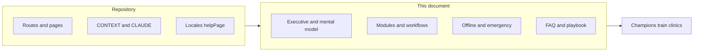
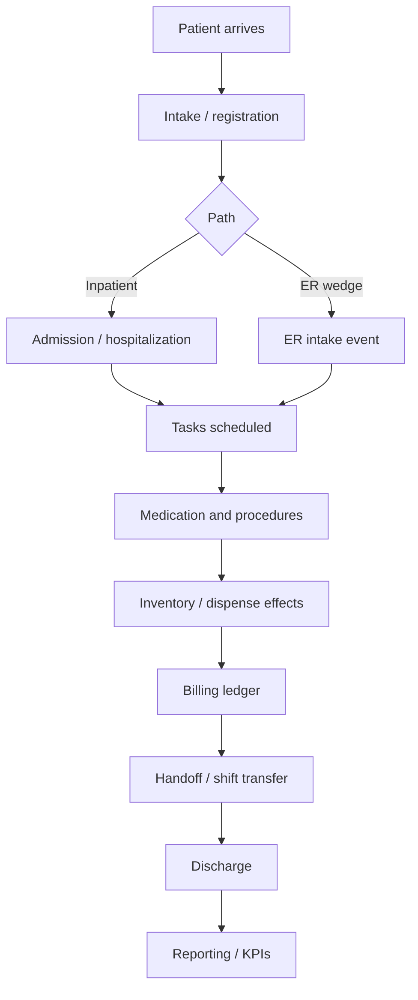

# VetTrack Champion Enablement Guide

**Audience:** Champions, super users, trainers, clinic managers, internal implementation staff  
**Assumption:** Reader has never used VetTrack and is not technical  
**Source of truth:** Repository inspection (May 2026) — `README.md`, `CONTEXT.md`, `CLAUDE.md`, routes, roles, locales, and existing docs under `docs/`

---

## Table of contents

1. [Implementation plan (how this guide was built)](#implementation-plan-how-this-guide-was-built)
2. [Executive summary](#1-executive-summary)
3. [Quick mental model](#2-quick-mental-model)
4. [User roles](#3-user-roles)
5. [Module-by-module explanation](#4-module-by-module-explanation)
6. [Offline behavior](#5-offline-behavior)
7. [Emergency workflows](#6-emergency-workflows)
8. [Common workflows](#7-common-workflows)
9. [FAQ](#8-faq)
10. [Troubleshooting](#9-troubleshooting)
11. [Champion playbook](#10-champion-playbook)
12. [Glossary](#11-glossary)
13. [Open questions](#12-open-questions)

---

## Implementation plan (how this guide was built)

### Repository inspection summary

| Area | Primary sources |
|------|-----------------|
| Product purpose | `README.md`, `CONTEXT.md`, investor docs |
| Roles & permissions | `server/middleware/auth.ts`, `server/lib/task-rbac.ts`, route `requireEffectiveRole` / `requireAdmin` |
| UI modules & routes | `src/app/routes.tsx`, `src/components/layout.tsx` |
| ER / Code Blue | `CONTEXT.md`, `shared/er-mode-access.ts`, `src/lib/offline-emergency-block.ts` |
| Offline | `src/lib/offline-db.ts`, `src/lib/sync-engine.ts`, `docs/offline-first-architecture-plan.md` |
| Pilot deployment | `docs/pilot.md`, `src/lib/pilot-mode.ts`, `server/app/routes.ts` |
| Integrations | `docs/integrations-guide.md` |
| Onboarding UX | `src/components/onboarding-walkthrough.tsx`, `src/pages/help.tsx`, `locales/en.json` (`helpPage`) |
| Existing staff docs | `docs/pilot.md`, `docs/dev-signin-runbook.md`, `docs/cloud-agent-starter-skill.md` |

### Planned document structure (delivered in sections 1–12 below)

- **§1–2:** Non-technical positioning and end-to-end patient journey.
- **§3:** Only roles present in `VALID_ROLES` and UI gates (no invented “receptionist” or “inventory manager” account types).
- **§4:** One subsection per real product surface (route + API family), with warnings tied to code (medication limits, ER concealment, pilot gating).
- **§5–6:** User-facing offline and emergency rules (no Dexie/SSE implementation detail).
- **§7:** Step lists mapped to actual APIs/pages (`/patients`, `/equipment`, `/er`, medication tasks, etc.).
- **§8–9:** Support-oriented FAQ and troubleshooting matrices.
- **§10:** Rollout calendar for champions.
- **§11–12:** Glossary + explicit uncertainty list.

### Diagram: guide information flow

---

## 1. Executive summary

### What VetTrack is

VetTrack is a **veterinary hospital operations platform**. It helps clinics track **equipment**, run **medication and task workflows**, manage **inventory and billing**, coordinate **emergency (ER) operations**, and connect to **external practice management systems (PMS)** — all scoped per **clinic** so data never mixes between hospitals.

### What problem it solves

Hospitals often rely on paper, spreadsheets, and disconnected systems. That leads to:

- Lost or misplaced equipment
- Medication errors and unclear who gave a dose
- Billing that does not match what was used
- Slow handoffs between shifts and teams
- Emergency events without a single live picture for the ward

VetTrack ties **clinical actions**, **assets**, and **financial records** into one system with audit trails and real-time updates where configured.

### Why clinics use it

- **Visibility:** Know who has which device, what tasks are due, and which patients are in the hospital.
- **Safety:** Medication dosing checks, duplicate-task prevention, and clinical integrity rules (Smart COP) where enabled.
- **Speed at the bedside:** QR/NFC scanning, mobile-friendly UI, ward display, Code Blue surfaces.
- **Resilience:** Works as a **Progressive Web App (PWA)** with offline queueing for equipment actions (not for emergencies or medication completion).
- **Scale:** Multi-clinic deployments with Clerk sign-in and per-clinic configuration.

### Core philosophy

- **One clinic, one boundary:** Every record belongs to a clinic; staff only see their clinic’s data.
- **Server is authoritative for clinical and financial state:** The app may queue equipment changes offline, but medication completion, billing, dispense, and Code Blue require the server.
- **Role from the database:** What someone can do comes from their **VetTrack account role** (`vt_users.role`), not from what they claim in the app.
- **Bedside first:** Scanning, large touch targets, Hebrew/English UI, ward display for shared screens.
- **Frozen safety surfaces:** Realtime (SSE), Code Blue offline blocking, and emergency API cache rules are intentional — do not expect “work offline” for Code Blue.

### How it differs from paper/manual workflows

| Paper / manual | VetTrack |
|----------------|----------|
| Sign-out sheet on a clipboard | Checkout on the item; name shown to the team |
| Sticky note on a cage card | Patient on **Active patients** with ward/bay and status |
| Nurse writes dose on a sheet | **Task** with calculated volume and completion audit |
| End-of-day billing guess | Billing ledger entries tied to tasks and usage |
| Phone tree for Code Blue | Code Blue session + ward display + realtime updates (when online) |
| “Someone saw it in the hall” | Scan log and room radar with staleness indicators |

---

## 2. Quick mental model

### What happens from arrival to discharge (simplified)

Not every clinic uses every step on day one. **Pilot deployments** may only use equipment and safety surfaces until the full platform is enabled.

**In plain language:**

1. **Patient arrives** — Reception or bedside staff capture identity (full registration may come later in critical cases; see ER **Clinical onset** in `CONTEXT.md`).
2. **Intake** — ER Mode uses a fast **Intake Event** with **Queue Severity**; the full platform uses **pending patients** and **admission** APIs.
3. **Admissions** — An active **hospitalization** links the animal to ward/bay and clinical status.
4. **Tasks** — User-facing label **Tasks** (internal name `appointments`): medications, maintenance, and other task types on `vt_appointments`.
5. **Medication** — Vet creates medication tasks; technicians **take** and **complete** with volume limits enforced server-side.
6. **Procedures / equipment** — Checkout/return of devices; optional operational state when feature is enabled for the clinic.
7. **Inventory effects** — Completing a med task creates a background **inventory job** (deduction may lag briefly).
8. **Billing** — Ledger entries with statuses `pending` / `synced` / `voided`.
9. **Discharge** — Dedicated discharge endpoint (not a casual status change); checks for open tasks/jobs where implemented.
10. **Reporting** — Analytics, outcome KPI (ER), management dashboard, leakage reports (admin-oriented).

---

## 3. User roles

VetTrack stores these **account roles** in the database (`VALID_ROLES` in `server/routes/users.ts`):

| Role | Level (internal) | Typical job |
|------|------------------|-------------|
| **admin** | 40 | Clinic IT lead, owner delegate, implementation staff |
| **vet** | 30 | Veterinarian |
| **senior_technician** | 25 | Lead tech; broader task permissions |
| **technician** | 20 | Vet tech / nurse |
| **student** | 10 | Trainee — equipment only |

**Aliases** recognized in permission math (often from Clerk metadata): `lead_technician`, `vet_tech` — treated like technician tier unless mapped otherwise.

**Legacy:** `viewer` is migrated to **student**.

There is **no** separate account role named receptionist, inventory manager, or clinic owner. Clinics usually map those jobs to **technician**, **senior_technician**, or **admin**.

### Account status (separate from role)

| Status | Meaning |
|--------|---------|
| **pending** | Signed up but not approved — API returns `ACCOUNT_PENDING_APPROVAL` |
| **active** | Normal use |
| **blocked** | Cannot use the app — `ACCOUNT_BLOCKED` |

Admins approve users from **Admin → Users**.

### Operational shift role (not the same as account role)

**Clinical check-in** can record an **operational role** (e.g. ward doctor vs admission pool) for authority and routing. This comes from `vt_clinical_check_ins` and shift CSV imports — it does **not** replace account role. See `CONTEXT.md` (“Identity vs duty”).

**Secondary role** on a user is optional metadata set by admin; it does **not** grant clinical permissions by itself.

---

### admin

**What they do**

- Configure clinic users (role, status, secondary role)
- Manage formulary, integrations, shifts import, asset types, docks
- Full equipment lifecycle (create, delete, restore, bulk, import)
- Access audit log, ops dashboards, medication integrity tools, procurement, inventory item master
- Toggle **ER Mode** for the clinic if on the ER manager allowlist (`ADMIN_EMAILS` or admin when allowlist empty)
- Pilot: coverage reports, staleness threshold, scan log attribution

**What they can access**

- Essentially all routes; many admin-only menu items in `layout.tsx`
- Integration credentials (write-only; never shown back in clear text)

**What they should never do**

- Share integration API keys in chat or email
- Approve unknown users without verifying employment
- Turn off ER Mode during an active mass-casualty event without ops lead sign-off

**Daily responsibilities**

- User approvals, config checks, review alerts/audit, support escalations

---

### vet

**What they do**

- Create **medication tasks** (only vets may create — enforced in `task-rbac.ts`)
- Admit/update patients, ER intake assignment, structured handoffs
- Code Blue participation (UI gate: vet tier and above)
- Revert certain equipment scans (vet-only endpoint)

**What they can access**

- Patients, Tasks, Medication hub, ER command center (assign/handoff where allowed), Code Blue, shift handover, inventory (technician floor+)

**What they should never do**

- Ask technicians to create medication tasks under the vet’s login
- Complete medication without following dose override rules when the system requires a reason

**Daily responsibilities**

- Patient care decisions, task creation, handoffs, emergency leadership

---

### senior_technician

**What they do**

- Same broad **task** permissions as vet for assign/cancel/create (non-medication task types)
- Medication: read/start/complete per policy; **cannot** create medication tasks (vet only)
- Code Blue and handover surfaces (same UI tier as vet/technician for Code Blue access)

**What they can access**

- Same clinical navigation as technicians plus task management features

**What they should never do**

- Override blocked doses without vet involvement when policy says blocked

**Daily responsibilities**

- Floor coordination, task assignment, med administration supervision

---

### technician

**What they do**

- Execute tasks (start/complete), administer medications after vet creates tasks
- Patient list operations (routes require technician floor)
- Equipment checkout/return/scan, inventory pages, shift handover
- Dispense and restock (when full platform enabled — online)

**What they can access**

- Core operational menu: equipment, tasks, patients, meds, rooms, inventory, billing view, analytics entry points per layout

**What they should never do**

- Create medication tasks (system denies)
- Discharge patients without using the proper discharge flow

**Daily responsibilities**

- Scans, med passes, patient updates, returns equipment

---

### student

**What they do**

- **Equipment only:** scan, checkout, return (minimum role on equipment routes)
- First-time onboarding walkthrough (scan, checkout, report issue)

**What they can access**

- Equipment list/detail, rooms, alerts, my equipment — **not** Tasks or Medication hub (frontend redirects to equipment)

**What they should never do**

- Use a senior staff login to bypass training restrictions
- Administer medications through VetTrack on a student account

**Daily responsibilities**

- Asset verification, returns, learning workflows

---

### ER staff (operational concept, not a login role)

ER workflows use normal roles (**vet**, **technician**, **admin**) plus **ER Mode** on the clinic. When ER Mode is on, most of the app is hidden (**Concealment 404**); staff live in **ER Command Center** (`/er`). Technicians can perform assign/handoff actions where `requireAssignableRole` allows — not “vet only” for all ER endpoints.

---

## 4. Module-by-module explanation

> **Pilot mode:** When `VITE_PILOT_MODE=true` / `PILOT_MODE=true`, many modules below are **hidden** (equipment + safety + admin only). See `docs/pilot.md`.

> **ER Mode:** When the clinic ER flag is active, non-allowlisted pages return not found; APIs outside `shared/er-mode-access.ts` are blocked.

---

### Equipment

| | |
|--|--|
| **Purpose** | Track devices and consumables with QR/NFC; checkout/return; status and location |
| **Inputs** | Scans, manual edits, room assignment, folder organization |
| **Outputs** | Scan logs, transfer logs, alerts, “my equipment”, optional billing on return-with-charge |
| **Dependencies** | Rooms, folders, users, optional asset types / operational state feature |
| **Common actions** | Scan OK/issue/maintenance, checkout, return, move between rooms, floor note (pilot) |
| **Common mistakes** | Returning without checking plug/charge flags; ignoring **version** conflict after another user edited |
| **Warnings** | Optimistic locking on updates; rate limits on scan/checkout; stale badges in pilot |

**Statuses (examples):** ok, issue, maintenance, sterilized, inactive, critical, needs_attention.

---

### Rooms & Asset Radar

| | |
|--|--|
| **Purpose** | See equipment grouped by room; verify all items in a room; NFC room verify |
| **Inputs** | Room membership on equipment, scan activity |
| **Outputs** | Health ring (% verified in 24h), stale/audit badges, activity feed |
| **Dependencies** | Equipment scans |
| **Common actions** | Open room → verify items; “Verify all in room” |
| **Common mistakes** | Assuming “empty room” means equipment does not exist (may be checked out) |
| **Warnings** | Admin-only staff names on activity in pilot attribution mode |

---

### Alerts

| | |
|--|--|
| **Purpose** | Central list of items needing attention (computed from equipment state) |
| **Inputs** | Equipment conditions, overdue returns, issues |
| **Outputs** | Acknowledgments via alert-acks API |
| **Common actions** | Review bell icon count → open alert → acknowledge |
| **Warnings** | Badge count is derived client-side from equipment query — refresh if stale |

---

### Tasks (UI label; route `/appointments`)

| | |
|--|--|
| **Purpose** | Unified work queue: medications and non-med tasks (`taskType` on `vt_appointments`) |
| **Inputs** | Scheduled tasks, assignments, patient linkage |
| **Outputs** | Status changes, ownership, dashboard views |
| **Dependencies** | Animals/hospitalizations, users, shifts |
| **Common actions** | Filter by status; assign; start/complete non-med tasks per RBAC |
| **Common mistakes** | Confusing with external PMS “appointments” — this is in-hospital work |
| **Warnings** | Internal i18n keys still say `appointmentsPage`; only display text says Tasks |

---

### Medication hub & medication tasks

| | |
|--|--|
| **Purpose** | Safe med ordering and execution with dose calculator snapshot |
| **Inputs** | Weight, dose per kg, route (IV/IM/PO/SC), formulary drug, optional override reason |
| **Outputs** | Medication task rows, billing on complete, inventory job async |
| **Dependencies** | Formulary, animal, open task uniqueness per animal+drug+route |
| **Common actions** | Vet: create → tech: take → complete with actual volume |
| **Common mistakes** | Duplicate open task for same drug/route; volume ≥ 100 ml liquid (rejected) |
| **Warnings** | `blocked` safety → cannot create; `requiresReason` without override → 400; **must be online** to complete |

---

### Patients & admissions (hospitalizations)

| | |
|--|--|
| **Purpose** | Active inpatients: ward, bay, status, admitting vet |
| **Inputs** | Admit with existing or new animal; owner fields optional |
| **Outputs** | Hospitalization row until discharge |
| **Statuses** | admitted, observation, critical, recovering, discharged, deceased |
| **Dependencies** | Animals, owners, appointments, inventory jobs on discharge checks |
| **Common actions** | Admit → update status/location → discharge with notes |
| **Common mistakes** | Using PATCH status to discharge (must use **discharge** endpoint) |
| **Warnings** | Minimum role technician on patient routes |

**Pending patients** (`/pending`): List and “take” assign — UI may show Hebrew strings; confirm locale with clinic.

---

### Inventory (cabinets, containers, restock, dispense)

| | |
|--|--|
| **Purpose** | Stock in containers, restock workflows, dispense with Smart COP validation |
| **Inputs** | Container scans, restock orders, dispense lines linked to patient |
| **Outputs** | Quantity changes, dispense events, orphan alerts when COP enabled |
| **Dependencies** | Items master, hospitalization, medication orders |
| **Common actions** | Restock drawer flow; dispense against patient context |
| **Common mistakes** | Dispense without active hospitalization/order → orphan usage |
| **Warnings** | **Online required**; enforcement may block with reason codes in enforce mode |

---

### Inventory items & procurement (admin-heavy)

| | |
|--|--|
| **Purpose** | Master item catalog; purchase orders and lines |
| **Who** | Menu routes often **admin-only** in navigation |
| **Warnings** | Hidden in pilot mode |

---

### Billing

| | |
|--|--|
| **Purpose** | Financial ledger aligned to clinical/asset usage |
| **Inputs** | Task completion, equipment usage sessions, Code Blue reconciliation flows |
| **Outputs** | Ledger rows: `pending`, `synced`, `voided` |
| **Dependencies** | Idempotency keys prevent duplicate charges |
| **Common actions** | Review ledger; leakage report; inventory jobs queue for failed deductions |
| **Warnings** | Brief lag between task complete and inventory deduction is normal |

---

### Scheduling (shifts)

| | |
|--|--|
| **Purpose** | Import technician (and extended) shifts from CSV; drives operational routing |
| **Who** | Admin import under `/admin/shifts` |
| **Warnings** | `vt_shifts.role` does not encode vet admission-pool roles yet — see open questions |

---

### Shift handover & patient handoffs

| | |
|--|--|
| **Purpose** | End-of-shift summaries; structured patient handoff records |
| **Inputs** | Active hospitalizations, consumables report, emergencies list |
| **Outputs** | Handoff artifacts for continuity |
| **Dependencies** | Patients, appointments, clinical check-in checkout on session end |
| **Warnings** | Distinct from ER **Structured Clinical Handoff** (`/api/er/handoffs`) |

---

### ER Command Center & ER Mode

| | |
|--|--|
| **Purpose** | High-pressure wedge: intake board, severity, assignment, handoffs, KPIs |
| **Inputs** | Intake events, queue severity, time-based escalation |
| **Outputs** | Realtime board updates via outbox/SSE |
| **Dependencies** | Clinic `erMode` flag; allowlists in `shared/er-mode-access.ts` |
| **Common actions** | Create intake → assign → admission busy state → handoff → ack |
| **Common mistakes** | Bookmarking non-ER URLs during ER Mode (404 concealment) |
| **Warnings** | Only admins on allowlist toggle ER Mode; technicians allowed on several assign paths |

---

### Code Blue

| | |
|--|--|
| **Purpose** | Emergency session per event: logs, presence, ward display mirror |
| **Inputs** | Start session, post logs, end session (server-confirmed) |
| **Outputs** | Active session on display; history for admins |
| **Dependencies** | Realtime stream; snapshot endpoint when degraded |
| **Warnings** | **Never offline**; never optimistic “end” locally — see §6 |

---

### Ward display (`/display`)

| | |
|--|--|
| **Purpose** | Large-screen ward view; Code Blue state |
| **Warnings** | Emergency endpoint — not cached by service worker |

---

### Crash cart

| | |
|--|--|
| **Purpose** | Checklist workflow for crash cart readiness (Code Blue adjacent) |
| **Access** | Same tier as Code Blue in navigation (vet/senior_technician/technician/admin) |

---

### Notifications (push & in-app)

| | |
|--|--|
| **Purpose** | Device push (Web Push/VAPID) and in-app/realtime signals |
| **Inputs** | User subscribes in Settings; server events for alerts, ER, etc. |
| **Outputs** | Push to user or clinic; scheduled notifications worker |
| **Common actions** | Enable push → send test notification |
| **Warnings** | Requires Redis/VAPID in production; dedupe on equipment alerts |

**WhatsApp:** Optional alert channel via `/api/whatsapp` (technician+); needs confirmation of which clinics enable it.

---

### Integrations

| | |
|--|--|
| **Purpose** | Sync patients, inventory, appointments/tasks, billing with external PMS |
| **Who** | **Admin** API only |
| **Inputs** | Adapter config + encrypted credentials |
| **Outputs** | Sync log; external IDs on animals, appointments, billing, items |
| **Reference** | `docs/integrations-guide.md`, vendor playbook under `docs/integrations/` |

---

### Reporting & dashboards

| Surface | Purpose |
|---------|---------|
| `/analytics` | Equipment/analytics views |
| `/analytics/outcome-kpi` | ER outcome KPI vs baseline window |
| `/analytics/shift-leaderboard` | Shift metrics |
| `/dashboard` | Management dashboard |
| `/admin/ops-dashboard` | Operational health |
| `/admin/metrics` | Operational metrics |
| `/billing/leakage` | Revenue leakage view |
| `/pharmacy-forecast` | Forecast (nav gated by role — pharmacy forecast permission) |
| `/stability` | Admin stability/token tools |

Hidden in **pilot mode**.

---

### Clinical check-in

| | |
|--|--|
| **Purpose** | Staff declares operational role at start of clinical work; feeds authority resolution |
| **Inputs** | Open/close check-in with optional operational role |
| **Outputs** | Authority for Code Blue manager and enforcement evaluators when enabled |
| **Warnings** | Force-close admin-only; stale check-in sweeps run in background |

---

### Admin & settings

| | |
|--|--|
| **Purpose** | Users, formulary, folders, equipment admin, support tickets, pilot tools |
| **Settings (`/settings`)** | Locale, display density, sound, push, dark mode |
| **Help (`/help`)** | Quick guide aligned with `helpPage` locale strings |
| **App tour (`/app-tour`)** | Video tour (full platform; not in pilot nav set) |

---

### Support

| | |
|--|--|
| **Purpose** | In-app support tickets (student+ submit; admin resolve) |

---

### Authority / Smart COP (cross-cutting)

| | |
|--|--|
| **Purpose** | Prevent orphan dispenses and unsafe assignments when enforcement enabled per clinic |
| **Modes** | `off` / `shadow` / `enforce` per evaluator family |
| **User-visible** | Banners, 422 errors with stable codes, shadow audits |
| **Trainer note** | Default rollout is conservative; clinics may still be on Strategy A legacy authority |

---

## 5. Offline behavior

### What works offline (queued locally)

When the network fails, these **equipment-related** actions are saved on the device and replayed later:

- Create / update / delete equipment (with version conflicts possible on update)
- Scan and “seen” events
- Checkout, return, return-with-charge

The app shows a **cloud icon** in the header: pending count, failed count, tap to open **sync queue**.

### What does not work offline

- **Code Blue** start, log, end, presence — blocked immediately with a clear message
- **Medication task complete** and related billing/inventory finalization
- **Dispense** and authority-enforced clinical mutations
- **Billing finalization**
- Anything not in the offline allow registry — unregistered actions fail at enqueue with an error (not silently dropped)

### What users should expect

- The app **continues to open**; cached equipment/rooms may display from IndexedDB (Dexie).
- Actions show as **Pending** until synced.
- After reconnect, the **sync engine** retries with backoff; permanent failures stay in **Failed** for manual retry or discard.
- **409 conflicts** on equipment updates mean someone else changed the record — user must refresh and reconcile.

### Synchronization behavior (simple)

- Queue is **FIFO** (first in, first out) with retry delays (2s, 5s, 10s, then repeats last delay).
- Checkout/return for the **same item** overwrite one pending row (dedup); **scans** append (each scan replays).
- Circuit breaker pauses sync after repeated failures; recovers after cooldown.
- **Never** silently drops mutations — offline equipment ops must enqueue.

### Conflicts

- Equipment PATCH uses **version** — stale offline edit loses with 409; user should reload item.
- Conflict UI exists but in-memory conflict store may not survive reload — needs confirmation for champion training emphasis.

### Emergency restrictions

If staff try Code Blue actions offline:

- Loud toast / error
- Local tab-only telemetry buffer (not sent as clinical data)
- Counters may increment for hospital observability

Train staff: **move to connectivity or use paper emergency protocol** until online.

---

## 6. Emergency workflows

### Code Blue behavior

1. Authorized staff start a **session** (online POST).
2. Team posts **log entries** during the event (online).
3. **Ward display** and realtime subscribers show active session (SSE / keepalive).
4. **End session** only when server confirms — UI must not show “ended” until server says so.
5. Reconnect after dropout: app **replays** missed realtime events and reconciles snapshot — not “refresh every few seconds” as primary strategy.

### Emergency rules (doctrine)

| Rule | Why |
|------|-----|
| No offline queue for Code Blue | Replaying minutes later is clinically wrong |
| No optimistic end | Prevents false “all clear” on ward display |
| Emergency APIs not cached in PWA | Stale emergency state is dangerous |
| Split app versions detected | Forces reload when tabs run different builds |

### Restrictions

- Pending/blocked accounts cannot run clinical APIs (`ACCOUNT_PENDING_APPROVAL`, `ACCOUNT_BLOCKED`).
- Role floor for Code Blue UI: admin, vet, senior_technician, technician — **not student**.
- Equipment plugged into emergency workflows may still be tracked separately — Code Blue is not a substitute for asset checkout.

### Critical user expectations (train verbatim)

1. **“Code Blue needs internet.”** If offline, use hospital verbal/alarm protocol; do not expect VetTrack to queue the arrest log.
2. **“The screen ends when the server ends it.”** Do not assume closing the browser ends the session.
3. **“Watch the ward display.”** That is the shared truth for the team.
4. **“Update the app when prompted.”** Build-tag mismatch can split tabs during an event.

### ER Mode (related but distinct)

- Narrows navigation to ER surfaces; full platform hidden.
- Intake severity can **escalate over time** (scheduler runs about every 60 seconds).
- Handoff SLA breach scanning runs about every 5 minutes.
- Admission doctor “busy” state affects notification pools — see `CONTEXT.md` for routing nuance.

---

## 7. Common workflows

### A. Patient check-in (pending list)

**Needs confirmation:** Exact UI path varies; API includes pending hospitalizations and ER intake flows.

1. Open **Pending** or ER intake (clinic-dependent).
2. Review waiting patients and severity/wait time.
3. Clinician **assigns** or **takes** patient (ER: accept intake; pending page: `api.patients.assign`).
4. Continue to admission or ER board placement.

---

### B. Patient admission

1. Go to **Active patients** (`/patients`).
2. **Admit** — select existing animal or create new with name/species/owner optional.
3. Set ward, bay, admission reason, admitting vet if known.
4. Status typically starts as **admitted** (or observation/critical per case).
5. System may post shift-chat presence messages — needs confirmation per clinic config.

---

### C. Equipment checkout

1. Scan QR or open equipment from list/room.
2. Tap **Check out** (pilot may say **Confirm here** for location verification only — know your deployment mode).
3. Item shows holder name on **My equipment** and detail.
4. If offline, action queues — confirm when cloud icon clear.

---

### D. Equipment return

1. Open checked-out item (or scan).
2. Tap **Return**.
3. If prompted for plug/charge issue, answer honestly — may trigger charge alert job when unplugged.
4. Verify item back on room radar.

---

### E. Medication administration

1. **Vet** creates medication task from Medication hub or Tasks with dose calc input.
2. **Technician** opens task → **Take** (ownership).
3. Prepare dose; system calculated volume is in snapshot.
4. **Complete** with actual volume (liquid must be **> 0 and < 100 ml**; tablets use separate rules).
5. Expect billing row and async inventory deduction — brief delay normal.

---

### F. Inventory adjustment / restock / dispense

**Needs confirmation:** Which UI path the clinic enables first.

1. Open **Inventory** from menu (technician+).
2. Restock: follow drawer wizard (navigation may lock during restock).
3. Dispense: link patient/context; if Smart COP blocks, read reason code and escalate to vet.
4. Stay **online** for these steps.

---

### G. Patient discharge

1. Open patient detail for active hospitalization.
2. Resolve open tasks and inventory jobs where system enforces pre-flight (errors list blocking reasons).
3. Use **Discharge** action with optional notes (not generic status edit).
4. Equipment bound to procedures may auto-release — needs confirmation when operational state feature on.

---

### H. Emergency handling (Code Blue)

1. Confirm connectivity.
2. Open **Code Blue** from nav or emergency shortcut.
3. Start session with patient/context as required.
4. Log drugs, defibrillation, procedures per hospital protocol in log entries.
5. Assign roles via presence if used.
6. End session only through **End** control when clinically appropriate; wait for confirmation.
7. Admin may reconcile billing later via Code Blue reconciliation page.

---

### I. Shift handover (full platform)

1. Open **Shift handover**.
2. Review summary, consumables, pending emergencies.
3. Complete structured notes per patient handoff modules.
4. End shift session where check-in/checkout tied — needs confirmation per clinic SOP.

---

### J. ER intake (ER Mode)

1. Ensure clinic is in **ER Mode** (manager toggle).
2. Open **ER Command Center**.
3. Create **Intake Event** with minimal fields + **Queue Severity**.
4. Assign clinician; track lane and badges on board.
5. Enter **In Admission** busy state when policy applies.
6. Submit **Structured Clinical Handoff** when ready; incoming assignee must ack (or forced ack with reason).

---

## 8. FAQ

1. **Why do I not see a device?** — It may be checked out, inactive, in another room, soft-deleted (admin), or filtered out; refresh when online.
2. **Why is the equipment list empty offline?** — Cache may be stale; connect once to refresh Dexie cache.
3. **Why did my scan not appear immediately?** — Offline queue; wait for sync cloud to clear.
4. **Why did sync fail permanently?** — Validation error, permission, or conflict; open sync queue for message.
5. **Why can’t I edit this equipment?** — Role below technician for edits; or 409 version conflict.
6. **Why can’t I create a medication task?** — Only **vet** role may create; students cannot access meds page.
7. **Why was my dose blocked?** — Safety level blocked or volume out of range; vet override reason may be required.
8. **Why two open med tasks for same drug?** — System prevents duplicate open tasks per animal+drug+route.
9. **Why is billing missing after med?** — Ledger may still be `pending`; inventory job may be processing.
10. **Why inventory not deducted yet?** — Async worker; check inventory jobs page (admin/billing).
11. **Why can’t I sign in?** — Account **pending** or **blocked**; contact admin.
12. **Why pending after signup?** — Admin must set status to **active**.
13. **What happens if internet goes down?** — Equipment ops queue; Code Blue and med complete do not.
14. **Why is Code Blue grayed out?** — Role is student; or account not active.
15. **Why won’t Code Blue end?** — Offline or server error; session ends only on server confirmation.
16. **Why ER pages only?** — **ER Mode** concealment — ask lead to deactivate after event.
17. **Why 404 on procurement?** — ER Mode or pilot mode hides route.
18. **Why don’t I see Tasks menu?** — Pilot mode hides; or student redirect; or ER concealment.
19. **Why Hebrew on pending page?** — Some pages still hardcoded; switch locale globally where supported.
20. **How do I enable push?** — Settings → push → subscribe; send test.
21. **Why no push?** — VAPID not configured, Redis down, or subscription expired — re-subscribe.
22. **Why alerts bell wrong?** — Client computed from equipment fetch; pull to refresh.
23. **Who can approve users?** — Admin on Users tab.
24. **Can I share my login?** — No — audit ties actions to user.
25. **Why dispense blocked orphan?** — No patient link, hospitalization, or matching order — Smart COP enforce.
26. **What is shadow mode?** — Hospital sees violations in logs/metrics without blocking — implementation rollout state.
27. **Why charge alert on return?** — Return reported device not plugged in; delayed job may notify.
28. **How to print QR?** — Menu print QR / admin equipment print (pilot: sort unconfirmed first).
29. **What is pilot “Confirm here”?** — Location verification scan, not full checkout semantics — pilot only.
30. **Why app wants reload?** — New service worker build tag or chunk load failure recovery.
31. **Can students do checkout?** — Yes — that is their primary training scope.
32. **Why can’t technician create med?** — By design — vet accountability.
33. **What is secondary role?** — Label only unless product configures more — does not grant vet powers.
34. **How do integrations sync?** — Admin configures adapter; manual or scheduled sync — see integrations guide.
35. **Why duplicate billing?** — Should not happen — idempotency keys; report to support with request id.

---

## 9. Troubleshooting

| Problem | Likely cause | Resolution | Escalation |
|---------|--------------|------------|------------|
| Cannot log in | Pending/blocked user | Admin activates account | Admin + Clerk dashboard |
| 403 on all APIs | Wrong clinic or deleted user | Admin verifies `vt_users` | Engineering |
| Equipment 409 on save | Version mismatch | Reload item; discard offline edit | Champion |
| Sync stuck pending | Offline / circuit breaker | Go online; open sync queue retry | Engineering if server 5xx |
| Sync failed validation | Bad payload or role | Read error in queue; fix data | Engineering |
| Code Blue “offline blocked” | No network | Use paper protocol; reconnect | Clinical lead |
| Code Blue ended in UI but display active | Local state drift | Force reconcile: reload; check display | Engineering realtime |
| Med complete 400 volume | ≥100 ml or ≤0 | Re-enter actual volume | Vet |
| Med create 400 blocked dose | Formulary safety | Vet review override reason | Clinical lead |
| Dispense 422 orphan | No order/hosp | Link patient; verify admission | Vet + admin |
| ER page 404 | ER Mode concealment | Use `/er` routes; toggle mode when safe | Ops lead |
| Full menu missing | Pilot mode build | Expect limited nav; plan rollout | Implementation |
| Push test fails | No subscription/VAPID | Re-enable notifications in settings | Admin + engineering |
| Integration sync fail | Credentials/vendor down | Revalidate credentials; check sync log | Admin |
| Ward display stale | SSE degraded | Wait for keepalive recovery; snapshot path | Engineering |
| Hebrew/English mixed | Partial i18n migration | Set user locale; report page path | Product |
| Student sees meds briefly | Redirect flash | Update app; expected redirect | Champion |

---

## 10. Champion playbook

### Goals

- Staff trust **scan → checkout → return** before advanced modules.
- Vets confident creating **Tasks/meds** before inventory enforcement goes to `enforce`.
- Everyone understands **Code Blue needs network**.

### Day 1 (first 4 hours)

**Priorities**

- Accounts: signup → admin approves → correct **role**
- Install PWA to home screen; accept push if clinic uses it
- Walkthrough: onboarding overlay (scan, checkout, issue)
- Practice 10 equipment scans and 3 checkouts/returns
- Show **Help** quick guide and sync cloud icon

**Risks**

- Pending users think app is “broken”
- Students on wrong role expecting meds

**Resistance**

- “Another app” — tie to real devices they already hunt for

**Tips**

- Use real rooms and QR sheets printed Day 0
- Pair one vet champion with one tech champion

### Week 1

**Priorities**

- Room radar habit: verify rooms once per shift
- Alerts acknowledgment loop
- Active patients: admit/discharge drill (if full platform)
- Medication: one vet-created task → tech complete (online)
- Code Blue tabletop (online) — not live patient

**Risks**

- Offline queue conflicts if two people edit same equipment

**Resistance**

- Bypassing checkout “just this once”

**Tips**

- Celebrate scan streaks; pilot coverage page if in pilot

### Week 2

**Priorities**

- Shift handover or ER intake (whichever clinic adopted)
- Inventory restock/dispense with COP banner awareness
- Billing ledger spot-check after med completes
- Integrations: verify one test patient sync (admin)

**Risks**

- Orphan dispense blocks if orders not in system

**Resistance**

- “PMS is source of truth” — define which fields VetTrack owns

### Month 1

**Priorities**

- ER Mode drill if purchased (concealment + handoff ack)
- Outcome KPI baseline window if ER wedge live
- Review failed sync queue and audit log samples
- Tune pilot staleness hours or move off pilot flag
- Enforcement mode review per evaluator with clinical lead

**Adoption risks**

- Partial pilot → staff think VetTrack is “only QR app”

**Tips**

- Weekly 15-minute champion huddle
- Escalate open questions §12 to product before customizing SOP

---

## 11. Glossary

Alphabetical. User-facing **Tasks** = unified work queue (table still `vt_appointments`).

| Term | Simple meaning |
|------|----------------|
| **Account role** | Global permission: admin, vet, senior_technician, technician, student |
| **Account status** | pending, active, blocked — gates login |
| **Active patients** | Hospitalized animals not yet discharged |
| **Admission** | Creating/active hospitalization record |
| **Alert** | Equipment or system condition needing attention |
| **Asset Radar** | Room-based equipment map (`/rooms`) |
| **Audit log** | Admin view of critical actions |
| **Billing ledger** | Financial charges linked to usage |
| **Build tag** | App version marker for PWA cache and split-tab detection |
| **Check-in (clinical)** | Staff declares operational role for authority |
| **Checkout** | Assign equipment to a user |
| **Clinic** | Tenant — all data scoped by clinicId |
| **Code Blue** | Emergency session workflow |
| **Concealment 404** | ER Mode hides non-allowlisted pages |
| **Container** | Inventory storage unit (cabinet/drawer) |
| **Cop / Smart COP** | Clinical integrity checks on dispense and orders |
| **Dexie** | Browser database for offline cache (implementation term) |
| **Dispense** | Remove stock for patient use with validation |
| **Discharge** | Close hospitalization with dedicated endpoint |
| **Dose hard-stop** | Server rejects unsafe dose |
| **ER Allowlist** | APIs/routes allowed during ER Mode |
| **ER Command Center** | Board for intake, lanes, handoffs |
| **ER Mode** | Clinic-wide focus on emergency wedge |
| **Enforcement mode** | off / shadow / enforce for safety evaluators |
| **Formulary** | Drug catalog with concentrations and safety |
| **Handoff** | Structured transfer of patient responsibility |
| **Hospitalization** | Inpatient stay record |
| **Idempotency key** | Prevents duplicate billing charges |
| **Intake Event** | ER fast triage record at arrival |
| **Inventory job** | Background row to deduct stock after med complete |
| **My equipment** | Items checked out to me |
| **Offline queue** | Pending sync actions on device |
| **Operational role** | Job hat for this shift (check-in), not account role |
| **Orphan usage** | Dispense not matching active order/context |
| **Outcome KPI** | ER metric vs pre-go-live baseline |
| **Outbox** | Server event queue feeding realtime |
| **Pilot mode** | Reduced feature flag deployment |
| **Primary Lane** | Single board column for ER item |
| **PMS** | Practice management system (external) |
| **PWA** | Installable web app with offline support |
| **Queue Severity** | low / medium / high / critical urgency |
| **Realtime / SSE** | Live event stream per clinic |
| **Return** | Check equipment back in |
| **Risk Badge** | Secondary ER marker without duplicating card |
| **Scan log** | Record of QR/NFC scan at a point in time |
| **Secondary role** | Optional admin label on user |
| **Shift** | Scheduled work period imported via CSV |
| **Staging queue** | Equipment promotion workflow — needs confirmation if used |
| **Strategy A** | Legacy authority path when no clinical check-in |
| **Sync queue** | UI sheet to retry failed offline actions |
| **Task** | Work item (medication, maintenance, etc.) |
| **Ward display** | Large screen ward/Code Blue view |
| **WhatsApp alert** | Optional messaging integration |

---

## 12. Open questions

Items below could **not** be confirmed from code alone. Marked **needs confirmation** with your product/clinical owner before teaching as fact.

| Topic | Notes |
|-------|--------|
| **Receptionist workflow** | No `receptionist` role — which account role clinics should use |
| **Inventory manager workflow** | No dedicated role; likely admin + technician |
| **Clinic owner** | Maps to admin; ER toggle may need email on `ADMIN_EMAILS` allowlist |
| **Pending page UI language** | `pending.tsx` contains hardcoded Hebrew — parity with i18n unclear |
| **Exact patient “check-in” screen** | Multiple paths: ER intake vs `/pending` vs PMS integration |
| **WhatsApp alerts production use** | API exists; clinic enablement unknown |
| **Operational state / bundle readiness** | Feature can be `FEATURE_DISABLED` per clinic |
| **Admission doctor pool in software** | Domain doc describes routing; `vt_shifts.role` may not encode vet pools yet |
| **Handoff hard block threshold** | Soft limit 2–3 pending handoffs per doctor — hard block per clinic optional |
| **Student meds redirect** | Implemented in UI; verify deployed branch for training materials |
| **Conflict resolution UX after reload** | In-memory conflict store may not persist |
| **Which modules customer purchased** | Pilot vs full platform vs ER wedge is deployment-specific |
| **Hebrew default locale** | Product default Hebrew; confirm champion training language per clinic |
| **Clerk Organizations vs DB clinic fallback** | Tenancy resolution depends on env configuration |
| **Pricing / leakage definitions** | Business definitions for leakage report |
| **Support SLAs** | Escalation contacts not in repository |
| **Training video currency** | App tour video filename is static in repo — confirm still accurate |

---

## Document control

| Field | Value |
|-------|--------|
| Created | 2026-05-25 |
| Maintainer | Implementation team |
| Related docs | `docs/pilot.md`, `CONTEXT.md`, `CLAUDE.md`, `docs/integrations-guide.md`, `docs/offline-first-architecture-plan.md`, `docs/dev-signin-runbook.md` |

When product behavior changes, update this file in the same PR as user-visible workflow changes.
