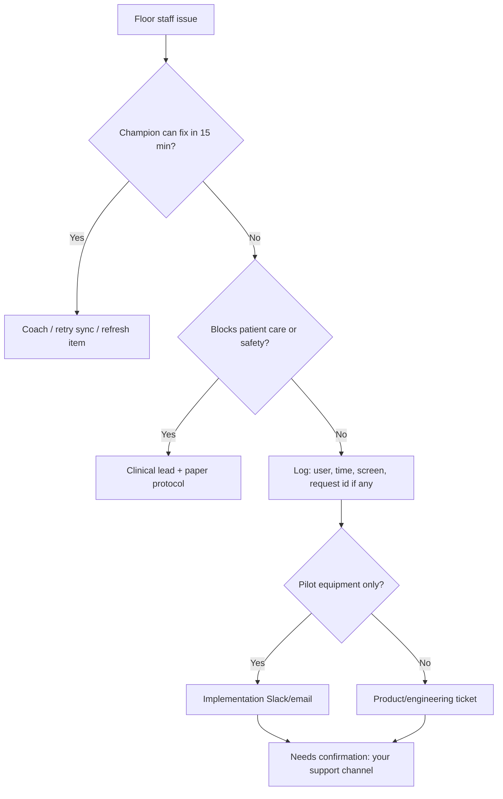

# VetTrack Champion Playbook

**Purpose:** Practical implementation and training execution — not a product encyclopedia.  
**Companion:** `docs/champion-onboarding-guide.md` (reference depth).  
**Scope legend:** Every workflow below is tagged **Pilot-validated**, **Platform capability — not pilot validated**, or **Needs confirmation**.

---

## Critical scope distinction

| Label | Meaning |
|-------|---------|
| **Pilot-validated** | Deployed, trained, and exercised in the real-world **equipment-only** pilot (`docs/pilot.md`, `PILOT_MODE` / `VITE_PILOT_MODE`). |
| **Platform capability — not pilot validated** | Exists in the codebase and may be enabled in a build, but **was not** part of pilot training or validation. |
| **Needs confirmation** | Repository or rollout evidence is incomplete — confirm with product/ops before teaching as fact. |

The pilot did **not** validate admissions, medication, billing, ER, Code Blue, inventory reconciliation, broader tasks, integrations, or reporting behavior — even when those routes appear in a pilot-mode navigation list.

---

## Pre-go-live checklist

### Champion / implementation lead

| # | Task | Scope |
|---|------|-------|
| 1 | Confirm deployment mode: pilot flag on vs full platform | **Pilot-validated** path = equipment focus |
| 2 | Read `docs/pilot.md` and this playbook; skim onboarding guide §5–6 only if non-pilot modules are in contract | Mixed |
| 3 | Define champion roster (1 admin super-user, 2 floor champions) | Process |
| 4 | Agree clinic role mapping (no `receptionist` role in product — use technician/admin) | **Platform capability — not pilot validated** |
| 5 | List hardware: labels/QR, tablets, ward display only if purchased | Mixed |
| 6 | Clerk sign-in tested; pending-user approval process documented | **Platform capability — not pilot validated** (auth exists in all builds) |
| 7 | Do **not** promise med/billing/ER go-live on pilot timeline | Business rule |

### Clinic setup checklist

| # | Task | Scope |
|---|------|-------|
| 1 | `DATABASE_URL`, Redis (if push/workers needed), Clerk keys per `docs/dev-signin-runbook.md` | Infra |
| 2 | Admin accounts created; test student + technician accounts | **Platform capability — not pilot validated** for student policy |
| 3 | Equipment master: folders, rooms, QR print (`/print` or pilot `/admin/equipment/print-qr`) | **Pilot-validated** |
| 4 | `usuallyFoundHere`, `searchAlias`, floor notes strategy | **Pilot-validated** |
| 5 | Pilot staleness threshold (`pilot_stale_ms`) if using pilot mode — default 24h | **Pilot-validated** |
| 6 | Push/VAPID — only if clinic expects device alerts | **Needs confirmation** for pilot clinics |
| 7 | Integrations, formulary, shifts CSV | **Platform capability — not pilot validated** |
| 8 | PMS sync expectations written as **future phase** on pilot contracts | Business rule |

### Data readiness (equipment)

- [ ] Every tracked asset has a QR or NFC path (**Pilot-validated**)
- [ ] Room assignments make sense for radar (**Pilot-validated**)
- [ ] Naming convention agreed (serial vs friendly name) (**Pilot-validated**)
- [ ] Who may create/edit equipment (technician+ create; admin delete) (**Platform capability — not pilot validated** for create; **Pilot-validated** for scan/checkout/return)

---

## First-day workflow

**Goal:** Trust scan → locate → confirm/checkout → return without fear of “breaking the hospital system.”

### Morning (champion-led, 90 min)

| Time | Activity | Scope |
|------|----------|-------|
| 0:00 | Admin approves pending users; roles assigned | **Platform capability — not pilot validated** |
| 0:15 | Install PWA; open **Help** quick guide | **Pilot-validated** (help exists); onboarding walkthrough **Needs confirmation** if shown in pilot build |
| 0:30 | Demo: scan QR → equipment detail → status OK | **Pilot-validated** |
| 0:45 | Demo: checkout → **My equipment** → return | **Pilot-validated** |
| 1:00 | Demo: cloud icon = offline queue (airplane mode 2 min) | **Pilot-validated** |
| 1:15 | Explicitly **do not** train Code Blue, meds, patients on pilot day | Business rule |

### Afternoon (supervised floor)

- Each tech: 5 real scans in assigned rooms (**Pilot-validated**)
- One intentional **issue** report on damaged item (**Pilot-validated**)
- Admin: pilot pulse + coverage page review (**Pilot-validated**)

### End of day metrics (pilot)

| Metric | Target |
|--------|--------|
| Active users approved | 100% of floor list |
| Items with ≥1 scan today | **Needs confirmation** — set with clinic |
| Failed sync queue items | 0 unresolved |
| Support tickets | Log themes for week 1 |

---

## First-week workflow

| Day | Champion focus | Scope |
|-----|----------------|-------|
| 1 | Equipment confidence | **Pilot-validated** |
| 2 | Room radar + verify-all habit | **Pilot-validated** |
| 3 | Alerts bell + acknowledge loop | **Pilot-validated** |
| 4 | Return-with-charge / plug honesty drill | **Pilot-validated** (return path); charge alert job **Platform capability — not pilot validated** for “validated outcomes” |
| 5 | Admin scan-log review + never-confirmed list | **Pilot-validated** |

**Do not schedule** in pilot week 1: med tasks, admit/discharge, ER board, billing review, integration sync.

### Week 1 staff adoption milestones

| Milestone | Signal |
|-----------|--------|
| M1 | ≥80% of floor staff completed 1 checkout + 1 return |
| M2 | Room radar opened at least once per shift per zone |
| M3 | Zero critical sync failures >24h |
| M4 | Champions can explain offline vs Code Blue in one sentence |

---

## First-month workflow

**If clinic remains pilot-only:**

| Week | Focus |
|------|-------|
| 2 | Staleness threshold tuning; QR reprint for never-confirmed |
| 3 | Resistance coaching; shadowing slow adopters |
| 4 | Pilot exit readout: coverage %, scan cadence, incident log |

**If clinic expands to full platform (new validation phase):**

| Week | Focus | Scope |
|------|-------|-------|
| 2 | Patients admit/discharge dry run | **Platform capability — not pilot validated** |
| 3 | Vet-created med task → tech complete (online only) | **Platform capability — not pilot validated** |
| 4 | Billing spot-check; inventory jobs awareness | **Platform capability — not pilot validated** |

Treat expansion as a **new** go-live, not “pilot proved everything.”

---

## Staff adoption milestones

### Pilot-validated milestones (equipment)

1. **Scan reflex** — QR before asking “where is it?”
2. **Holder visibility** — checkout when taking; return when done
3. **Honest status** — issue/maintenance not hidden
4. **Offline calm** — pending cloud, not duplicate paper sheet
5. **Admin hygiene** — never-confirmed list trending down

### Platform milestones (only after explicit non-pilot rollout)

- Medication task completion without workaround
- Discharge with pre-flight checks understood
- ER Mode tabletop (if purchased)
- Integration sync trusted for patient IDs

---

## Resistance patterns

| Pattern | What staff say | Champion response | Scope |
|---------|----------------|---------------------|-------|
| Clipboard nostalgia | “We already have a sheet” | One sheet for exceptions; VetTrack is system of record for **assets** | **Pilot-validated** |
| Speed fear | “Slows me down” | Timed drill: scan faster than search | **Pilot-validated** |
| Blame fear | “Admin will punish scans” | Explain audit is safety, not surveillance; admin attribution policy | **Pilot-validated** (admin-only names on scan log) |
| Offline panic | “It didn’t save” | Show sync queue; never dismiss cloud icon | **Pilot-validated** |
| Scope creep | “Why no meds?” | Contract honesty: pilot = equipment; med is next phase | Business rule |
| Hero login | “I use vet’s login” | Forbidden; role per person | **Platform capability — not pilot validated** |
| Code Blue assumption | “App handles arrest offline” | **Never** — hospital protocol first | **Platform capability — not pilot validated** |

---

## Escalation flow

| Tier | Owner | Examples |
|------|-------|----------|
| L0 | Champion | Wrong room, forgot return, offline queue retry |
| L1 | Clinic admin | User pending, role change, staleness config |
| L2 | Implementation | Pilot coverage anomalies, mass 409 conflicts |
| L3 | Engineering | 5xx, data cross-clinic, realtime outage |
| Clinical | Vet/med director | Dose blocked, orphan dispense — **not pilot validated** |

Always capture **request id** from error JSON when shown.

---

## Success metrics

### Pilot-validated (report these for equipment pilot)

| Metric | Source | Notes |
|--------|--------|-------|
| Never-confirmed count | `/admin/pilot-coverage` | **Pilot-validated** |
| Confirmed today | Pilot pulse | **Pilot-validated** |
| Scan volume / day | Scan logs | **Pilot-validated** |
| Sync failed count | Client sync queue | **Pilot-validated** |
| Median time checkout→return | **Needs confirmation** — manual sample |
| Alert ack time | **Needs confirmation** |

### Do not claim pilot success for

- Revenue captured in billing ledger
- Med task completion rate
- ER KPI / outcome metrics
- Integration sync freshness
- Inventory variance resolution

---

## Common implementation failures

| Failure | Why it hurts | Prevention |
|---------|--------------|------------|
| Selling “full hospital OS” on pilot SKU | Trust collapse | Scope legend in every slide |
| Go-live without QR on high movers | Low adoption | Print before day 1 |
| Shared logins | Audit useless | Per-user accounts |
| Skipping offline drill | Panic on outage | Day 1 airplane mode |
| Training Code Blue on pilot | False confidence | Exclude from pilot curriculum |
| Ignoring 409 conflicts | Split brain on equipment | Teach refresh |
| Wrong role (student on floor) | Blocked workflows | Admin review |
| Clerk pending users not approved | “App broken” | Approve before shift |
| Mixing pilot “Confirm here” with full checkout semantics | Wrong SOP | **Needs confirmation** per build — read `docs/pilot.md` |

---

## What champions should observe silently

- Who bypasses checkout (watch for items always “available” while in use)
- Sync queue left red over multiple shifts
- Same item scanned OK in two rooms within minutes (possible mis-scan)
- Students on clinical pages (**Platform capability — not pilot validated** — redirect expected)
- Never-confirmed items in high-traffic rooms (data for admin, not public shaming)
- Resistance leaders — engage 1:1, not in huddle call-out

---

## What champions should never say

| Never say | Say instead |
|-----------|-------------|
| “The pilot proved VetTrack works for everything.” | “The pilot proved equipment tracking; other modules are separate rollouts.” |
| “Code Blue works offline.” | “Code Blue requires internet; use hospital emergency protocol if offline.” |
| “Billing is always right after a scan.” | “Billing ties to specific workflows; equipment scans alone don’t close billing.” (**Platform**) |
| “You can skip checkout just this once.” | “Checkout is how the team sees who has it.” |
| “I’ll log in as you.” | “Use your account so actions are traced.” |
| “ER Mode is the same as Code Blue.” | “ER Mode narrows the app to ER workflows; Code Blue is an emergency session.” (**Platform**) |
| “Integrations will fix your data tonight.” | “Integrations are admin-configured and need validation.” (**Platform**) |
| “The app deleted your data.” | “Check filters, checkout state, clinic scope; escalate with request id.” |
| “Pending sync means it’s saved forever.” | “Pending means queued; failed needs retry or discard.” |
| “Admin sees everything you do personally” on pilot floor | “Scan log names are admin-visible; other surfaces differ.” (**Pilot-validated** attribution boundary) |

---

## Quick reference links

| Doc | Use |
|-----|-----|
| `docs/champion-onboarding-guide.md` | Deep module reference |
| `docs/champion-cheat-sheet.md` | Print for champions |
| `docs/champion-training-scenarios.md` | Drill scripts |
| `docs/pilot.md` | Pilot feature truth |

---

## Document control

| Field | Value |
|-------|--------|
| Created | 2026-05-25 |
| Pilot scope | Equipment workflows only (business context) |
