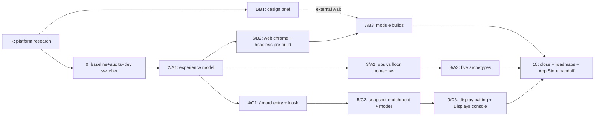

# VetTrack Program — Per-Role UX · Web Management Console · Command Center as Fourth Platform

> **Refined 2026-07-06.** This is a refinement of the owner's draft program plan. Part I (WHY + locked decisions) and the Globally-Frozen list are owner-authored and preserved verbatim in substance — not re-litigated. Part II ground truth was independently re-verified against the code during this refinement; each claim now carries a verification stamp (✅ re-confirmed now / ⚠️ carried from draft, re-verify at phase start). Parts III–IV are tightened for scannability without dropping executable specifics.

**Context — why this program exists.** VetTrack today is an equipment-first PWA wrapped in a Capacitor shell (App Store build 25). The owner wants three things the current single-codebase-stretched-across-viewports approach can't give: (1) genuinely *different* experiences for admin vs floor staff, not hidden menus; (2) the web app repurposed from a mobile mirror into a management console; (3) the equipment board promoted from an in-app page to a standalone always-on display. All of it must protect the shipped mobile app — zero regressions. Longer term this is the cheap-ening groundwork for three distinct native apps and a hospital-management layer (vet + human). This plan lays the foundations; the native rewrite and new domains are owner-gated follow-on programs.

Reading order: **Part I — WHY** · **Part II — GROUND TRUTH** · **Part III — OPERATING RULES** · **Part IV — THE WORK**. Precedence: a rule beats a phase instruction; the Frozen list beats everything; a cited research finding (Phase R) beats any plan text except I.4 and the Frozen list.

---

# Part I — WHY (owner-locked)

## I.1 What prompted this (owner, 2026-07-06)
1. **Per-role UX** — admin and non-admin get different experiences (focus, not hidden menus).
2. **Web = management console** — oversight, configuration, reporting; stops mirroring mobile.
3. **Command Center = fourth platform** — the board becomes a standalone always-on display.
4. **Protect the shipped product** — zero regressions to the live iPhone/iPad app (build 25).

## I.2 North star: three distinct apps
The destination is a **website** (management console), a **TV/big-screen app** (the display), and a **full-native mobile/tablet app** (not a wrapped PWA). Each workstream advances one target:
- **B → website:** console built web-first, standalone-extractable later at no cost.
- **C → TV app:** `/board` gets its own shell, entry, auth, self-healing runtime — a TV app minus final packaging.
- **A → native foundation:** the experience model (Phase 2) is written as **UI-framework-free contracts** (pure TS — no React/DOM/wouter imports) so a Swift/Kotlin implementation can consume it as spec. The costliest part of going native is re-deriving product logic tangled into web UI; this de-tangles it up front.
- **Decision rule:** when two implementations are equally valid, pick the one that moves toward three distinct apps — never one that deepens PWA-in-shell coupling.

## I.3 Product vision: equipment-first → hospital-management layer (vet + human)
The owner is growing this into a management layer solving six field problems. This program lays foundations; each future module is a follow-on.

| # | Problem | Today | What THIS program lays down |
|---|---|---|---|
| 1 | Reception can't cover rush-hour triage | nothing reception-facing | experience-model archetypes + capability contracts let a "reception" archetype slot in without re-architecture; waitlist/staging primitives |
| 2 | Reception closes on manpower gaps | nothing | console IA with room for an intake module; board can carry a waiting-room display |
| 3 | No cross-department platform | realtime outbox/SSE, tasks, shift-chat (clinic-scoped, not department-modeled) | Command Center as shared live surface; console as cross-department oversight |
| 4 | Every patient needs a PMS treatment page | `server/integrations/` adapter layer exists | Integrations & Webhooks console (7b) makes the PMS layer operable/visible |
| 5 | Poor shift handover | shifts, `/handoff`, shift-chat, shift-adjustments | per-role homes surface handover-relevant state at shift edges |
| 6 | Losing money on equipment damage; too little inventory data | THE core: custody, scan/audit, inventory, restock | Command Center visibility, Inventory & Procurement (7d), per-role data access, Ops Health |

Consequences for every phase: **build for growth** (archetypes, capability union, console IA, generic primitives accept new domains as modules, not rewrites); **domain-neutral new code** (vet-only assumptions live only in i18n copy + config — never in identifiers, schemas, or logic); **patient-facing domains stay removed** (migrations 142–143, `docs/scope-change-2026.md`) until an owner-gated follow-on.

## I.4 Locked decisions (not up for re-litigation)
| Decision | Choice |
|---|---|
| Command Center gap | Whole concept: standalone entry + richer data + glanceable under pressure |
| Per-role depth | v1 = ops (admin + lead/senior) vs floor (vet/tech/student); full 5-archetype split in Phase 8 |
| Shift elevation | Capabilities overlay only — home/nav shape follows *permanent* role; "acting as shift lead" badge; no mid-shift reflow |
| Web console access | Admin full; leads read-only; others excluded in v1 |
| TV auth | Interim: admin signs TV in once. Final (Phase 9): pairing code → clinic-scoped read-only display token, revocable from a Displays console page |
| Guardrail | Every phase ends with `pnpm cap:build:native` + iPhone/iPad sim verification. Zero mobile regressions |

---

# Part II — GROUND TRUTH (verified 2026-07-06)

*These facts were re-verified against the code during this refinement. ✅ = independently re-confirmed at file:line during refinement. ⚠️ = carried from the draft; re-verify at the start of the phase that touches it (per III.4). Amendable: Phase R (R.1) or any later research that refutes a claim updates this section — research facts outrank plan text.*

**Platform seam** ✅ `src/app/platform/index.ts` — `PlatformTarget = "mobile" | "desktop" | "marketing"` (line 6); `resolvePlatformTarget()` (line 36) and `usePlatformTarget()` (line 51, returns 62–65) both resolve native → marketing-path → touch-narrow → desktop; `isMarketingPathname()` (line 18) is the single predicate to mirror for `/board`. `PlatformRouter.tsx` is **22 lines** (draft said 23), `mobile → NativeShell`, else passthrough. Adding a fourth target is mechanical. **Pattern validated ✅ (R.1-K1):** resolving a distinct shell by URL path prefix is idiomatic (React Router ships `prefix()`+`layout()` for exactly the marketing/app/kiosk split) — [reactrouter.com/start/framework/routing](https://reactrouter.com/start/framework/routing). *(Web research validates the pattern; the ⚠️ code-fact items below remain code-verification tasks — research does not resolve line numbers or column names.)*

**Role divergence** ✅ Client `UserRole` = 7 values (`src/types/platform.ts:8`, incl. `lead_technician`, `vet_tech`). Server `AuthUser.role` = 5 values (`server/middleware/auth.ts:17`); `normalizeUserRole()` (auth.ts:54–68) collapses `lead_technician`/`vet_tech` → `student` (they fall through to the `return "student"` default at :67). So the API never emits those two values → the client archetype map must be **total over all 7**, and dev-testing the "lead" archetype uses `x-dev-role-override: senior_technician`, "tech" uses `technician`.

**Dev role override** ✅ `x-dev-role-override` / `x-dev-user-id-override` / `x-dev-clinic-id-override` exist in `auth.ts:258–260`, dev-bypass-gated (`resolveAuthModeFromEnv().mode === "dev-bypass"`, :255). `overrideRole` is run through `normalizeUserRole` (:266), and `ensureDevUserRecord` upserts the dev row. Phase 0 adds only a client switcher + a Clerk-inertness test — no server change.

**Role-gating consumers** ✅ (partial) Confirmed `IconSidebar.tsx:36-38` (`useAuth().isAdmin`, `NAV.filter(n => !n.adminOnly || isAdmin)`) and `MoreSheet.tsx:41,69`. ⚠️ Draft also lists `Topbar.tsx:62`, `NativeTabSidebar.tsx:87-91`, `layout.tsx:167,550`, ad-hoc `canAccessCodeBlue` at `layout.tsx:466`, and static `NativeTabBar.tsx` — re-grep `isAdmin|adminOnly|role ===` across `src/` at Phase 2 start to get the exact live set before editing.

**Board route** ✅ `/equipment/board` → `AuthGuard > WebOnlyGuard(fallback="/my-equipment") > WardDisplayPage` (routes.tsx:113); `/display` → `RedirectPreserveSearch to="/equipment/board"` (:122); `/equipment-board` legacy redirect (:123). `/admin` (:152) and `/admin/metrics` (:156) are **not** WebOnlyGuard-fenced (Phase 6 restages); `/audit-log` (:159) is fenced. ⚠️ `display.tsx` internals (line count, `useDisplaySnapshot` 5s/2s poll, own SSE + HTTP replay, `useKioskWakeLock(?kiosk=1)`, `useDisplayHeartbeat`, build-tag + code-blue-seen gossip) are carried from the draft — re-read before the Phase 4 extraction.

**Snapshot service** ✅ `server/services/equipment-command-board.service.ts::buildCommandBoardSnapshot` — single query over `equipment` filtered `status IN (critical, issue, needs_attention)` (:60), already `leftJoin`s `rooms` and selects `roomName` (:52,55). `byLocation` is hardcoded `[]` (:163) — **so Phase 5 populating it needs no new join, only aggregation from rows already fetched.** No power/docks/waitlist/staging blocks. ⚠️ `withTimeout(COMMAND_BOARD_TIMEOUT_MS = 2500)` and the client legacy-list fallback (draft: `routes/display.ts:30,216`, `display.tsx:731`) carried from draft.

**Data for Phase 5** ⚠️ `vt_equipment.isPluggedIn`, `vt_docks`, `vt_staging_queue`, `vt_equipment_waitlist` (draft cites `server/schema/equipment.ts:222,49,233,264`). No battery-% column → v1 power story is plugged/charging/alert only. Re-confirm column names at Phase 5 start.

**Unwired/weak-UI server routes** ⚠️ `integrations.ts`, `webhooks.ts`, `whatsapp.ts`, `admin-outbox-dlq.ts`, `admin-outbox-health.ts`, `rfid.ts`, `push.ts`, `restock.ts` in `server/routes/` (feeds Phases 6–7). Read each handler's actual shape before writing a client (III.4).

**Design inputs** ⚠️ `docs/design-handoff/stages-full/project/` (Stage 1–10 `.dc.html`), `.design-sync/NOTES.md` + `conventions.md`, 111 synced components + Stage 1 tokens in the Claude Design project.

## II.2 Known codebase condition (owner-stated fact)
The repo is **loaded with irrelevant docs, dead code, idea-only flows, and flows that never reach the frontend.** Operate on this always:
- **Existence ≠ relevance.** Before building on ANY existing code, verify the real reachability chain: route registered in `src/app/routes.tsx`? reachable from a nav model / in-app link? API fn actually called from a mounted component? server route in `server/app/routes.ts`? worker in `start-schedulers.ts`? An unreachable flow is an idea — never a contract to preserve, never something to wire into without flagging.
- **Docs are claims; code is truth.** Repo docs are historical claims to verify, not facts to build on.
- **Every dead thing is logged** (classified per `vettrack-codebase-relevance-audit`) and routed per III.5/III.7 — deleted only via the sanctioned clean sub-phase when in-fence, else reported.
- **Baseline map:** Phase 0 produces `docs/audit/RELEVANCE_BASELINE.md`; every later phase consults it, every clean sub-phase updates it.

---

# Part III — OPERATING RULES (apply to every phase without restatement)

**III.1 — Four products, four build paths.** Never one responsive codebase stretched across viewports. Each phase declares its platform(s); designs, components, and verification are platform-specific.
| Platform | What | Build/ship | Design language |
|---|---|---|---|
| iPhone | in-hand ops tool | Capacitor shell, App Store via `scripts/build-native-shell.sh` only | HIG phone: thumb-reach, one-task screens |
| iPad | ops workstation | same shell, distinct tablet compositions (`NativeTabSidebar`, `useIsNativeTablet` master-detail) — not scaled phone | HIG iPad: split view, sidebar, density |
| Web | management console | Vite desktop bundle, ≥1024px, `WebOnlyGuard`-fenced, no native implications | desktop console: tables, drawers, keyboard |
| Board | always-on display | same web bundle, own `BoardShell`: chrome-free, kiosk, wake-lock, self-healing | 3-metre glanceable TV patterns |

*✅ Validated (R.2/R.1): iPad-as-distinct-composition — [Apple HIG Split views](https://developer.apple.com/design/human-interface-guidelines/split-views) (A2); the "not a web wrapper" bar that makes distinct native surfaces a real App-Review-4.2 mitigation — [Apple App Review 4.2](https://developer.apple.com/app-store/review/guidelines/) (A1); console density/tables ≠ mobile mirror — [NN/g desktop tables](https://www.nngroup.com/videos/designing-tables-desktop-apps/) (A5). See `docs/design/platform-strategy-research.md` R.2-1/2.*

**III.2 — 2026 SV-grade UI bar, everywhere.** Every rendered surface (Claude-Design screens AND Claude-Code-composed homes/panels/primitives) clears the repo's anti-template policy (`.claude/rules/ecc/web/design-quality.md`): real hierarchy via scale, spacing rhythm, depth/layering, designed hover/focus/active, semantic color, motion that clarifies. "Works but looks like a default shadcn dashboard" fails the phase like a broken flow. The bar is calibrated by Phase R topic 6's cited references, not taste. Rails that outrank it: clinical/indigo theme + Stage 1 tokens, RTL-Hebrew-first, frozen surfaces.

**III.3 — System-first (engine before suspension).** Orient before touching: at each phase/sub-task, trace the end-to-end path (flow → route → guard → component → API client → server route → service → table → realtime event) and state it in the PR body. Engine (does the capability run / is it reachable / does it lose data) outranks suspension (works, this makes it nicer) — every suggestion declares its layer; suspension work on a broken engine is flagged, not done. Before keeping any edit: what does the running system do differently? If "nothing observable," question it. The system-check unit is a **running platform experience**, not a green unit test on an unreachable page.

**III.4 — Scope containment.** Per-phase **Allowed to touch / DO NOT touch** fences; anything outside → stop and ask. Additive or move-only — no deletions outside the sanctioned clean sub-phase (III.7); "move, not rewrite" must diff clean (only import paths change). Verify before claiming (Read/grep the real symbol before coding against it; run the real gate before reporting done → `docs/audit/PROOF_ALIGNMENT_LOG.md`). No invented surfaces (endpoints, tables, telemetry fields, audit kinds, env vars, deps) beyond the phase spec — if one seems needed, stop and ask. Behavior-preserving phases commit PRE-refactor snapshots first, assert byte-identical after. `git diff --stat` before every commit shows only allowlisted files. No amend/force-push. Frozen-surface tripwire = always an error, never a judgment call. **i18n parity is MUST scope:** every new string in BOTH `he.json` + `en.json` in the same commit (Hebrew is default — a missing he key is a shipped bug); all copy via typed `t` (`@/lib/i18n`), zero hardcoded strings; `pnpm i18n:check` in every gate; new surfaces RTL-verified in Hebrew first.

**III.5 — Improvement-driven reading.** Every opened file is actively evaluated (correctness, perf, security, a11y, RTL/i18n, dead weight, dated patterns, UI datedness, missing tests). A spotted improvement is neither silently implemented (fence) nor dropped — it's surfaced. Format: observed evidence (`file:line`, reproduced where practical) → why it's real (**cited** external source) → proposed change → benefit → cost/risk → engine-or-suspension → in-fence?. Owner routes it (fold in only if in-fence / queue / reject); all accumulate in `docs/audit/IMPROVEMENT_LOG.md`. Frozen surfaces can be *suggested about*, never executed on without an explicit unfreeze.

**III.6 — 100% flow verification, zero-tolerance UX.** `docs/audit/FLOW_INVENTORY.md` (Phase 0, then living): every route × entry point × role × platform, from real reachability, stamped **pass / broken / degraded / unreachable**. Each phase walks every flow its diff can affect end-to-end in the real running app (sim/browser) — never inferred from unit tests. Any-size defect (dead link, mis-truncated Hebrew, sub-44px target, untranslated flash, breakpoint overflow, hung spinner) is a defect: in-fence → fixed before PR; out-of-fence → **blocking finding** for the owner. Phase 10 re-verifies the full inventory on all four platforms.

**III.7 — One PR per phase; clean before opening; babysit to green.** Branch `claude/phase-<n>-<slug>` off the merged default. PR body carries: scope fence, gate results, PROOF_ALIGNMENT_LOG ref, flow-walkthrough results, improvement suggestions, clean-sub-phase report. **Mandatory closing clean sub-phase (before PR opens):** run `vettrack-codebase-relevance-audit` scoped to the phase's touched surface + what it obsoleted; deletion-candidates **created/orphaned by this phase** removed in a separate `chore: clean phase <n>` commit (cross-checked with `pnpm knip` + reference grep + green `typecheck`+`test`); out-of-fence candidates → PR body "Audit findings (not touched)"; update `RELEVANCE_BASELINE.md`. This is the ONE sanctioned deletion path. Babysit: on CI failure diagnose→fix→push; on review comment address or reply with reasoning; ambiguous → ask. **Merge on green — standing permission** (CI green + threads resolved + no conflicts). Next phase branches only from the merged result — no stacked branches.

**III.8 — Standard gate (every phase):**
```
pnpm typecheck && pnpm test
pnpm i18n:check                    # UNCONDITIONAL
pnpm architecture:gates            # if server/module boundaries touched
pnpm tenant:lint:touched           # if new queries added
pnpm cap:build:native && pnpm cap:install:ios-sim
  → iPhone (tab bar, MoreSheet, home, scan, code-blue entry) + iPad (two-pane, NativeTabSidebar, home dashboard)
pnpm test:playwright:phase9        # if realtime/SW/PWA/display touched
pnpm test:playwright:ci            # for web-UI phases
+ III.6 flow walkthrough for every flow the diff can affect
```
Proof → `docs/audit/PROOF_ALIGNMENT_LOG.md`. Gate green locally → PR opens; PR merging green closes the phase.

---

# Part IV — THE WORK

## IV.1 Three tools, one code author
- **Claude Code** (this repo): all implementation, tests, gates, proof. The only code author.
- **Claude Design** (external project; 111 components + Stage 1 tokens synced): produces web-console screen designs — an external dependency in **workstream B only**.
- **Claude Cowork** (owner's workspace, never touches repo): carries briefs from `docs/design/` to Claude Design and returns `.dc.html` into `docs/design-handoff/`; keeps the program board + locked-decisions log + deferred questions; answers escalated III.4/III.5 questions. Claude Code treats Cowork output as owner input via `docs/` or prompts — never a second code author.

**Design handoff loop (B):** Phase 1 authors `docs/design/web-management-brief.md` → owner runs it in Claude Design → screens return as `.dc.html` → Phase 6 pre-builds all headless structure while designs are out → Phase 7 skins each returned design as an independently shippable slice (7a–7e, any order) → re-sync per `.design-sync/NOTES.md` if component surfaces change. Workstreams A and C never wait on Claude Design — they compose already-shipped components.

## IV.2 Architecture keystones (one per workstream)

**A — Role → experience model.** New `src/lib/roles/experience-model.ts`, single client-side source of truth:
- `UserRole` (7) → `ExperienceArchetype: "admin" | "vet" | "lead" | "tech" | "student"` (`senior_technician`+`lead_technician`→lead; `technician`+`vet_tech`→tech). **Total map, no default fallthrough** (II role divergence).
- `RoleExperience = { archetype, homeSurface, nav deltas, capabilities: ReadonlySet<Capability> }`; `Capability` = closed string-literal union (`"codeBlue.manage" | "shiftChat.post" | "equipment.vetActions" | "management.web" | "management.webWrite" | …`) — bounded-enum doctrine. ✅ **Validated (R.1-K3):** a closed capability-union consumed via `can()` is the named cure for the "scattered role checks" anti-pattern — [LogRocket: access-control models for the frontend](https://blog.logrocket.com/choosing-best-access-control-model-frontend/).
- Consumed via new `src/hooks/use-experience.ts` wrapping `useAuth()`. Shift elevation (`roleSource === "shift"`) overlays **capabilities only**, never home/nav shape (I.4).
- Pure TS — no React/DOM/wouter (I.2 portability). **The server stays the enforcement boundary** (`requireAdmin`/`requireEffectiveRole`/evaluators); client shaping is UX only; any NEW server denial ships through the authority-evaluator envelope (`off|shadow|enforce`), shadow-first.

**C — Command Center entry.** Fourth `PlatformTarget "board"`, resolved by path prefix `/board` in **both** `resolvePlatformTarget()` and `usePlatformTarget()` — after `isCapacitorNative()` (native can never hit the TV shell), before touch-narrow (a TV at any viewport gets it). Mirrors the `isMarketingPathname` predicate shape. `PlatformRouter` routes it to new `src/board/BoardShell.tsx`. `/equipment/board` stays during transition; both render the same extracted screen from `src/features/command-board/`.
```
isCapacitorNative()? ──yes→ mobile (NativeShell)        ← native NEVER hits board
      │no
isMarketingPathname()? ─yes→ marketing
      │no
startsWith "/board"? ───yes→ board (BoardShell)         ← NEW, before touch-narrow
      │no
isTouchNarrow()? ──yes→ mobile
      │no
desktop
```

**B — Web management platform.** Keep existing URLs; restage the IA. New management nav model consumed by desktop chrome for `can("management.web")` users (admin full; lead read-only — `management.webWrite` is admin-only). Net-new modules under `/admin/*` and `/ops/*` behind `WebOnlyGuard` + capability gate. All structure pre-built headless (Phase 6) while designs are out.

## IV.3 Phase dependency shape


## IV.4 Phases (III.1–III.8 apply throughout; fences are the III.4 lists)

### Phase R — Foundational research (FIRST, MANDATORY, before any code)
*Establish factual ground for the whole plan. Everything here is a claim until R confirms it; what R refutes, the plan amends. Outputs are execution-easing playbooks, not academic reports.*

> ✅ **EXECUTED 2026-07-06.** Deliverables: `docs/design/plan-validation-register.md` (R.1) and `docs/design/platform-strategy-research.md` (R.2 + R.3 per-phase playbooks) — every claim cited. **Register result:** all 5 keystones + 7 additional assumptions tested; **11 CONFIRMED, 1 ADJUSTED (K4 — display auto-reload), 0 REFUTED, 0 contradicting I.4/Frozen.** Applied amendments are marked ⟲ inline below and collected in the "Phase R amendment log" near the end. A later phase starts by reading its R.3 playbook.
- **R.1 Plan-validation sweep** — one register of every load-bearing assumption, each web-researched and stamped **CONFIRMED / REFUTED / ADJUSTED** with cited sources (e.g. "path-prefix platform target is right for a kiosk shell"; "additive optional snapshot fields are the safe evolution path for a shared type"; "capability unions are how mature products model per-role UX"; "in-app auto-reload on build-tag mismatch is safe for always-on displays"; "pre-building headless before designs return is faster"). Each REFUTED/ADJUSTED row → a **plan amendment proposal** (plan says → research shows [cites] → change → phases affected) routed to the owner via the Wave 1 PR; accepted amendments update the plan + Part II **before** the affected phase starts. Mechanism stays open all program.
- **R.2 Platform-strategy research** — (1) distinct phone-vs-tablet inside one Capacitor shell (HIG, App Review 4.2 pitfalls); (2) console-≠-mobile-mirror (IA, density, tables/drawers, keyboard, RTL consoles); (3) kiosk/wall-display engineering (always-on reliability, wake-lock, auto-recovery, fleet auth/pairing → Phases 4–5,9); (4) per-role adaptive UX in ops/clinical products (→ Phases 2–3,8); (5) full-native migration paths off a Capacitor PWA (incremental native vs SwiftUI/Kotlin rewrite vs RN, real cost/risk → I.2 roadmap); (6) 2026 UI benchmarks with concrete references (→ III.2).
- **R.3 Execution playbooks** — one actionable playbook per downstream phase: validated approach, 2–3 real-team pitfalls + avoidance, references to copy, what NOT to do. Checklists, not essays.
- **Deliverables:** `docs/design/platform-strategy-research.md` (R.2+R.3) and `docs/design/plan-validation-register.md` (R.1). Every claim cited. Findings contradicting frozen surfaces → noted N/A. Method: parallel WebSearch/WebFetch (one per topic) + `apple-platform-ux` skill + `deep-research` skill for contested R.1 rows.
- **Fence:** the two research docs only. Zero code.

### Phase 0 — Baseline: audits, flow inventory, role-testing enabler
- Run + record the full III.8 gate on the default branch — this IS the baseline.
- `vettrack-codebase-relevance-audit` across the whole repo → `docs/audit/RELEVANCE_BASELINE.md` (report-only, no deletions).
- `docs/audit/FLOW_INVENTORY.md` (III.6): every reachable flow per platform × role, walked and stamped.
- Role-testing enabler (no new server override — it exists, II): (1) client dev-role switcher — dev-bypass builds only (`!import.meta.env.VITE_CLERK_PUBLISHABLE_KEY`) attach `x-dev-role-override` from `localStorage` key `vt:devRole` at the shared header-assembly point, plus a tiny switcher in `/settings` gated the same way, inert in Clerk builds; (2) vitest asserting the header is ignored when `resolveAuthModeFromEnv().mode !== "dev-bypass"`; (3) document the collapse pitfall in the helper (test **lead** via `senior_technician`, **tech** via `technician`; do NOT widen `normalizeUserRole`).
- **Allowed:** `src/lib/auth-fetch.ts` (or the one header point in `src/lib/api.ts`), one switcher component under `src/features/settings/`, `src/pages/settings.tsx` (mount only), one new test file, the two audit docs. **DO NOT:** `server/middleware/auth.ts`, `server/lib/auth-mode.ts`, `server/seed.ts`, Clerk provider code.

### Phase 1 (B1) — Web management design brief → Claude Design
- `docs/design/web-management-brief.md`: positioning (web = console), personas (admin full / lead read-only).
- IA spine, one section per module: Management Home (restages `/dashboard`) · People & Roles (`/admin` tabs + `/admin/shifts`) · Equipment Governance (asset-types, docks, readiness rules, folders) · Inventory & Procurement (incl. net-new restock UI) · Integrations & Webhooks (net-new) · Notifications (net-new: whatsapp/push) · RFID Readers (net-new) · Ops Health (net-new: outbox DLQ/health, display heartbeats + future Displays, queue health, `/admin/metrics` restage) · Analytics & Reports (Stage 7 restage) · Audit (Stage 8 restage).
- Per module: exists-vs-net-new table; inputs (Stage 1 tokens, Stage 7/8 `.dc.html`, 111 components, `docs/design-system.md`). Hard constraints stated: Hebrew-default RTL, i18n keys only, compose from existing components, desktop-only ≥1024px, no native implications, frozen surfaces (read-only views over bounded telemetry, no new transport), the III.2 bar with Phase R references as the calibration set. Requested: screens + empty/loading/error states + RTL spot-checks.
- **Fence:** the brief doc only. Zero code.

### Phase 2 (A1) — Role-experience model foundation (behavior-preserving)
*The IV.2-A keystone as a pure refactor — same UI for everyone, new single source underneath; also the I.2 native-spec artifact.*
- New `src/lib/roles/experience-model.ts` (pure TS) + `src/hooks/use-experience.ts` (the only React touchpoint). Initially admin archetype = today's admin view; all others = today's non-admin view.
- **Re-grep `isAdmin|adminOnly|role ===` across `src/` first** to lock the exact live consumer set (II flags the draft's list as partially unverified). Move `adminOnly` filtering behind the experience object in `nav-model.ts` + `native-nav-model.ts`; switch confirmed consumers (`IconSidebar`, `MoreSheet`) and the re-grepped remainder from `isAdmin` to the hook.
- Migrate 2–3 ad-hoc checks to `can()`, behavior-identical: `canAccessCodeBlue` first, then shift-chat posting and equipment vet actions (`src/features/equipment/detail/EquipmentActions.tsx`).
- `tests/experience-model.test.ts`: nav-output snapshots per client `UserRole` (all 7) × platform — fixtures generated from PRE-refactor code, committed first, asserted byte-identical after; shift-overlay tests (capabilities change, nav/home don't).
- **Allowed:** the two new files, the two nav models, the confirmed+re-grepped consumers, test files. **DO NOT:** server enforcement, `use-auth.tsx` contract, home surfaces, route registration, `NativeTabBar.tsx` (stays static this phase).

### Phase 3 (A2) — Per-role nav + home split v1 (ops vs floor)
- `src/pages/home.tsx` currently forks `isNativeTablet ? HomeTabletDashboard : HomePhoneAndDesktop` — add the `homeSurface` fork. Keep the component-level fork pattern (not early returns) to preserve hook order across runtime predicate flips (same reasoning as the file's M3 comment).
- New `src/features/today/surfaces/OpsHomeSurface.tsx` + `FloorHomeSurface.tsx` **composing existing pieces** (hero, quick-scan, urgent chips, tasks preview, `HomeTabletDashboard` internals); iPad variants respect `useIsNativeTablet`. Floor leads with scan/tasks/my-equipment; ops with coverage/readiness/exceptions.
- Nav deltas in the experience model: lead gains `/admin/shifts`; tech/student tab bar emphasizes scan/tasks; student loses code-blue-initiation affordances in nav (server already restricts). i18n `homeSurface.*` (he+en same commit). Deep links to shaped-out surfaces still work (shaping, not fencing).
- Gate adds sim matrix: iPhone + iPad × {admin, senior_technician, technician} via the Phase 0 switcher.
- **Allowed:** `home.tsx` (fork only), new `src/features/today/surfaces/`, `experience-model.ts` (nav deltas), `locales/{he,en}.json`, tests. Surfaces compose — if a card needs a prop, add the prop, don't fork the card. **DO NOT:** route registration, server, any page but `home.tsx`.

### Phase 4 (C1) — `/board`: fourth-platform entry + kiosk hardening
*Give the Command Center its own platform posture without touching its proven data path.*
- `platform/index.ts`: add `"board"` to `PlatformTarget`; add `isBoardPathname()` (prefix `/board`) checked in **both** resolvers after native, before touch-narrow.
- `PlatformRouter.tsx`: `board` → new `src/board/BoardShell.tsx`: dark full-bleed, error boundary resetting to `/board` (not dying), fullscreen on first interaction, unconditional `useKioskWakeLock(true)` **that re-acquires the lock on `visibilitychange`/`pageshow`** (⟲ AMENDED R.1-K4: the wake-lock sentinel is released by the system when the document is hidden or on low power, so a one-shot acquire lets the screen sleep after the first backgrounding — [MDN Screen Wake Lock API](https://developer.mozilla.org/en-US/docs/Web/API/Screen_Wake_Lock_API)), heartbeat `kioskMode: true`.
- Extract from `display.tsx` into `src/features/command-board/` (**move, not rewrite**): presentational tree (`CommandBoard`, `CodeBlueOverlay`, status token maps, skeleton, legacy fallback) AND page-level orchestration (SSE connect/replay, `useDisplaySnapshot`, heartbeat, gossip) as one `CommandBoardScreen`. `WardDisplayPage` becomes a thin wrapper; BoardShell renders the same screen — Phase-9 realtime wiring exists **exactly once**.
- Register `/board` in `routes.tsx`: `AuthGuard` only, **no WebOnlyGuard**. Test: native still resolves `mobile` for `/board`.
- Kiosk split-version: BoardShell auto-reloads on `SW_UPDATED`/build-tag mismatch, guarded by **three** conditions (⟲ AMENDED R.1-K4): (a) the sessionStorage loop-guard from `main.tsx`; (b) only on a **confirmed byte-different** new worker (not on every `update()` tick — `ServiceWorkerRegistration.update()` installs only when the script is not byte-identical); (c) **never while an emergency/Code Blue is on screen — defer the reload until the board returns to calm** (aligns with the plan's "no optimistic termination of emergency state" doctrine). *Rationale:* an unattended wall display can't act on a "prompt to update," so auto-apply is required — but a never-closing kiosk page also risks reload loops and interrupting a live emergency view. This governs only the **new BoardShell reaction** to `SW_UPDATED`; it does **not** touch the frozen SW mechanics. Sources: [Chrome/Workbox — service worker updates](https://developer.chrome.com/docs/workbox/handling-service-worker-updates), [whatwebcando — SW updates](https://whatwebcando.today/articles/handling-service-worker-updates/). Existing telemetry enums only.
- Gate adds phase-9 drills + new Playwright smoke (`/board` renders chrome-free, polls live, heartbeats).
- **Allowed:** `platform/index.ts`, `PlatformRouter.tsx`, new `src/board/`, new `src/features/command-board/` (verbatim moves — moved blocks diff clean), `display.tsx` (shrinks to wrapper), `routes.tsx` (one line), tests. **DO NOT:** `public/sw.js`, SSE internals (`src/lib/realtime.ts`), snapshot semantics/cadence, `server/routes/display.ts`, emergency cache denylist.

### Phase 5 (C2) — Snapshot enrichment + calm/pressure modes
- `shared/equipment-board.ts`: **OPTIONAL additive** fields — `power?` (from `isPluggedIn` + charge-alert; plugged/charging/alert only, no battery %), `docks?`, `waitlist?` (depth), `staging?` (depth). Existing fields untouched (shared type). ✅ **Validated (R.1-K2):** additive optional fields are the textbook backward-compatible schema change — [Confluent schema evolution](https://docs.confluent.io/platform/current/schema-registry/fundamentals/schema-evolution.html). ⟲ **AMENDED (R.1-K2, reinforcement):** the companion **tolerant-reader** requirement is now explicit — the live client must render **gracefully when any new block is `undefined`** and never assume a field exists (the `?`-optional type enforces this at compile time; the panels below must enforce it at render time). This is a strengthening of the panels' contract, not a change to the field design.
- Service: 4 cheap clinicId-filtered aggregates via `Promise.all`, each individually try/caught so one failure degrades only its block to `undefined` (the 2500ms `withTimeout` never trips on partial failure). Optional ~15s in-process per-clinic memo only if measured cost demands (server memo ≠ forbidden client/SW caching).
- **Populate `byLocation` (currently `[]`) from the room join the unit query already does** (`roomName` is already selected — II) — the UI section already renders it.
- `src/features/command-board/`: Power/Docks/Waitlist/Staging panels + `mode = "pressure"` when `activeEmergency` or critical alerts ≥ threshold, ~30s hysteresis. Pressure: emergency block full-bleed, rest → ticker. Calm: readiness, docks/power, waitlist/staging.
- Tests: service fixtures per block + per-block degradation + clinicId scoping + latency guard + hysteresis. i18n (he+en same commit).
- **Allowed:** `shared/equipment-board.ts` (additive `?`-optional only), `equipment-command-board.service.ts`, new panels in `command-board/`, `locales/*`, tests. Every new query filters `clinicId`. **DO NOT:** existing snapshot fields, poll cadence, SSE reconciliation, the `routes/display.ts` timeout envelope.

### Phase 6 (B2) — Web chrome restage + headless pre-build (runs while designs are out)
- New `src/lib/routes/web-management-nav-model.ts` (the Phase 1 IA spine); `IconSidebar`/`Topbar` consume it for `can("management.web")` users; lead sees read-only scope.
- Scaffold routes for net-new modules (`/admin/integrations`, `/admin/webhooks`, `/admin/notifications`, `/admin/rfid-readers`, `/ops/health`): `AuthGuard` + `WebOnlyGuard` + capability gate, structured skeletons (title, table shell, empty state). Also fence `/admin/metrics` (currently unguarded).
- `src/lib/api.ts` + `src/types/`: typed clients for integrations, webhooks, whatsapp, outbox-dlq/health, rfid, restock, push — each written against the **actual route handler** (shapes read, never assumed).
- New `src/desktop/management/` primitives: data-table (sorting/pagination/RTL), detail drawer, config-form scaffold — composed from `components/ui/`, domain-neutral. ✅ **Validated (R.1-K5):** headless-then-skin is the established way to parallelize design and dev against shared tokens — [Martin Fowler: Headless Component](https://martinfowler.com/articles/headless-component.html). ✅ **RTL guidance (R.1-A6):** build with **CSS logical properties** (`margin-inline-start`, `text-align: start`, `border-inline-start`) from the first component so one stylesheet serves both directions; flip directional icons but **not** functionally-directional controls — [SimpleLocalize RTL guide](https://simplelocalize.io/blog/posts/rtl-design-guide-developers/). Density/IA calibration (A5): [NN/g desktop tables](https://www.nngroup.com/videos/designing-tables-desktop-apps/).
- **Allowed:** new nav model, new pages/skeletons, `routes.tsx` (additive lines), `api.ts` + `src/types/` (additive), new `src/desktop/management/`, `IconSidebar`/`Topbar` (rebase on Phase 2's merged result for these two — the one known Wave-2 overlap). **DO NOT:** `src/native/**`, `native-nav-model.ts`, operational page internals, server route logic (read, don't edit).

### Phase 7 (B3) — Module builds as designs return (each independently shippable)
- 7a Management Home + Ops Health (restage `/dashboard`; DLQ/outbox/queue/heartbeat consoles; any new server endpoint appends audit kinds to the closed `AuditActionType` union) · 7b Integrations/Webhooks/Notifications (secrets never round-trip to client) · 7c RFID Readers + Equipment Governance · 7d Inventory & Procurement (restock completion) · 7e Analytics & Audit restage per Stage 7/8.
- **Fence per module:** only its own pages + Phase 6 primitives + its typed client. Implement strictly what the returned design shows — a design gap is an owner question, never a guess. Any new server endpoint is proposed + reviewed against the existing route file before writing.

### Phase 8 (A3) — Full per-role differentiation
- Vet (clinical emphasis: code-blue readiness, vet actions, room radar) · tech (scan/custody throughput) · student (guided, read-mostly — exact scope is a deferred owner question). New surfaces in `src/features/today/surfaces/`, archetype deltas, per-archetype tab-bar order, migrate remaining ad-hoc checks to `can()`.
- **Ad-hoc-check migration enumerated FIRST** (grep `isAdmin|role ===` across `src/`), listed in the commit; each behavior-identical, proven by the extended Phase 2 snapshot suite.
- Any NEW server restriction ships as an evaluator in shadow first (touching only `server/lib/authority/enforcement/` + its wiring call site).
- Gate: sim matrix iPhone + iPad × 5 archetypes (lead via `senior_technician`).
- **Fence:** same shape as Phase 3 (surfaces compose, experience-model deltas only; no route/server edits except the shadow evaluators).

### Phase 9 (C3) — Display-device pairing + Displays console
- `vt_display_devices` (clinicId, name, tokenHash, lastSeenAt, revokedAt) in `server/schema/ops.ts` + migration via `npx drizzle-kit generate`; pairing-code issue/claim endpoints; display-token auth accepting ONLY read-only `GET /api/display/snapshot` + heartbeat + SSE stream for that clinic; `/board/pair` screen; Displays page in Ops Health (list/rename/revoke/heartbeat). Audit kinds appended to the closed union. Security review of token scope before merge.
- **Fence:** the display-token path is a NEW additive resolver branch — `resolveAuthUser` and every existing auth mode stay byte-identical (full existing auth suite green, zero fixture edits). Token denies everything but the three read-only endpoints by default; **deny-list tests written before the allow path**. One new table — no ALTERs to existing tables.

### Phase 10 — Program close: regression, roadmaps, App Store handoff
- Full regression on all gates; **FULL flow-inventory re-verification across all four platforms** — no row closes broken/degraded/unreachable without a recorded owner decision; PROOF_ALIGNMENT_LOG reconciled; design re-sync if component surfaces changed; decide `/equipment/board` → `/board` end-state (owner call).
- **`docs/design/native-migration-roadmap.md`** (serves I.2): recommended path from Phase R topic 5 + what this program made portable (experience model, capability contracts, typed API surface, standalone board shell), staged with cost/risk.
- **`docs/design/product-growth-roadmap.md`** (serves I.3): the six problems → concrete follow-on modules (provided / missing / proposed schema+platform placement / rough cost) so the owner can sequence the next program.
- **`docs/release/cowork-appstore-resubmission-prompt.md`**: ready-to-paste owner prompt, grounded in the real pipeline (verified against the actual scripts first): build only via `pnpm cap:build:native` (bakes `VITE_CLERK_PUBLISHABLE_KEY` + `VITE_API_ORIGIN` from `.env`, never sets `CAPACITOR_SERVER_URL`); `pnpm cap:open:ios`; bump build number past 25; archive+upload via Organizer; App Store Connect steps (what's-new he+en, per-role screenshots); App Review 4.2 notes (real native, not a wrapper) + reviewer account; pre-flight (`pnpm auth:preflight`, `pnpm validate:prod`, sim matrix).
- **Fence:** verification + docs only — no code except the single redirect line IF the owner decides it; every close-out claim cites a command + output in PROOF_ALIGNMENT_LOG.

## IV.5 Sequencing — 4 waves, parallel tracks + parallel review (never skip the gate/clean/PR-green rule)
```
Wave 1:  R ∥ 0 ∥ 1            — research fan-out + baseline/audits + brief; all independent
Wave 2:  [2→3] ∥ [4→5] ∥ [6]  — A, C, B in parallel, worktree-isolated
Wave 3:  7a…7e (as designs return) ∥ 8 ∥ 9
Wave 4:  10                    — regression + roadmaps + handoff
```
- **Wave 1** carries R.1 plan-amendment proposals in its PR; accepted amendments update the plan + Part II **before Wave 2 starts.** Research is bounded to what later phases consume.
- **Wave 2** tracks touch disjoint file sets by design (A: nav models + consumers + home · C: platform router + board + command-board · B: new management scaffolding). Each in an isolated git worktree, own phase PR, serialized merges through the gate. **The ONE known overlap:** `IconSidebar`/`Topbar` (Phase 2 + Phase 6) — Phase 6 rebases on Phase 2's merged result for those two files.
- **Wave 3** 7a–7e independently shippable; 8 and 9 on their own worktrees.
- **Safety under parallelism:** every subagent prompt carries its phase's full fence verbatim; worktree subagents implement, only the main session opens PRs/merges; sim verification (the one serial gate) batches per wave; no two concurrent tracks write the same file (the one exception is sequenced, not shared).

**First execution slice: Wave 1 (R ∥ 0 ∥ 1).**

---

# Globally frozen (overrides everything above — never touched)
SSE transport + outbox cursor · BroadcastChannel envelope · SW emergency-endpoint denylist · `__VT_BUILD_TAG__` mechanics · authority evaluators `off|shadow|enforce` + Strategy A · `AuditActionType` closed union (append-only) · bounded-enum telemetry · `appointmentsPage.*` / `vt_appointments` / `/api/appointments` · he/en parity via typed `t` · clinicId on every query · native builds only via `scripts/build-native-shell.sh`.

# Deferred owner questions (do not block start)
- Battery **percentage** on the board (needs telemetry ingestion — v1 ships plugged/charging/alert only).
- Exact student scope in Phase 8.
- `/equipment/board` end-state (alias vs redirect) — decided at Phase 10.
- Whether Phase 8 mobile surfaces get a second Claude Design brief or compose from Stage 3/4 specs.

# Phase R amendment log (applied 2026-07-06 — owner may veto any row)
> Every amendment Phase R applied to this plan, at a glance. Backing detail + citations in `docs/design/plan-validation-register.md`. Nothing here touches I.4 or the Frozen list. **0 refuted, 0 contradictions flagged for owner decision.**

| # | Phase(s) | Plan said → Research shows → Change applied | Source |
|---|---|---|---|
| A-1 (K4) | Phase 4 | Auto-reload on build-tag mismatch after a safety window → an *unattended* display can't act on an update prompt (so auto-apply is right) but a never-closing kiosk risks reload loops + interrupting a live emergency → **added two guardrails**: reload only on a confirmed byte-different worker, and never while an emergency is on screen (defer to calm), on top of the existing loop-guard | [Chrome/Workbox](https://developer.chrome.com/docs/workbox/handling-service-worker-updates), [MDN update()](https://developer.mozilla.org/en-US/docs/Web/API/ServiceWorkerRegistration/update) |
| A-2 (K4) | Phase 4 | `useKioskWakeLock(true)` (implied one-shot) → the wake-lock sentinel is released by the system when the doc is hidden or on low power → **added: re-acquire the lock on `visibilitychange`/`pageshow`** so the screen doesn't sleep after the first backgrounding | [MDN Screen Wake Lock](https://developer.mozilla.org/en-US/docs/Web/API/Screen_Wake_Lock_API) |
| A-3 (K2) | Phase 5 | Optional additive fields (safe) → the companion tolerant-reader pattern is what *makes* it safe → **added an explicit tolerant-reader requirement**: panels render gracefully when any new block is `undefined`; never assume presence | [Confluent schema evolution](https://docs.confluent.io/platform/current/schema-registry/fundamentals/schema-evolution.html) |
| A-4 (A6) | Phase 6 | Console primitives "with RTL" → **specified the mechanism**: build with CSS logical properties from the first component; flip directional icons but not functionally-directional controls | [SimpleLocalize RTL guide](https://simplelocalize.io/blog/posts/rtl-design-guide-developers/) |

**Confirmations (no change, citation added to the plan):** K1 path-prefix shell (Part II + IV.2-C), K3 capability-union (IV.2-A), K5 headless-first (Phase 6), A1 App-Review-4.2 risk (III.1/Phase 10), A2 iPad-distinct (III.1), A3 pairing-token (Phase 9), A4 role-homes reinforce I.4 (Phase 3/8), A5 console density (III.1/Phase 1/6/7), A7 staged-native (Phase 10). **Surfaced opportunity, NOT applied (exceeds Phase R fence):** Cmd+K command palette as a future console affordance (R.2-6) — owner to route.

# Refinement notes (what changed vs the draft, for the reviewer)
- **Phase R executed (2026-07-06).** Two cited docs added under `docs/design/`; every load-bearing assumption tested (11 CONFIRMED, 1 ADJUSTED, 0 REFUTED). Research-touched claims across Part II / III.1 / IV.2 / Phases 4–6 now carry citations; the 4 applied amendments are marked ⟲ inline and collected in the amendment log above. I.4 and the Frozen list were not touched.
- **Part II re-verified.** Platform seam, role divergence + `normalizeUserRole` collapse, dev-override headers, `IconSidebar`/`MoreSheet` gating, board route + guards, and the snapshot service (incl. the already-present `rooms` join that makes Phase 5's `byLocation` fill a no-new-join change) were independently re-confirmed at file:line today. Claims *not* re-confirmed now are marked ⚠️ with an instruction to re-verify at the owning phase's start — notably the fuller role-consumer list (`Topbar`, `NativeTabSidebar`, `layout.tsx`), `display.tsx` internals, and the Phase 5 schema column names.
- **One drift fixed:** `PlatformRouter.tsx` is 22 lines, not 23 (immaterial to the work).
- **Phase 2 sharpened:** added an explicit "re-grep the live consumer set first" step, since the draft's consumer list is only partially verified.
- **Phase 5 sharpened:** made explicit that `byLocation` needs only aggregation (the `rooms` join and `roomName` selection already exist), not a new query.
- Operating rules III.1–III.8 condensed for scannability; every enforceable specific (fences, gate commands, i18n MUST-scope, clean sub-phase, merge-on-green) retained.

# How to verify this plan hangs together
This is a planning artifact, not code — verification is structural, done by the reviewer:
1. **Ground-truth spot-check:** open any ✅ claim in Part II at the cited file:line and confirm (e.g. `server/middleware/auth.ts:54-68` for the role collapse; `equipment-command-board.service.ts:163` for `byLocation: []`).
2. **Dependency sanity:** confirm the IV.3 graph matches the fences — Phase 4 depends on Phase 2's `PlatformTarget` change; Phase 6 rebases on Phase 2 for `IconSidebar`/`Topbar`; Phase 5 depends on Phase 4's `command-board/` extraction.
3. **Frozen-surface non-collision:** confirm no phase's "Allowed to touch" list intersects the Globally-frozen list (e.g. Phase 4 explicitly excludes `sw.js`, SSE internals, the display timeout envelope).
4. **Amendment gate:** confirm Wave 1's PR is the point where R.1 findings can change Part II before any Wave 2 code — so a refuted assumption never reaches implementation.
5. **Phase R findings:** read `docs/design/plan-validation-register.md` (verdicts + citations) and `docs/design/platform-strategy-research.md` (R.2 findings + R.3 per-phase playbooks). Spot-check any ⟲ AMENDED marker (Phases 4, 5, 6) against its cited source, and confirm each amendment governs only new code — never a Frozen surface (K4 explicitly governs the *new BoardShell reaction* to `SW_UPDATED`, not the frozen SW mechanics). Veto any amendment row directly in the amendment log.
