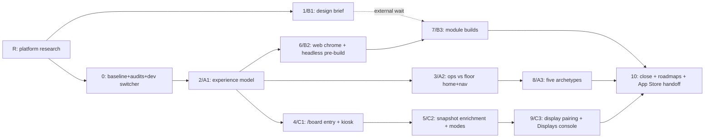

# VetTrack Program — Per-Role UX · Web Management Console · Command Center as Fourth Platform

> **Refined 2026-07-06.** This is a refinement of the owner's draft program plan. Part I (WHY + locked decisions) and the Globally-Frozen list are owner-authored and preserved verbatim in substance — not re-litigated. Part II ground truth was independently re-verified against the code during this refinement; each claim now carries a verification stamp (✅ re-confirmed now / ⚠️ carried from draft, re-verify at phase start). Parts III–IV are tightened for scannability without dropping executable specifics.

**Context — why this program exists.** VetTrack today is an equipment-first PWA wrapped in a Capacitor shell (App Store build 25). The owner wants three things the current single-codebase-stretched-across-viewports approach can't give: (1) genuinely *different* experiences for admin vs floor staff, not hidden menus; (2) the web app repurposed from a mobile mirror into a management console; (3) the equipment board promoted from an in-app page to a standalone always-on display. All of it must protect the shipped mobile app — zero regressions. Longer term this is the cheap-ening groundwork for three distinct native apps and a hospital-management layer (vet + human). This plan lays the foundations; the native rewrite and new domains are owner-gated follow-on programs.

Reading order: **Part I — WHY** · **Part II — GROUND TRUTH** · **Part III — OPERATING RULES** · **Part IV — THE WORK**. Precedence: a rule beats a phase instruction; the Frozen list beats everything; a cited research finding (Phase R) beats any plan text except I.4 and the Frozen list.

---

# Part I — WHY (owner-locked)

## I.1 What prompted this (owner, 2026-07-06)
1. **Per-role UX** — admin and non-admin get different experiences (focus, not hidden menus).
2. **Web = management console** — oversight, configuration, reporting; stops mirroring mobile.
3. **Command Center = fourth platform** — the board becomes a standalone always-on display.
4. **Protect the shipped product** — zero regressions to the live iPhone/iPad app (build 25).

## I.2 North star: three distinct apps
The destination is a **website** (management console), a **TV/big-screen app** (the display), and a **full-native mobile/tablet app** (not a wrapped PWA). Each workstream advances one target:
- **B → website:** console built web-first, standalone-extractable later at no cost.
- **C → TV app:** `/board` gets its own shell, entry, auth, self-healing runtime — a TV app minus final packaging.
- **A → native foundation:** the experience model (Phase 2) is written as **UI-framework-free contracts** (pure TS — no React/DOM/wouter imports) so the native implementation can consume it as spec — concretely the Expo/React-Native app in the sibling repo `exposwifty31/VetTrack---RN-Migration-` consuming `@vettrack/contracts` (authored in-repo at `packages/contracts/`, per `docs/MAINTENANCE_MODE.md`), not an abstract future target. The costliest part of going native is re-deriving product logic tangled into web UI; this de-tangles it up front.
- **Decision rule:** when two implementations are equally valid, pick the one that moves toward three distinct apps — never one that deepens PWA-in-shell coupling.

## I.3 Product vision: equipment-first → hospital-management layer (vet + human)
The owner is growing this into a management layer solving six field problems. This program lays foundations; each future module is a follow-on.

| # | Problem | Today | What THIS program lays down |
|---|---|---|---|
| 1 | Reception can't cover rush-hour triage | nothing reception-facing | experience-model archetypes + capability contracts let a "reception" archetype slot in without re-architecture; waitlist/staging primitives |
| 2 | Reception closes on manpower gaps | nothing | console IA with room for an intake module; board can carry a waiting-room display |
| 3 | No cross-department platform | realtime outbox/SSE, tasks, shift-chat (clinic-scoped, not department-modeled) | Command Center as shared live surface; console as cross-department oversight |
| 4 | Every patient needs a PMS treatment page | `server/integrations/` adapter layer exists | Integrations & Webhooks console (7b) makes the PMS layer operable/visible |
| 5 | Poor shift handover | shifts, `/handoff`, shift-chat, shift-adjustments | per-role homes surface handover-relevant state at shift edges |
| 6 | Losing money on equipment damage; too little inventory data | THE core: custody, scan/audit, inventory, restock | Command Center visibility, Inventory & Procurement (7d), per-role data access, Ops Health |

Consequences for every phase: **build for growth** (archetypes, capability union, console IA, generic primitives accept new domains as modules, not rewrites); **domain-neutral new code** (vet-only assumptions live only in i18n copy + config — never in identifiers, schemas, or logic); **patient-facing domains stay removed** (migrations 142–143, `docs/scope-change-2026.md`) until an owner-gated follow-on.

## I.4 Locked decisions (not up for re-litigation)
| Decision | Choice |
|---|---|
| Command Center gap | Whole concept: standalone entry + richer data + glanceable under pressure |
| Per-role depth | v1 = ops (admin + lead/senior) vs floor (vet/tech/student); full 5-archetype split in Phase 8 |
| Shift elevation | Capabilities overlay only — home/nav shape follows *permanent* role; "acting as shift lead" badge; no mid-shift reflow |
| Web console access | Admin full; leads read-only; others excluded in v1 |
| TV auth | Interim: admin signs TV in once. Final (Phase 9): pairing code → clinic-scoped read-only display token, revocable from a Displays console page |
| Guardrail | Every phase ends with `pnpm cap:build:native` + iPhone/iPad sim verification. Zero mobile regressions |

---

# Part II — GROUND TRUTH (verified 2026-07-06)

*These facts were re-verified against the code during this refinement. ✅ = independently re-confirmed at file:line during refinement. ⚠️ = carried from the draft; re-verify at the start of the phase that touches it (per III.4). Amendable: Phase R (R.1) or any later research that refutes a claim updates this section — research facts outrank plan text.*

**Platform seam** ✅ `src/app/platform/index.ts` — `PlatformTarget = "mobile" | "desktop" | "marketing"` (line 6); `resolvePlatformTarget()` (line 36) and `usePlatformTarget()` (line 51, returns 62–65) both resolve native → marketing-path → touch-narrow → desktop; `isMarketingPathname()` (line 18) is the single predicate to mirror for `/board`. `PlatformRouter.tsx` is **22 lines** (draft said 23), `mobile → NativeShell`, else passthrough. Adding a fourth target is mechanical. **Pattern validated ✅ (R.1-K1):** resolving a distinct shell by URL path prefix is idiomatic (React Router ships `prefix()`+`layout()` for exactly the marketing/app/kiosk split) — [reactrouter.com/start/framework/routing](https://reactrouter.com/start/framework/routing). *(Web research validates the pattern; the ⚠️ code-fact items below remain code-verification tasks — research does not resolve line numbers or column names.)*

**Role divergence** ✅ Client `UserRole` = 7 values (`src/types/platform.ts:8`, incl. `lead_technician`, `vet_tech`). Server `AuthUser.role` = 5 values (`server/middleware/auth.ts:17`); `normalizeUserRole()` (auth.ts:54–68) collapses `lead_technician`/`vet_tech` → `student` (they fall through to the `return "student"` default at :67). So the API never emits those two values → the client archetype map must be **total over all 7**, and dev-testing the "lead" archetype uses `x-dev-role-override: senior_technician`, "tech" uses `technician`.

**Dev role override** ✅ `x-dev-role-override` / `x-dev-user-id-override` / `x-dev-clinic-id-override` exist in `auth.ts:258–260`, dev-bypass-gated (`resolveAuthModeFromEnv().mode === "dev-bypass"`, :255). `overrideRole` is run through `normalizeUserRole` (:266), and `ensureDevUserRecord` upserts the dev row. Phase 0 adds only a client switcher + a Clerk-inertness test — no server change.

**Role-gating consumers** ✅ (partial) Confirmed `IconSidebar.tsx:36-38` (`useAuth().isAdmin`, `NAV.filter(n => !n.adminOnly || isAdmin)`) and `MoreSheet.tsx:41,69`. ⚠️ Draft also lists `Topbar.tsx:62`, `NativeTabSidebar.tsx:87-91`, `layout.tsx:167,550`, ad-hoc `canAccessCodeBlue` at `layout.tsx:466`, and static `NativeTabBar.tsx` — re-grep `isAdmin|adminOnly|role ===` across `src/` at Phase 2 start to get the exact live set before editing.

**Board route** ✅ `/equipment/board` → `AuthGuard > WebOnlyGuard(fallback="/my-equipment") > WardDisplayPage` (routes.tsx:113); `/display` → `RedirectPreserveSearch to="/equipment/board"` (:122); `/equipment-board` legacy redirect (:123). `/admin` (:152) and `/admin/metrics` (:156) are **not** WebOnlyGuard-fenced (Phase 6 restages); `/audit-log` (:159) is fenced. ⚠️ `display.tsx` internals (line count, `useDisplaySnapshot` 5s/2s poll, own SSE + HTTP replay, `useKioskWakeLock(?kiosk=1)`, `useDisplayHeartbeat`, build-tag + code-blue-seen gossip) are carried from the draft — re-read before the Phase 4 extraction.

**Snapshot service** ✅ `server/services/equipment-command-board.service.ts::buildCommandBoardSnapshot` — single query over `equipment` filtered `status IN (critical, issue, needs_attention)` (:60), already `leftJoin`s `rooms` and selects `roomName` (:52,55). `byLocation` is hardcoded `[]` (:163) — **so Phase 5 populating it needs no new join, only aggregation from rows already fetched.** No power/docks/waitlist/staging blocks. ⚠️ `withTimeout(COMMAND_BOARD_TIMEOUT_MS = 2500)` and the client legacy-list fallback (draft: `routes/display.ts:30,216`, `display.tsx:731`) carried from draft.

**Data for Phase 5** ⚠️ `vt_equipment.isPluggedIn`, `vt_docks`, `vt_staging_queue`, `vt_equipment_waitlist` (draft cites `server/schema/equipment.ts:222,49,233,264`). No battery-% column → v1 power story is plugged/charging/alert only. Re-confirm column names at Phase 5 start.

**Unwired/weak-UI server routes** ⚠️ `integrations.ts`, `webhooks.ts`, `whatsapp.ts`, `admin-outbox-dlq.ts`, `admin-outbox-health.ts`, `rfid.ts`, `push.ts`, `restock.ts` in `server/routes/` (feeds Phases 6–7). Read each handler's actual shape before writing a client (III.4).

**Design inputs** ⚠️ `docs/design-handoff/stages-full/project/` (Stage 1–10 `.dc.html`), `.design-sync/NOTES.md` + `conventions.md`, 111 synced components + Stage 1 tokens in the Claude Design project.

## II.2 Known codebase condition (owner-stated fact)
The repo is **loaded with irrelevant docs, dead code, idea-only flows, and flows that never reach the frontend.** Operate on this always:
- **Existence ≠ relevance.** Before building on ANY existing code, verify the real reachability chain: route registered in `src/app/routes.tsx`? reachable from a nav model / in-app link? API fn actually called from a mounted component? server route in `server/app/routes.ts`? worker in `start-schedulers.ts`? An unreachable flow is an idea — never a contract to preserve, never something to wire into without flagging.
- **Docs are claims; code is truth.** Repo docs are historical claims to verify, not facts to build on.
- **Every dead thing is logged** (classified per `vettrack-codebase-relevance-audit`) and routed per III.5/III.7 — deleted only via the sanctioned clean sub-phase when in-fence, else reported.
- **Baseline map:** Phase 0 produces `docs/audit/RELEVANCE_BASELINE.md`; every later phase consults it, every clean sub-phase updates it.

---

# Part III — OPERATING RULES (apply to every phase without restatement)

**III.1 — Four products, four build paths.** Never one responsive codebase stretched across viewports. Each phase declares its platform(s); designs, components, and verification are platform-specific.
| Platform | What | Build/ship | Design language |
|---|---|---|---|
| iPhone | in-hand ops tool | Capacitor shell, App Store via `scripts/build-native-shell.sh` only | HIG phone: thumb-reach, one-task screens |
| iPad | ops workstation | same shell, distinct tablet compositions (`NativeTabSidebar`, `useIsNativeTablet` master-detail) — not scaled phone | HIG iPad: split view, sidebar, density |
| Web | management console | Vite desktop bundle, ≥1024px, `WebOnlyGuard`-fenced, no native implications | desktop console: tables, drawers, keyboard |
| Board | always-on display | same web bundle, own `BoardShell`: chrome-free, kiosk, wake-lock, self-healing | 3-metre glanceable TV patterns |

*✅ Validated (R.2/R.1): iPad-as-distinct-composition — [Apple HIG Split views](https://developer.apple.com/design/human-interface-guidelines/split-views) (A2); the "not a web wrapper" bar that makes distinct native surfaces a real App-Review-4.2 mitigation — [Apple App Review 4.2](https://developer.apple.com/app-store/review/guidelines/) (A1); console density/tables ≠ mobile mirror — [NN/g desktop tables](https://www.nngroup.com/videos/designing-tables-desktop-apps/) (A5). See `docs/design/platform-strategy-research.md` R.2-1/2.*

**III.2 — 2026 SV-grade UI bar, everywhere.** Every rendered surface (Claude-Design screens AND Claude-Code-composed homes/panels/primitives) clears the repo's anti-template policy (`.claude/rules/ecc/web/design-quality.md`): real hierarchy via scale, spacing rhythm, depth/layering, designed hover/focus/active, semantic color, motion that clarifies. "Works but looks like a default shadcn dashboard" fails the phase like a broken flow. The bar is calibrated by Phase R topic 6's cited references, not taste. Rails that outrank it: clinical/indigo theme + Stage 1 tokens, RTL-Hebrew-first, frozen surfaces.

**III.3 — System-first (engine before suspension).** Orient before touching: at each phase/sub-task, trace the end-to-end path (flow → route → guard → component → API client → server route → service → table → realtime event) and state it in the PR body. Engine (does the capability run / is it reachable / does it lose data) outranks suspension (works, this makes it nicer) — every suggestion declares its layer; suspension work on a broken engine is flagged, not done. Before keeping any edit: what does the running system do differently? If "nothing observable," question it. The system-check unit is a **running platform experience**, not a green unit test on an unreachable page.

**III.4 — Scope containment.** Per-phase **Allowed to touch / DO NOT touch** fences; anything outside → stop and ask. Additive or move-only — no deletions outside the sanctioned clean sub-phase (III.7); "move, not rewrite" must diff clean (only import paths change). Verify before claiming (Read/grep the real symbol before coding against it; run the real gate before reporting done → `docs/audit/PROOF_ALIGNMENT_LOG.md`). No invented surfaces (endpoints, tables, telemetry fields, audit kinds, env vars, deps) beyond the phase spec — if one seems needed, stop and ask. Behavior-preserving phases commit PRE-refactor snapshots first, assert byte-identical after. `git diff --stat` before every commit shows only allowlisted files. No amend/force-push. Frozen-surface tripwire = always an error, never a judgment call. **i18n parity is MUST scope:** every new string in BOTH `he.json` + `en.json` in the same commit (Hebrew is default — a missing he key is a shipped bug); all copy via typed `t` (`@/lib/i18n`), zero hardcoded strings; `pnpm i18n:check` in every gate; new surfaces RTL-verified in Hebrew first.

**III.5 — Improvement-driven reading.** Every opened file is actively evaluated (correctness, perf, security, a11y, RTL/i18n, dead weight, dated patterns, UI datedness, missing tests). A spotted improvement is neither silently implemented (fence) nor dropped — it's surfaced. Format: observed evidence (`file:line`, reproduced where practical) → why it's real (**cited** external source) → proposed change → benefit → cost/risk → engine-or-suspension → in-fence?. Owner routes it (fold in only if in-fence / queue / reject); all accumulate in `docs/audit/IMPROVEMENT_LOG.md`. Frozen surfaces can be *suggested about*, never executed on without an explicit unfreeze.

**III.6 — 100% flow verification, zero-tolerance UX.** `docs/audit/FLOW_INVENTORY.md` (Phase 0, then living): every route × entry point × role × platform, from real reachability, stamped **pass / broken / degraded / unreachable**. Each phase walks every flow its diff can affect end-to-end in the real running app (sim/browser) — never inferred from unit tests. Any-size defect (dead link, mis-truncated Hebrew, sub-44px target, untranslated flash, breakpoint overflow, hung spinner) is a defect: in-fence → fixed before PR; out-of-fence → **blocking finding** for the owner. Phase 10 re-verifies the full inventory on all four platforms. **Named risk (external review 2026-07-07):** green CI ≠ working runtime — the suite is largely static-analysis style (`docs/testing-guide.md` self-describes it so), so the live walk is the only proof a flow actually runs. The owner accepted skipping the Phase 0 live walk; **the Phase-10 four-platform re-verification was executed green 2026-07-16** (the backstop is now cashed — see the IV.4 reconciliation banner and `docs/audit/FLOW_INVENTORY.md`), and any Phase-9-adjacent (realtime/PWA/display) change still requires its browser/sim verification per III.8.

**III.7 — One PR per phase; clean before opening; babysit to green.** Branch `claude/phase-<n>-<slug>` off the merged default. PR body carries: scope fence, gate results, PROOF_ALIGNMENT_LOG ref, flow-walkthrough results, improvement suggestions, clean-sub-phase report. **Mandatory closing clean sub-phase (before PR opens):** run `vettrack-codebase-relevance-audit` scoped to the phase's touched surface + what it obsoleted; deletion-candidates **created/orphaned by this phase** removed in a separate `chore: clean phase <n>` commit (cross-checked with `pnpm knip` + reference grep + green `typecheck`+`test`); out-of-fence candidates → PR body "Audit findings (not touched)"; update `RELEVANCE_BASELINE.md`. This is the ONE sanctioned deletion path. Babysit: on CI failure diagnose→fix→push; on review comment address or reply with reasoning; ambiguous → ask. **Merge on green — standing permission** (CI green + threads resolved + no conflicts). Next phase branches only from the merged result — no stacked branches.

**III.8 — Standard gate (every phase):**
```
pnpm typecheck && pnpm test
pnpm i18n:check                    # UNCONDITIONAL
pnpm architecture:gates            # if server/module boundaries touched
pnpm tenant:lint:touched           # if new queries added
pnpm cap:build:native && pnpm cap:install:ios-sim
  → iPhone (tab bar, MoreSheet, home, scan, code-blue entry) + iPad (two-pane, NativeTabSidebar, home dashboard)
pnpm test:playwright:phase9        # if realtime/SW/PWA/display touched
pnpm test:playwright:ci            # for web-UI phases
+ III.6 flow walkthrough for every flow the diff can affect
```
Proof → `docs/audit/PROOF_ALIGNMENT_LOG.md`. Gate green locally → PR opens; PR merging green closes the phase.

**III.9 — Zero unresolved warnings.** *Scope: not a single warn remains unresolved.* Every gate and CI run — typecheck, lint, `architecture:gates` (dependency-cruiser / cycle baseline), `knip`, tests, build — must end with **zero live warnings**, not merely zero errors. A warning is dispositioned like an error: fixed in-fence, or (owner-signed) moved to the documented baseline with a cited reason. "Green with warnings" is not a close-out state. A phase that surfaces a pre-existing warning **in its touched surface** clears it in-fence; an out-of-fence pre-existing warning is recorded in the PR body under "Audit findings (not touched)" (III.7) and flagged for the owner (III.6 shape) — never left silent. No PR opens while its gate prints a warning it has not dispositioned.

---

# Part IV — THE WORK

## IV.1 Three tools, one code author
- **Claude Code** (this repo): all implementation, tests, gates, proof. The only code author.
- **Claude Design** (external project; 111 components + Stage 1 tokens synced): produces web-console screen designs — an external dependency in **workstream B only**.
- **Claude Cowork** (owner's workspace, never touches repo): carries briefs from `docs/design/` to Claude Design and returns `.dc.html` into `docs/design-handoff/`; keeps the program board + locked-decisions log + deferred questions; answers escalated III.4/III.5 questions. Claude Code treats Cowork output as owner input via `docs/` or prompts — never a second code author.

**Design handoff loop (B):** Phase 1 authors `docs/design/web-management-brief.md` → owner runs it in Claude Design → screens return as `.dc.html` → Phase 6 pre-builds all headless structure while designs are out → Phase 7 skins each returned design as an independently shippable slice (7a–7e, any order) → re-sync per `.design-sync/NOTES.md` if component surfaces change. Workstreams A and C never wait on Claude Design — they compose already-shipped components.

## IV.2 Architecture keystones (one per workstream)

**A — Role → experience model.** New `src/lib/roles/experience-model.ts`, single client-side source of truth:
- `UserRole` (7) → `ExperienceArchetype: "admin" | "vet" | "lead" | "tech" | "student"` (`senior_technician`+`lead_technician`→lead; `technician`+`vet_tech`→tech). **Total map, no default fallthrough** (II role divergence).
- `RoleExperience = { archetype, homeSurface, nav deltas, capabilities: ReadonlySet<Capability> }`; `Capability` = closed string-literal union (`"codeBlue.manage" | "shiftChat.post" | "equipment.vetActions" | "management.web" | "management.webWrite" | …`) — bounded-enum doctrine. ✅ **Validated (R.1-K3):** a closed capability-union consumed via `can()` is the named cure for the "scattered role checks" anti-pattern — [LogRocket: access-control models for the frontend](https://blog.logrocket.com/choosing-best-access-control-model-frontend/).
- Consumed via new `src/hooks/use-experience.ts` wrapping `useAuth()`. Shift elevation (`roleSource === "shift"`) overlays **capabilities only**, never home/nav shape (I.4).
- Pure TS — no React/DOM/wouter (I.2 portability). **The server stays the enforcement boundary** (`requireAdmin`/`requireEffectiveRole`/evaluators); client shaping is UX only; any NEW server denial ships through the authority-evaluator envelope (`off|shadow|enforce`), shadow-first.

**C — Command Center entry.** Fourth `PlatformTarget "board"`, resolved by path prefix `/board` in **both** `resolvePlatformTarget()` and `usePlatformTarget()` — after `isCapacitorNative()` (native can never hit the TV shell), before touch-narrow (a TV at any viewport gets it). Mirrors the `isMarketingPathname` predicate shape. `PlatformRouter` routes it to new `src/board/BoardShell.tsx`. `/equipment/board` stays during transition; both render the same extracted screen from `src/features/command-board/`.
```
isCapacitorNative()? ──yes→ mobile (NativeShell)        ← native NEVER hits board
      │no
isMarketingPathname()? ─yes→ marketing
      │no
startsWith "/board"? ───yes→ board (BoardShell)         ← NEW, before touch-narrow
      │no
isTouchNarrow()? ──yes→ mobile
      │no
desktop
```

**B — Web management platform.** Keep existing URLs; restage the IA. New management nav model consumed by desktop chrome for `can("management.web")` users (admin full; lead read-only — `management.webWrite` is admin-only). Net-new modules under `/admin/*` and `/ops/*` behind `WebOnlyGuard` + capability gate. All structure pre-built headless (Phase 6) while designs are out.

## IV.3 Phase dependency shape

```mermaid
graph LR
  PR[R: platform research] --> P0
  PR --> P1
  P0[0: baseline+audits+dev switcher] --> P2[2/A1: experience model]
  P1[1/B1: design brief] -.external wait.-> P7[7/B3: module builds]
  P2 --> P3[3/A2: ops vs floor home+nav]
  P2 --> P4[4/C1: /board entry + kiosk]
  P4 --> P5[5/C2: snapshot enrichment + modes]
  P2 --> P6[6/B2: web chrome + headless pre-build]
  P6 --> P7
  P3 --> P8[8/A3: five archetypes]
  P5 --> P9[9/C3: display pairing + Displays console]
  P7 --> P10[10: close + roadmaps + App Store handoff]
  P8 --> P10
  P9 --> P10
```

## IV.4 Phases (III.1–III.8 apply throughout; fences are the III.4 lists)

> **Reconciliation status — 2026-07-16 (git-verified; supersedes the stale per-phase markers).** The program is *built*. Phases R–9 all shipped July 6–12 (PRs cited below); the original per-phase markers were stale (only P3 was flagged). **What changed 2026-07-16:** Phase 10's headline verification bar — the **4-platform `FLOW_INVENTORY` live-walk** — was executed **green on all four surfaces** (web+board **147 rows / 145 pass / 0 broken / 2 degraded** across 5 roles; native **iPhone 68/68**; native **iPad 68/68** — evidence in `docs/audit/evidence/flow-walk-*-2026-07-16.*`), and **docking P3 merged** (#106). Those were the two open items on the prior reconciliation's gate. **What remains is the actual App Store resubmit** — the repo is prepared at **build 26**; the App Store live build is still **25**.
>
> | Phase | Status | Evidence |
> |---|---|---|
> | R · research | ✅ done | 2 research docs (`plan-validation-register.md`, `platform-strategy-research.md`) |
> | 0 · baseline/audits | ✅ done | role switcher + `FLOW_INVENTORY.md`; **live-walk executed 2026-07-16** |
> | 1 · web brief | ✅ done | brief + `design_handoff_web_console/` |
> | 2 · experience model | ✅ done | #50, #51 |
> | 3 · home split | ✅ done | #53, #91 |
> | 4 · `/board` platform | ✅ done | #55 (`src/board/BoardShell.tsx`, `PlatformTarget "board"`) |
> | 5 · snapshot modes | ✅ done | #56 (`power?/docks?/waitlist?/staging?` additive fields) |
> | 6 · web console | ✅ done | #52 (`web-management-nav-model.ts`, `src/desktop/management/`) |
> | 7 · module builds (7a–7f) | ✅ done | #58–#69 |
> | 7S · god-file split | ✅ mostly | #70 (detail page split) |
> | 7R · remediation | ✅ done | #61/#71–#74; **R1 flow-walk executed 2026-07-16** |
> | 8 · full per-role | ✅ done · ⚠️ student scope = deferred owner-Q | 5 archetype home surfaces wired (`FloorHomeSurface` forks vet/tech/student); caps fully differentiated (`student = tech − WITHHELD`) |
> | 9 · display pairing | ✅ done | #75 (`vt_display_devices`, `/board/pair`, display-token auth) |
> | 10 · program close | ✅ verification DONE (2026-07-16) · ⚠️ **resubmit not shipped** (repo build 26; store build 25) | roadmaps #76/#78/#80/#83; 4-platform walk green |
>
> **Operative gate to resubmission — now 1 item.** The prior four-step gate is down to its last: (1) ~~land docking P3~~ **✅ #106**; (2) ~~4-platform `FLOW_INVENTORY` live-walk~~ **✅ green 2026-07-16** (branch `claude/flow-walk-fixes` → PR #109 — 1 app defect fixed, 2 findings deferred, 0 broken); (3) ~~fix walk failures~~ **✅ 0 broken rows**; (4) **run `docs/release/cowork-appstore-resubmission-prompt.md`** — archive + upload **build 26** via Xcode → App Store Connect. That step was previously blocked on a GitLab push + a build device (see `project_appstore_resubmission` / `project_transformation_state`); it is the only owner/device action between here and a submitted build. **Post-P0–10 tracks (outside this numbering):** docking-first-class (separate plan — P4/charging still open) + the Consolidated Audit × 10x program.

### Phase 7S (Structural) — Equipment god-file decomposition (behavior-preserving) — ✅ MOSTLY (#70 — detail page)
*Added 2026-07-08 (owner-approved during the pre-Phase-7 cleanup). `server/routes/equipment.ts` (~1.05k LOC) and `src/pages/equipment-detail.tsx` (~2k LOC) mix concerns and make every equipment change high-risk. Scheduled as its own phase — deliberately NOT folded into Phase 7 or the cleanup — so it stays a clean, reviewable, behavior-preserving refactor.*
- Execute per [`docs/architecture/equipment-god-files-split-plan.md`](architecture/equipment-god-files-split-plan.md) (route slices + page-component extraction) and its companion `equipment-inline-mutations-inventory.md`. **Do not start without product sign-off on the paused inline mutations** (per that inventory).
- **Move, not rewrite:** each extraction diffs clean (only import paths + file boundaries change); assert byte-identical behavior via the existing equipment test suite + a PRE-refactor snapshot. No new endpoints, no semantic changes.
- **Sweep the pre-Phase-7-cleanup residue while here:** the now-unreachable server `POST/DELETE /api/equipment/:id/procedure-bind` route + the orphaned `operationalState.procedureBind*` / `stagingQueue.bindToHospitalization*` locale keys (the cleanup's Group B removed only the client dead-end).
- **Sequencing:** after Phase 7's module builds by default (7c/7d also touch equipment surfaces — avoid a concurrent-edit collision); owner may resequence. Own branch + PR; gate = full III.8.
- **Fence:** `server/routes/equipment.ts`, `src/pages/equipment-detail.tsx`, and the new extracted modules only. DO NOT change equipment behavior, any frozen surface, or any other page.

### Phase 10 — Program close: regression, roadmaps, App Store handoff — ✅ VERIFICATION DONE (4-platform walk green 2026-07-16; roadmaps #76/#78/#80/#83) · ⚠️ resubmit NOT shipped (repo build 26; store build 25)
> **Status (2026-07-16):** the three deliverable docs exist (`native-migration-roadmap.md`, `product-growth-roadmap.md`, `cowork-appstore-resubmission-prompt.md`); the canonical `/equipment/board`→`/board` end-state was decided (#78); and the headline bar — **full four-platform flow-inventory re-verification** — is **executed green** (web+board 147 rows / 145 pass / 0 broken / 2 degraded across 5 roles; native iPhone + iPad 68/68 each; evidence in `docs/audit/evidence/`, rows stamped in `FLOW_INVENTORY.md`, account in `PROOF_ALIGNMENT_LOG.md`). **The only open item is the resubmit itself** — archive+upload the prepared build 26 via Xcode → App Store Connect (owner/device action; see `cowork-appstore-resubmission-prompt.md`). The 2 degraded rows (shift-chat archive 404) + the auth-resilience finding are logged as follow-ups, non-blocking.
- Full regression on all gates; **FULL flow-inventory re-verification across all four platforms** — no row closes broken/degraded/unreachable without a recorded owner decision; PROOF_ALIGNMENT_LOG reconciled; design re-sync if component surfaces changed; decide `/equipment/board` → `/board` end-state (owner call).
- **`docs/design/native-migration-roadmap.md`** (serves I.2): recommended path from Phase R topic 5 + what this program made portable (experience model, capability contracts, typed API surface, standalone board shell), staged with cost/risk — mapped to the **existing** downstream (`exposwifty31/VetTrack---RN-Migration-` Expo/RN app consuming the in-repo `@vettrack/contracts`, per `docs/MAINTENANCE_MODE.md`), so the roadmap targets a real consumer, not a greenfield.
- **`docs/design/product-growth-roadmap.md`** (serves I.3): the six problems → concrete follow-on modules (provided / missing / proposed schema+platform placement / rough cost) so the owner can sequence the next program.
- **`docs/release/cowork-appstore-resubmission-prompt.md`**: ready-to-paste owner prompt, grounded in the real pipeline (verified against the actual scripts first): build only via `pnpm cap:build:native` (bakes `VITE_CLERK_PUBLISHABLE_KEY` + `VITE_API_ORIGIN` from `.env`, never sets `CAPACITOR_SERVER_URL`); `pnpm cap:open:ios`; bump build number past 25; archive+upload via Organizer; App Store Connect steps (what's-new he+en, per-role screenshots); App Review 4.2 notes (real native, not a wrapper) + reviewer account; pre-flight (`pnpm auth:preflight`, `pnpm validate:prod`, sim matrix).
- **Fence:** verification + docs only — no code except the single redirect line IF the owner decides it; every close-out claim cites a command + output in PROOF_ALIGNMENT_LOG.

## IV.5 Sequencing — 4 waves, parallel tracks + parallel review (never skip the gate/clean/PR-green rule)
```
Wave 1:  R ∥ 0 ∥ 1            — research fan-out + baseline/audits + brief; all independent
Wave 2:  [2→3] ∥ [4→5] ∥ [6]  — A, C, B in parallel, worktree-isolated
Wave 3:  7a…7e (as designs return) ∥ 8 ∥ 9
Wave 4:  10                    — regression + roadmaps + handoff
```
- **Wave 1** carries R.1 plan-amendment proposals in its PR; accepted amendments update the plan + Part II **before Wave 2 starts.** Research is bounded to what later phases consume.
- **Wave 2** tracks touch disjoint file sets by design (A: nav models + consumers + home · C: platform router + board + command-board · B: new management scaffolding). Each in an isolated git worktree, own phase PR, serialized merges through the gate. **The ONE known overlap:** `IconSidebar`/`Topbar` (Phase 2 + Phase 6) — Phase 6 rebases on Phase 2's merged result for those two files.
- **Wave 3** 7a–7e independently shippable; 8 and 9 on their own worktrees.
- **Safety under parallelism:** every subagent prompt carries its phase's full fence verbatim; worktree subagents implement, only the main session opens PRs/merges; sim verification (the one serial gate) batches per wave; no two concurrent tracks write the same file (the one exception is sequenced, not shared).

**First execution slice: Wave 1 (R ∥ 0 ∥ 1).**

---

# Globally frozen (overrides everything above — never touched)
SSE transport + outbox cursor · BroadcastChannel envelope · SW emergency-endpoint denylist · `__VT_BUILD_TAG__` mechanics · authority evaluators `off|shadow|enforce` + Strategy A · `AuditActionType` closed union (append-only) · bounded-enum telemetry · `appointmentsPage.*` / `vt_appointments` / `/api/appointments` · he/en parity via typed `t` · clinicId on every query · native builds only via `scripts/build-native-shell.sh`.

# Deferred owner questions (do not block start)
- Battery **percentage** on the board (needs telemetry ingestion — v1 ships plugged/charging/alert only).
- Exact student scope in Phase 8.
- `/equipment/board` end-state (alias vs redirect) — decided at Phase 10.
- Whether Phase 8 mobile surfaces get a second Claude Design brief or compose from Stage 3/4 specs.
- ~~`--status-stale` color (design drift A3)~~ — **RESOLVED 2026-07-08 (no longer deferred):** purple `#AF52DE` adopted and shipped in the pre-Phase-7 cleanup (`src/index.css` light `279 68% 60%` / dark `279 70% 70%` + `-bg/-fg/-border`; Tailwind maps `stale: hsl(var(--status-stale))`). Ended the M3 two-ambers collision; 7c/7e palette unblocked. Decision record: Group E commit + the token.
- **Postgres RLS as the tenancy security boundary** (external review 2026-07-07): today `clinicId` is application-layer + a `tenant:lint` CI gate; there is **zero RLS** in the DB. RLS is a legitimate defense-in-depth upgrade — but it is an owner-gated **hardening program**, not part of this UX/console/board work, and it must **never** be pulled into a UX phase (`clinicId on every query` is Frozen; changing the security boundary is a dedicated, separately-reviewed effort). *Reconfirmed owner-gated 2026-07-08 (pre-Phase-7 cleanup — verified not Phase-7-blocking, left as its own program).*
- **Worker "second backend" boundary** (external review 2026-07-07): `server/workers/` is large (13 workers, ~50 scheduler starts) and trending toward a second backend. A maintainability follow-on (decomposition / clearer ownership) — captured in the Phase 10 product-growth-roadmap; Phase 7a Ops Health is the observability down-payment, not the fix. *Reconfirmed owner-gated 2026-07-08 (pre-Phase-7 cleanup — own effort, not this cleanup).*
- **Phase 3 nav deltas deferred (opened 2026-07-07, owner-confirmed defer):** the Phase-3 spec listed three nav deltas; **#2 (tech/student scan/tasks emphasis) shipped in-fence** as the FloorHomeSurface composition. **#1 (lead gains `/admin/shifts`)** and **#3 (student loses code-blue *initiation* in nav)** are **out of the Phase-3 fence** — #1 needs a per-node reach-cap gate spanning `nav-model.ts` + `native-nav-model.ts` + `layout.tsx` **plus** a rewrite of the byte-identical `filterAdminNav` parity test (granting `lead` `app.adminNav` would over-grant the whole admin section); #3's only honest consumer is an Initiate control on `code-blue.tsx` (nav-entry gating over-removes the student's *view* of an active emergency). Both are dormant seams without their consumers (III.3). Route to the phase that owns the nav models (or Phase 8 full differentiation), NOT a capability-only stub now. Do **not** grant `lead` `app.adminNav`.
- **Ops-tile source convergence (opened 2026-07-07, owner chose in-fence reimplementation):** the ops CoverageCard/ExceptionsTile/ReadinessTile were reimplemented under `src/features/today/surfaces/ops/` because `HomeTabletDashboard.tsx` (their inline, un-exported origin) is out of the Phase-3 fence. The **data is single-sourced** (shared react-query cache); only the render helpers duplicate. Convergence = a behavior-preserving, `data-testid`-stable extraction in `HomeTabletDashboard.tsx` so iPad-ops and phone/desktop-ops share one source — a small follow-up when a phase legitimately owns that file.
- **Ops "staffing" coverage (opened 2026-07-07):** the ops CoverageCard ships as **fleet** coverage (availability %/ready/not-ready/items-out/in-use — fully data-backed). True clinic-wide *staffing* ("who is on shift now") is not in any existing read (`HomeDashboardPulse.shift` is the caller's own roster shift) → needs a new server field, out of the Phase-3 server fence. i18n copy is written to fleet language so nothing over-promises.

# Phase R amendment log (applied 2026-07-06 — owner may veto any row)
> Every amendment Phase R applied to this plan, at a glance. Backing detail + citations in `docs/design/plan-validation-register.md`. Nothing here touches I.4 or the Frozen list. **0 refuted, 0 contradictions flagged for owner decision.**

| # | Phase(s) | Plan said → Research shows → Change applied | Source |
|---|---|---|---|
| A-1 (K4) | Phase 4 | Auto-reload on build-tag mismatch after a safety window → an *unattended* display can't act on an update prompt (so auto-apply is right) but a never-closing kiosk risks reload loops + interrupting a live emergency → **added two guardrails**: reload only on a confirmed byte-different worker, and never while an emergency is on screen (defer to calm), on top of the existing loop-guard | [Chrome/Workbox](https://developer.chrome.com/docs/workbox/handling-service-worker-updates), [MDN update()](https://developer.mozilla.org/en-US/docs/Web/API/ServiceWorkerRegistration/update) |
| A-2 (K4) | Phase 4 | `useKioskWakeLock(true)` (implied one-shot) → the wake-lock sentinel is released by the system when the doc is hidden or on low power → **added: re-acquire the lock on `visibilitychange`/`pageshow`** so the screen doesn't sleep after the first backgrounding | [MDN Screen Wake Lock](https://developer.mozilla.org/en-US/docs/Web/API/Screen_Wake_Lock_API) |
| A-3 (K2) | Phase 5 | Optional additive fields (safe) → the companion tolerant-reader pattern is what *makes* it safe → **added an explicit tolerant-reader requirement**: panels render gracefully when any new block is `undefined`; never assume presence | [Confluent schema evolution](https://docs.confluent.io/platform/current/schema-registry/fundamentals/schema-evolution.html) |
| A-4 (A6) | Phase 6 | Console primitives "with RTL" → **specified the mechanism**: build with CSS logical properties from the first component; flip directional icons but not functionally-directional controls | [SimpleLocalize RTL guide](https://simplelocalize.io/blog/posts/rtl-design-guide-developers/) |

**Confirmations (no change, citation added to the plan):** K1 path-prefix shell (Part II + IV.2-C), K3 capability-union (IV.2-A), K5 headless-first (Phase 6), A1 App-Review-4.2 risk (III.1/Phase 10), A2 iPad-distinct (III.1), A3 pairing-token (Phase 9), A4 role-homes reinforce I.4 (Phase 3/8), A5 console density (III.1/Phase 1/6/7), A7 staged-native (Phase 10). **Surfaced opportunity, NOT applied (exceeds Phase R fence):** Cmd+K command palette as a future console affordance (R.2-6) — owner to route.

# Refinement notes (what changed vs the draft, for the reviewer)
- **Phase R executed (2026-07-06).** Two cited docs added under `docs/design/`; every load-bearing assumption tested (11 CONFIRMED, 1 ADJUSTED, 0 REFUTED). Research-touched claims across Part II / III.1 / IV.2 / Phases 4–6 now carry citations; the 4 applied amendments are marked ⟲ inline and collected in the amendment log above. I.4 and the Frozen list were not touched.
- **Part II re-verified.** Platform seam, role divergence + `normalizeUserRole` collapse, dev-override headers, `IconSidebar`/`MoreSheet` gating, board route + guards, and the snapshot service (incl. the already-present `rooms` join that makes Phase 5's `byLocation` fill a no-new-join change) were independently re-confirmed at file:line today. Claims *not* re-confirmed now are marked ⚠️ with an instruction to re-verify at the owning phase's start — notably the fuller role-consumer list (`Topbar`, `NativeTabSidebar`, `layout.tsx`), `display.tsx` internals, and the Phase 5 schema column names.
- **One drift fixed:** `PlatformRouter.tsx` is 22 lines, not 23 (immaterial to the work).
- **Phase 2 sharpened:** added an explicit "re-grep the live consumer set first" step, since the draft's consumer list is only partially verified.
- **Phase 5 sharpened:** made explicit that `byLocation` needs only aggregation (the `rooms` join and `roomName` selection already exist), not a new query.
- Operating rules III.1–III.8 condensed for scannability; every enforceable specific (fences, gate commands, i18n MUST-scope, clean sub-phase, merge-on-green) retained.

# External review reconciliation (ChatGPT architecture report, 2026-07-07)
> An outside-in architecture report (ChatGPT, from public GitHub artifacts + owner description) was reviewed against the code on 2026-07-07. It cites only 4 files + "what you described," and visibly inferred architecture from **dead code** (`server/integrations/conflicts/*`, unwired) and **removed scope** (billing/medication) — so its specifics are low-confidence. It mostly *validates* the architecture; the actionable signal is small. Nothing below changes I.4, the Frozen list, or Phases 1–9.

| Report claim | Verdict | Evidence | Disposition |
|---|---|---|---|
| Static tests > behavioral/runtime | ✅ real, self-admitted | `docs/testing-guide.md` ("static-analysis style — read source files and assert structural properties"); green CI ≠ working runtime | Already the point of **III.6** (reinforced there); owner's live-walk skip recorded as an accepted trade-off |
| App-layer tenancy → add Postgres RLS | ✅ real, out of scope | zero RLS in `migrations/`/`server/`; `clinicId` app-layer + `tenant:lint` gate, and Frozen | → Deferred owner question (hardening program; never a UX phase) |
| Worker = "second backend" | ✅ real, out of scope | 13 workers, ~50 scheduler starts in `start-schedulers.ts` | → Deferred (maintainability follow-on); Phase 7a Ops Health = observability down-payment |
| Capacitor near limit; Expo/RN next | ✅ real, documented | `MAINTENANCE_MODE.md` → `VetTrack---RN-Migration-` + in-repo `@vettrack/contracts` | Already I.2 + Phase 10 roadmap (now names the real target) |
| Complexity vs solo-maintainability | ⚠️ heed | program adds surface on a "production monolith" repo | Posture note below |
| billing/medication live; append-only events | ❌ stale | `src/app/routes.tsx:180–188` — all redirects; removed June 2026 (`scope-change-2026.md`) | ignore |
| "Last Writer Wins; data loss possible" | ❌ wrong | `src/lib/sync-engine.ts:175,395–416` — conflict detect → payload → conflict store + telemetry (optimistic concurrency, not silent overwrite) | ignore |
| "redocking" domain; `integrations/conflicts` engine | ❌ invented / dead code | 0 hits for `redock*`; `integrations/conflicts/*` unwired (knip-flagged) | ignore |

**Bottom line:** two findings deserve weight (behavioral-testing gap, native migration) and both are already in the plan's DNA; two are legitimate-but-out-of-scope hardening items (RLS, worker split) routed to Deferred; the rest are stale, wrong, or generic.

**Maintainability posture (the report's "solo-dev survivability" caution).** The tension is real — this program *adds* surface (4th platform, per-role, console). But its design deliberately *lowers* future maintenance cost rather than raising it: I.2 framework-free portable contracts (consumed by `VetTrack---RN-Migration-`), Phase 6 headless pre-build (each returning design is a skinning pass, not a rebuild), additive-only fences (III.4), and per-phase clean sub-phases that shrink the II.2 clutter measurably. **Doc reconciliation flagged (owner):** `docs/MAINTENANCE_MODE.md` frames this repo as frozen "maintenance mode," which no longer matches an active 10-phase program — it should be updated when the owner is ready (flagged here, not silently changed).

# Design-return reconciliation (Web console Phase-1 handoff, 2026-07-07)
> Phase 1's designs returned and were **verified against live source** (see the Phase 1 status marker + PROOF_ALIGNMENT_LOG 2026-07-07). This reconciles the returned deliverable with the Phase 6/7 build plan. **No phase is restructured and nothing becomes an atomic "build-the-console" batch** — the implementation was always Phase 6 (headless pre-build) → Phase 7 (per-module skinning, 7a–7e *each independently shippable*). Two rational adjustments + the verified build constraints:

**1. Module → Phase-7 slice map.** The returned deliverable has **10** modules; the slice list named nine — **People & Roles was missing** (it is an existing-`/admin` restage, so it slipped the net-new enumeration). Full map:

| Slice | Modules | Note |
|---|---|---|
| 7a | Management Home · Ops Health | `/dashboard` restage + DLQ/outbox/heartbeat consoles |
| 7b | Integrations · Webhooks · Notifications | secrets never round-trip; **outbound webhook delivery is a future surface** (B2) |
| 7c | RFID Readers · Equipment Governance | **readiness rules blocked on schema** (B1) |
| 7d | Inventory & Procurement | restock completion |
| 7e | Analytics & Reports · Audit | Stage 7/8 restage |
| **7f** | **People & Roles** | **added** — restage existing `/admin` tabs + `/admin/shifts` (already split shell + per-tab sections, PR #47) into the console shell; lower-risk existing-surface restage, independently shippable |

**2. Build against verified code, never the mock's literal values** (`DESIGN_SYNC_FLAGS.md` §4 — all confirmed accurate against source):
- **A3 `--status-stale`** — OPEN owner decision (see Deferred questions). Bind to whatever token ships; never hardcode the mock's purple. Gates 7c + 7e palette.
- **A4 i18n** — no `console.*` keys exist. Add the `console.*` namespace (he+en, parity) and **generalize the existing keyed relative-time formatter** (`src/features/alerts/hooks/use-alerts-controller.ts:16`; a second lives at `src/lib/utils.ts:27`) — do not author a third. Applies to every slice.
- **B1 readiness rules** — net-new governed entity: **no `vt_` table, no closed-union audit kind** (adjacent `equipment_readiness_state_changed` is a state kind, not rule governance). 7c must land a schema migration + append `AuditActionType` members FIRST; do not assume it is modeled.
- **B2 integrations** — no Provet adapter. Bind cards to the **adapter registry** (`generic-pms` + `chameleon/priza/smartflow` stubs + flag-gated `vendor-x`), not a vendor name. Webhooks are **inbound-only** (`server/integrations/webhooks/inbound.router.ts`) — the outbound-delivery UI in 7b is a future surface, not a wireable one.
- **B3 / B4 illustrative ids** — DLQ job ids (7a) key off real BullMQ job names (`server/app/start-schedulers.ts`); audit target/entity ids (7e) key off real entities. Audit **kinds** already map to the real closed union.
- **Repo-side residues** (DM Mono font, Tailwind `--tw-*` bundle noise) tracked in `.design-sync/NOTES.md` → "Known design-system-check flags"; neither blocks console UI work. The Tailwind-scoping fix is an EDIT-tier re-sync build change (A2), not a phase.

**Net effect on sequencing:** unchanged. Wave 1 (R ∥ 0 ∥ 1) is **complete**; Wave 2 opens with **Phase 2** (the A-keystone that P3/P4/P6 depend on). Phase 7's external-design wait is now satisfied, but Phase 7 still gates on Phase 2 (`IconSidebar`/`Topbar`) + Phase 6 (headless scaffold), so it stays in Wave 3.

# How to verify this plan hangs together
This is a planning artifact, not code — verification is structural, done by the reviewer:
1. **Ground-truth spot-check:** open any ✅ claim in Part II at the cited file:line and confirm (e.g. `server/middleware/auth.ts:54-68` for the role collapse; `equipment-command-board.service.ts:163` for `byLocation: []`).
2. **Dependency sanity:** confirm the IV.3 graph matches the fences — Phase 4 depends on Phase 2's `PlatformTarget` change; Phase 6 rebases on Phase 2 for `IconSidebar`/`Topbar`; Phase 5 depends on Phase 4's `command-board/` extraction.
3. **Frozen-surface non-collision:** confirm no phase's "Allowed to touch" list intersects the Globally-frozen list (e.g. Phase 4 explicitly excludes `sw.js`, SSE internals, the display timeout envelope).
4. **Amendment gate:** confirm Wave 1's PR is the point where R.1 findings can change Part II before any Wave 2 code — so a refuted assumption never reaches implementation.
5. **Phase R findings:** read `docs/design/plan-validation-register.md` (verdicts + citations) and `docs/design/platform-strategy-research.md` (R.2 findings + R.3 per-phase playbooks). Spot-check any ⟲ AMENDED marker (Phases 4, 5, 6) against its cited source, and confirm each amendment governs only new code — never a Frozen surface (K4 explicitly governs the *new BoardShell reaction* to `SW_UPDATED`, not the frozen SW mechanics). Veto any amendment row directly in the amendment log.
