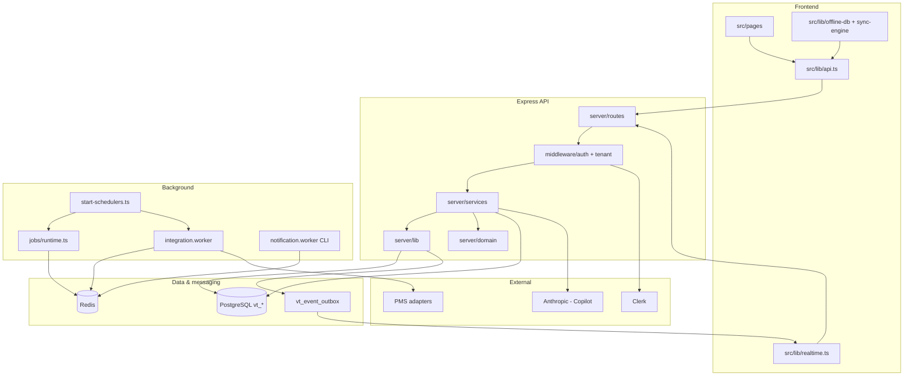

# VetTrack — Architecture Map

**Phase:** 1 — Repository Intelligence  
**Generated:** 2026-06-18  
**Governor:** Product Engineering Governor  
**Prerequisite:** [`PRODUCT_MODEL.md`](./PRODUCT_MODEL.md)  
**Inventories:** [`docs/audit/db.md`](../audit/db.md) (62 tables), [`docs/audit/routes.md`](../audit/routes.md) (~239 route pairs), [`docs/audit/frontend-routes.md`](../audit/frontend-routes.md)

---

## System overview

VetTrack is a **monolithic full-stack application**: React 18 PWA frontend + Express API + PostgreSQL (Drizzle) + Redis/BullMQ workers + Clerk auth. Deployed primarily on **Railway**. Multi-tenant via `clinicId` on every tenant table.

```
┌─────────────────────────────────────────────────────────────────────────┐
│  Clients                                                                 │
│  Browser PWA · Capacitor iOS/Android · Ward kiosk (/equipment/board)    │
└───────────────────────────────┬─────────────────────────────────────────┘
                                │ HTTPS (src/lib/api.ts)
                                ▼
┌─────────────────────────────────────────────────────────────────────────┐
│  Express (server/index.ts)                                               │
│  helmet · cors · clerk · json+xss · rate limits · i18n · tenant context  │
│  registerApiRoutes() · webhooks · rfid · static dist/public              │
└───────┬─────────────────────────────┬───────────────────────────────────┘
        │                             │
        ▼                             ▼
┌───────────────┐             ┌───────────────────┐
│  PostgreSQL   │             │  Redis (BullMQ)    │
│  vt_* tables  │             │  job runtime       │
│  migrations/  │             │  worker heartbeats │
└───────────────┘             └───────────────────┘
        ▲                             ▲
        │                             │
┌───────┴─────────────────────────────┴───────────────────────────────────┐
│  Background layer (server/app/start-schedulers.ts)                       │
│  SSE outbox publisher · integration worker · equipment TTL workers ·     │
│  Code Blue reconciliation · job runtime (charge-alert, expiry, …)        │
│  CLI: pnpm worker → notification.worker.ts (separate process)            │
└─────────────────────────────────────────────────────────────────────────┘
```

---

## Domains

| Domain | Schema module | Primary routes | Services / lib | Frontend |
|--------|---------------|----------------|----------------|----------|
| **Core / tenancy** | `core.ts` | `users.ts`, `health.ts` | `auth.ts`, `tenant-context.ts` | `AuthGuard`, Clerk hooks |
| **Equipment ops** | `equipment.ts` | `equipment.ts`, `equipment-operational-state.ts`, `returns.ts`, `rooms.ts`, `folders.ts`, `activity.ts`, `alert-acks.ts`, `operational-metrics.ts`, `equipment-copilot.ts`, `rfid.ts` | `equipment-*.service.ts`, `equipment-waitlist-promotion.ts`, `domain/equipment/` | `/equipment/*`, `/rooms`, `/alerts`, `/my-equipment` |
| **Emergency** | `er.ts` | `code-blue.ts`, `crash-cart.ts` | `code-blue-*.ts`, authority evaluators | `/code-blue`, `/crash-cart`, `/equipment/board` |
| **Tasks** | `tasks.ts` | `appointments.ts`, `tasks.ts` | `appointments.service.ts`, `task-*.service.ts` | `/equipment/tasks` (`appointments.tsx`) |
| **Shifts & clinical** | `ops.ts` | `shifts.ts`, `clinical-check-in.ts`, `shift-chat.ts` | `clinical-check-in.ts`, `authority.ts`, `role-resolution.ts` | `/home`, `/admin/shifts`, shift chat FAB |
| **Inventory** | `inventory.ts` | `containers.ts`, `dispense.ts`, `restock.ts`, `inventory-items.ts`, `procurement.ts` | `inventory.service.ts`, `dispense.service.ts`, `restock.service.ts`, `shadow-inventory.service.ts` | `/inventory`, `/procurement` |
| **Integrations** | `integrations.ts` | `integrations.ts`, `integration-webhooks/*` | `server/integrations/*` | Admin integration UI (via API) |
| **Realtime / ops** | `ops.ts` (`vt_event_outbox`) | `realtime.ts`, `display.ts` | `event-publisher.ts`, `realtime-outbox.ts` | `src/lib/realtime.ts`, ward board |
| **Platform infra** | `ops.ts` | `push.ts`, `audit-logs.ts`, `metrics.ts`, `queue.ts`, `storage.ts`, `uploads.ts`, `support.ts` | `audit.ts`, `metrics.ts`, `push.ts` | Settings, audit log |
| **Admin / tooling** | — | `admin-outbox-*`, `admin-task-ownership.ts`, `cursor-bug-fixer.ts`, `stability.ts`, `analytics.ts` | `cursor-bug-fixer.service.ts`, `outcome-kpi-roi.service.ts` | `/admin`, `/analytics`, `/dashboard` |
| **Notifications** | `ops.ts` | — (push routes only) | `notification.worker.ts` (CLI), `role-notification-scheduler.ts` | Push subscription UI |

---

## Route registration map

**Registry:** `server/app/routes.ts` → `registerApiRoutes()` in five groups:

1. **Infrastructure** — users, realtime, queue, metrics, storage, uploads, push, support, audit-logs, integrations, test, health  
2. **Equipment core** — equipment (+ copilot nested), operational-state, operational-metrics, rooms, folders, returns, alert-acks, activity, home, display (also `/api/equipment-board`)  
3. **Safety** — code-blue, crash-cart  
4. **Admin config** — outbox health/DLQ, task ownership, cursor-bug-fixer, stability  
5. **Platform** — platform capabilities, analytics, shifts, appointments, tasks, containers, restock, inventory-items, procurement, clinical check-in, dispense, shift-chat, whatsapp  

**Also mounted from `server/index.ts` (not in `routes.ts`):**

- `POST /api/webhooks/clerk`
- `POST /api/integration-webhooks/:adapterId`
- `/api/rfid` (via `mountRfidRoutes`)
- Early `/api/health` (pre-middleware stack)

**Mount order is significant** — equipment router before copilot; bare `/api` mounts for operational-state/metrics immediately after `/api/equipment`.

---

## Service layer

`server/services/` — **22 async function modules** (no service classes). `clinicId` passed explicitly.

| Service | Responsibility |
|---------|----------------|
| `equipment-operational-state.service.ts` | Multi-axis equipment state mutations |
| `equipment-waitlist.service.ts` | Waitlist CRUD + promotion coordination |
| `equipment-custody-toggle.service.ts` | Checkout/custody flows |
| `equipment-readiness-rules.service.ts` | Readiness rule evaluation |
| `equipment-command-board.service.ts` | Ward/command board data assembly |
| `appointments.service.ts` | Unified task CRUD + start/complete (on `vt_appointments`) |
| `task-intelligence.service.ts` | Task recommendations |
| `task-recall.service.ts` | Task dashboard / recall |
| `task-automation.service.ts` | Automation rules for tasks |
| `clinical-check-in.ts` | Clinical check-in/out authority path |
| `dispense.service.ts` | Dispense draft/confirm/emergency + emergency scan |
| `inventory.service.ts` | Container/item operations |
| `restock.service.ts` | Restock session flows |
| `shadow-inventory.service.ts` | Shadow inventory reconciliation scheduler |
| `asset-copilot-orchestrator.service.ts` | Copilot explain orchestration |
| `asset-copilot-resolve.service.ts` | Evidence graph resolution for copilot |
| `operational-metrics.service.ts` | Operational metrics aggregation |
| `outcome-kpi-roi.service.ts` | Analytics ROI (billing-oriented; ER metrics stubbed) |
| `user-sync.service.ts` | Clerk → `vt_users` sync |
| `account-deletion.service.ts` | Account soft-delete |
| `system-health-monitor.ts` | In-process health monitoring |
| `cursor-bug-fixer.service.ts` | Cursor Cloud Agents dispatch (admin) |

**Domain layer (emerging):** `server/domain/equipment/` — evidence graph, copilot validators, deployability resolver. `server/domain/service-task.adapter.ts` — appointment ↔ service-task shape adapter.

---

## Shared modules

| Location | Role |
|----------|------|
| `shared/` | Cross-cutting types: authority, equipment-truth, waitlist, code-blue, permissions, emergency manifest, contracts (copilot, cursor-bug-fixer) |
| `lib/i18n/` | Server i18n loader + middleware; paired with `locales/en.json`, `locales/he.json` |
| `@vettrack/contracts` | External package from `exposwifty31/literate-dollop` — offline/emergency surface parity |
| `server/db.ts` | Drizzle pool + re-exports all schema |
| `server/lib/authority/` | `resolveAuthority()` + 6 evaluator families (`off \| shadow \| enforce`) |
| `server/lib/audit.ts` | Closed `AuditActionType` union + `logAudit()` |
| `server/lib/event-publisher.ts` | Outbox poll loop → SSE `EventEmitter` |
| `server/lib/metrics.ts` | Closed counter union |
| `src/lib/api.ts` | **Single client API surface** (~2,376 lines) |
| `src/lib/offline-db.ts` | Dexie schema (versions 3–4) |
| `src/lib/sync-engine.ts` | Offline mutation FIFO + circuit breaker |
| `src/lib/realtime.ts` | SSE client, replay, BroadcastChannel gossip |
| `src/lib/offline-emergency-block.ts` | Code Blue offline denylist |

---

## Data flow (critical paths)

### 1. Authenticated API request

```
Client request()
  → auth headers (Clerk / dev-bypass)
  → Express global middleware (limiter, i18n, tenantContext, sessionContextMiddleware)
  → route handler (requireAuth / requireRole / requireEffectiveRole)
  → service function (clinicId explicit)
  → db.transaction (optional)
      → domain write
      → insertRealtimeDomainEvent (same tx when required)
      → logAudit (tx variant when must commit together)
  → JSON response (apiError envelope on failure)
```

### 2. Realtime propagation

```
Domain mutation (in tx)
  → insertRealtimeDomainEvent → vt_event_outbox
  → startEventOutboxPublisher (750ms poll)
  → outboxEmitter → SSE /api/realtime/stream (per clinic)
  → Client useRealtimeReconciliation (visibility, online, BFCache)
  → BroadcastChannel cursor gossip (cross-tab)
```

### 3. Equipment checkout → waitlist promotion

```
POST /api/equipment/:id/checkout | return | dock-return
  → equipment route / operational-state service
  → vt_equipment state update
  → equipment-waitlist-promotion (on return)
  → push via sendPushToUser (locale from resolve-user-locale / waitlist helper)
  → outbox event for ward board
```

### 4. Code Blue (online-only)

```
POST /api/code-blue/sessions|logs|end|presence
  → classifyEmergencyEndpoint blocks offline queue in api.ts
  → code-blue routes + authority evaluators (enforce path may deny)
  → server-confirmed session end (no optimistic UI terminate)
  → SSE + keepalive reconciliation
```

### 5. Integration sync

```
Cron / manual ops / webhook
  → integration.worker (BullMQ)
  → adapter (generic-pms, priza, vendor-x, local-sandbox)
  → vt_integration_sync_log + conflict engine
  → encrypted credentials via credential-manager
```

### 6. Background jobs (BullMQ job runtime)

```
startJobRuntime()
  → charge-alert (delayed on return isPluggedIn=false)
  → expiry-check (cron 08:00)
  → stale-checkin-sweep (cron)
```

**Separate process:** `pnpm worker` → `notification.worker.ts` (Redis heartbeat `vettrack:worker:heartbeat`); **not** started from `start-schedulers.ts`.

---

## Dependency graph (logical)



---

## External integrations

| System | Entry point | Notes |
|--------|-------------|-------|
| **Clerk** | `middleware/auth.ts`, `routes/webhooks.ts` | Production auth; dev-bypass when keys unset |
| **PostgreSQL** | `server/db.ts`, `migrations/` | Migrations run at boot (`runMigrations`) before schedulers |
| **Redis** | `server/lib/redis.ts` | Optional in dev; production expects queues |
| **Railway** | `deploy.sh`, CI deploy job | Primary hosting |
| **PMS vendors** | `server/integrations/adapters/*` | generic-pms, priza, vendor-x, stubs, local-sandbox |
| **Anthropic** | `server/lib/anthropic-client.ts` | Asset Copilot explain |
| **Web Push (VAPID)** | `server/lib/push.ts` | Subscriptions in `vt_push_subscriptions` |
| **WhatsApp** | `routes/whatsapp.ts` | Alert ingress |
| **RFID hardware** | `routes/rfid.ts`, `lib/rfid-ingest.ts` | Equipment location reads |
| **Cursor Cloud Agents** | `cursor-bug-fixer.service.ts` | Admin dispatch only |
| **Sentry** | `server/instrument.js` | Error telemetry |
| **@vettrack/contracts** | `package.json` github dep | Cross-repo mobile/offline contract parity |

---

## Frontend architecture

| Layer | Location | Notes |
|-------|----------|-------|
| Router | `src/app/routes.tsx` | Wouter; lazy pages; legacy redirects to equipment canonicals |
| Pages | `src/pages/` (39 route modules) | Thin route shells |
| Features | `src/features/` | shift-chat, auth, containers/dispense, restock reducer |
| Components | `src/components/` | shadcn/ui primitives + domain components |
| Hooks | `src/hooks/` | auth, push, offline sync, realtime reconciliation |
| State | TanStack Query (`queryClient.ts`) + Dexie for offline | Query keys in `src/lib/query-keys/` |

**Canonical user paths:** `/equipment`, `/equipment/tasks`, `/equipment/board` (see scope-change redirects).

---

## Middleware stack (order-sensitive)

`server/index.ts` (abbreviated):

1. `env-bootstrap` → `validateEnv` → migrations at boot  
2. Health (early)  
3. `helmet`, `cors`, `compression`, `clerkMiddleware` (conditional)  
4. Webhooks (raw body paths before JSON)  
5. `express.json` + recursive `xss()`  
6. `globalApiLimiter`, `i18nMiddleware`, `tenantContext`, `sessionContextMiddleware`  
7. `registerApiRoutes(app)`  
8. Static `dist/public` (production)  

Per-route: `requireAuth`, `requireRole`, `requireEffectiveRole`, `idempotencyMiddleware`, equipment replay idempotency, container dispense idempotency, authority middleware on clinical mutations.

---

## Architectural drift signals

| Signal | Evidence |
|--------|----------|
| **Scope-change residue** | `appointments` API/table vs user-facing "Tasks"; `animalId`/`ownerId` still in create schemas; `shared/er-types.ts` ROI fields reference removed ER concepts |
| **Stub workers still registered** | `procedureBoundReleaseWorker` (no-op post-hospitalization removal); `inventory-deduction.worker` (no-op); both tick in `start-schedulers` / job runtime |
| **Dual task APIs** | `/api/appointments` (CRUD) vs `/api/tasks` (start/complete/dashboard) — same `appointments.service` backend, split client contract |
| **`vt_tasks` vs `vt_appointments`** | `vt_tasks` = lightweight operational task log inserts (dispense/containers); `vt_appointments` = unified staff Tasks — naming collision risk |
| **Pilot mode removed but build-info still references** | `resolveBackendPilotMode` / `resolveFrontendPilotMode` in `server/index.ts` imports |
| **Handoff naming** | `/handoff` page = `ShiftSummarySheet` (equipment shift summary), not removed ER shift-handover product |
| **Design system doc stale** | `docs/design-handoff/.../README.md` still lists patients, medication tasks, ER command center |
| **Integrations guide stale** | References `vt_animals`, `vt_billing_ledger` sync columns post-142 |
| **Notification worker split** | API process runs BullMQ; push fan-out worker is separate CLI — Railway worker service may not run `notification.worker` (see `docs/evidence/demo-2026-05-28/worker-health-investigation.md`) |

---

## Duplicate domains

| Overlap | Details |
|---------|---------|
| **Tasks surface** | `appointments.ts` routes + `tasks.ts` routes + `task-automation.service` + `task-ownership` admin queue + `vt_tasks` operational log |
| **Display / board** | `/api/display` and `/api/equipment-board` both use `createDisplayRouter()` |
| **Health mounts** | `/api/health`, `/api/health/ready`, `/health` — intentional redundancy for probes |
| **Location aliases** | `/rooms` and `/locations` frontend routes → same pages |
| **Code Blue legacy paths** | `/emergency-equipment-*`, `/critical-kit-check` aliases in `routes.tsx` |
| **Circuit breakers** | `server/lib/circuit-breaker.ts` vs `server/integrations/resilience/circuit-breaker.ts` |
| **i18n loaders** | `lib/i18n/` (server) vs `src/lib/i18n.ts` (client re-export) — intentional split |

---

## Dead features & stubs

| Surface | Status |
|---------|--------|
| ER mode, patient UI, billing UI, pharmacy forecast | Removed; SPA redirects to `/equipment` or `/equipment/tasks` |
| `inventory-deduction.worker` | No-op; queue module retained for registry parity |
| `procedureBoundReleaseWorker` | No-op interval (hospitalization column removed) |
| `evaluateDispenseAgainstOrders` | Always returns empty blocks |
| `pilot-mode.ts` | Deleted; routes unconditional |
| `pnpm sync:formulary` | Removed |
| `/api/stability` | Dev/stability tooling; low product traffic |
| `/api/test/*` | Test-only scheduler triggers |
| `vt_tasks` | Narrow insert-only audit trail; not the staff Tasks UI model |

---

## Orphaned / low-reference modules

| Module | Concern |
|--------|---------|
| `server/lib/er-mode-permissions.ts` | ER removed — verify remaining callers |
| `shared/handoff-debt.ts` | Naming tied to removed handover product |
| `server/routes/stability.ts` | Stability runner — dev/ops only |
| `server/services/outcome-kpi-roi.service.ts` | ROI metrics partially orphaned (ER triage fields) |
| `src/pages/handoff.tsx` | Active route but equipment shift summary only — easy to confuse with removed ER handover |
| Feature-scoped code in `src/features/` | Only 4 feature folders; most UI lives in `src/pages/` + `src/components/` (inconsistent modularization) |

---

## Tight coupling hotspots

| Hotspot | Size / pattern | Risk |
|---------|----------------|------|
| **`server/routes/equipment.ts`** | ~5,620 lines | Single file owns checkout, waitlist hooks, scans, NFC, seen events, board inputs — high change blast radius |
| **`src/lib/api.ts`** | ~2,376 lines | All client-server contracts; knip dead-export gate |
| **`server/lib/metrics.ts`** | Closed union + large switch | Every new telemetry surface touches client + server |
| **`server/lib/audit.ts`** | Closed `AuditActionType` | Same as metrics — coordinated changes |
| **Authority evaluators** | 6 families × wiring in routes | Clinical mutations must respect enforce/shadow/off per clinic |
| **Realtime frozen contract** | Outbox + SSE + SW denylist + BC gossip | Phase 9 regression cost on any transport touch |
| **appointments.service.ts** | Shared by appointments + tasks routes | Task and appointment semantics entangled |

---

## Ownership ambiguity

| Area | Ambiguity |
|------|-----------|
| **Equipment vs operational-state** | Routes split across `equipment.ts`, `equipment-operational-state.ts`, and services — no single owner file |
| **Tasks naming** | Product says Tasks; code says appointments; `vt_tasks` is a third concept |
| **Mobile** | Capacitor in-repo vs Expo in `literate-dollop` — contracts in external repo |
| **CI ownership** | GitHub Actions (`.github/workflows/`) |
| **Worker deployment** | `start-schedulers` in API process vs `pnpm worker` notification process vs Railway worker service config |
| **Integrations** | `server/integrations/` is well-factored; `server/routes/integrations.ts` is large catch-all API |
| **Domain layer adoption** | `server/domain/equipment/` exists but most logic still in routes + services |

---

## Boot sequence (runtime dependencies)

```
server/index.ts
  1. env-bootstrap → validateEnv
  2. runMigrations()          ← failure aborts scheduler startup
  3. ensureClinicPhase2Defaults
  4. Express middleware + routes
  5. startBackgroundSchedulers()
       → event publisher, workers, job runtime, integration cron
  6. listen(PORT)
```

---

## Key configuration surfaces

| Concern | Location |
|---------|----------|
| Env vars | `.env.example`, `server/lib/env-bootstrap.ts`, `envValidation.ts` |
| Auth mode | `server/lib/auth-mode.ts` (config) vs `middleware/auth.ts` (runtime) |
| Feature flags | `server/lib/feature-flags.ts`, `server/integrations/feature-flags.ts` |
| Enforcement modes | `server/lib/authority/enforcement/config.ts` per clinic TTL |
| Drizzle schema | `server/schema/*.ts` → `drizzle-kit generate` → `migrations/` |
| CI gates | `scripts/ci/contracts-gate.sh`, `pnpm routes:contract`, architecture scripts |
| Knip dead code | `knip.json` |

---

## Regenerate inventories

```bash
pnpm docs:audit              # docs/audit/db.md, routes.md, frontend-routes.md
pnpm routes:contract         # warn on route drift
npx tsc --noEmit             # type graph sanity
```

---

## Next phase

**Phase 2 — Product Alignment Audit** → `PRODUCT_ALIGNMENT_REPORT.md` (classify each feature: CRITICAL / IMPORTANT / OPTIONAL / LEGACY / REMOVE).

**Optional (same phase family):** Code tour for new maintainers → `.tours/governance-architect-delivery.tour` per [`code-tour-integration.md`](../../.cursor/skills/product-engineering-governor/code-tour-integration.md).
