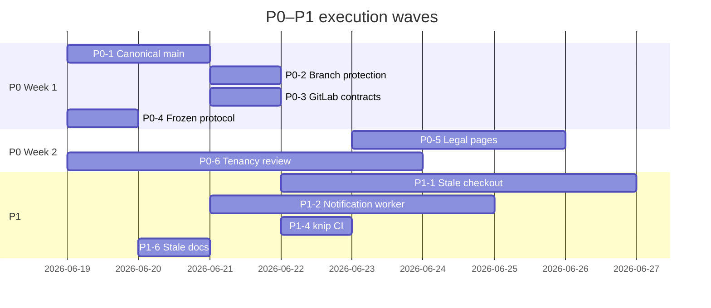

# VetTrack — Product-Driven Improvement Plan

> **Obsolete GitLab references (2026-07-07):** P0-1 (GitLab sync) and P0-3 (GitLab CI) are closed — GitHub is canonical. `GITHUB_GOVERNANCE.md` and `GITLAB_DEVELOPMENT.md` removed. Ignore GitLab items below.

**Phase:** 6 — Prioritized Improvement Plan  
**Generated:** 2026-06-18  
**Governor:** Product Engineering Governor  
**Prerequisites:** Phases 0–5 in [`docs/governance/`](./)

---

## Executive summary

This plan converts governance audits into **product-outcome-ranked** work. Every item below passed the governor filter: *"Does this help the product ship faster, safer, or more reliably?"*

**Top insight:** VetTrack's **live product aligns** with the post-2026 equipment-first scope. The highest ROI is not feature expansion — it is **restoring delivery-system trust** (single `main`, enforced CI), **floor reliability** (push locale, notification worker), and **targeted structural relief** on equipment hot paths.

| Priority | Theme | Items | Est. calendar effort |
|----------|-------|-------|----------------------|
| **P0** | Delivery trust & safety gates | 6 | 1–2 weeks |
| **P1** | Floor velocity & reliability | 8 | 2–4 weeks |
| **P2** | Maintainability & onboarding | 7 | 3–6 weeks (incremental) |
| **P3** | Horizon & polish | 5 | As capacity allows |

**Deferred / rejected** (low product ROI): cosmetic `appointments` → `tasks` internal renames (Phase 6 §17 forbidden), wholesale `src/features/` consolidation, deleting legacy SPA redirects, **building Expo/RN inside this monolith** (Expo evolution is a **separate track** — see §Mobile dual-track below).

**Gap addressed in this revision:** Phases 0–6 scoped the governor to *this* repository; Expo/RN implementation lives in [`exposwifty31/literate-dollop`](https://github.com/exposwifty31/literate-dollop). The improvement plan now includes cross-repo mobile evolution obligations and sequencing.

---

## Decision framework (applied)

1. **Increase product velocity** — preferred  
2. **Reduce operational risk** — secondary  
3. **Improve maintainability** — tertiary  
4. **Cosmetic cleanup** — reject unless bundled with P0–P1 touch

---

## P0 — Ship confidence & delivery trust

*Blockers to safe, fast releases. Execute before large feature work.*

---

### P0-1 — Establish single canonical `main` and remote

| Field | Value |
|-------|-------|
| **Objective** | One authoritative `main` branch and documented remote (`origin`); reconcile GitHub vs GitLab 71-commit gap; pause merges onto stale GitLab base until aligned. |
| **Business impact** | **Very high** — stops wrong-code merges, duplicate review, and agent confusion about where to push. Unblocks reliable Capacitor and web releases. |
| **Engineering impact** | **Very high** — eliminates recurring "which main?" tax (~10–15% of maintainer time per friction report). |
| **Risk** | **High** if ignored — MR !17/!20 on stale `gitlab/main` may lose GitHub fixes (F2). **Medium** during sync — requires careful fast-forward, not force-push without approval. |
| **Estimated effort** | **M** (4–8 hours decision + sync + doc updates) |
| **Expected ROI** | **Very high** — one-time cost; permanent reduction in merge/rebase incidents. |

**Execution notes:**
- Fast-forward `gitlab/main` from `origin/main` **or** declare GitHub canonical and update `CONTRIBUTING.md`, `MAINTENANCE_MODE.md`, `AGENTS.md`.
- Triage 6 open GitLab MRs: rebase/close drafts !8, !10; decide !17 vs !20 vs !9.
- **Requires explicit approval** before force-push or remote deletion.

**Evidence:** [`docs/devops/github-setup.md`](../devops/github-setup.md) §Platform reality; [`CI_CD_GOVERNANCE.md`](./CI_CD_GOVERNANCE.md) §Drift register.

---

### P0-2 — Enable branch protection on canonical `main`

| Field | Value |
|-------|-------|
| **Objective** | Require PR/MR before merge; require status checks: `CI — VetTrack` merge gate + both Playwright shards; block direct pushes to `main`. |
| **Business impact** | **Very high** — prevents broken production deploys from ungated `main` (public repo `exposwifty31/vettrack`). |
| **Engineering impact** | **High** — shifts quality left; ~5–7 min CI wait is cheaper than hotfix cycles. |
| **Risk** | **High** today — F1 (regressed production deploy). **Low** after enablement — may slow solo maintainer slightly; acceptable trade. |
| **Estimated effort** | **S** (1–2 hours GitHub settings + document required check names in `docs/devops/ci-cd.md`) |
| **Expected ROI** | **Very high** — minimal effort; blocks highest-severity delivery failure mode. |

**Required checks (GitHub):**
- `ci.yml` → merge gate job
- `playwright.yml` → shard 1/2 and 2/2 (or exact job names from workflow)

**Evidence:** [`CI_CD_GOVERNANCE.md`](./CI_CD_GOVERNANCE.md) §Quality gate maturity L4; [`docs/devops/github-setup.md`](../devops/github-setup.md) §Branch protection.

---

### P0-3 — Align GitLab CI with GitHub architecture gates

| Field | Value |
|-------|-------|
| **Objective** | Add `bash scripts/ci/contracts-gate.sh` to GitLab `architecture:gates` job; verify pipeline runs on current `main` after P0-1. |
| **Business impact** | **High** — protects `@vettrack/contracts` parity with `literate-dollop`; mobile/offline contract drift breaks bedside workflows. |
| **Engineering impact** | **High** — closes false confidence on GitLab MRs. |
| **Risk** | **High** — F8 (contracts drift). **Low** implementation risk (2-line script invocation). |
| **Estimated effort** | **XS** (under 1 hour) |
| **Expected ROI** | **Very high** — tiny change; guards cross-repo mobile contract. |
| **Status** | ✅ Done — 2026-06-18. `bash scripts/ci/contracts-gate.sh` added as first step in `.gitlab-ci.yml` `architecture:gates`. |

**Evidence:** [`CI_CD_GOVERNANCE.md`](./CI_CD_GOVERNANCE.md) §GitHub vs GitLab drift — `contracts-gate.sh` missing on GitLab.

---

### P0-4 — Document and enforce frozen-surface change protocol

| Field | Value |
|-------|-------|
| **Objective** | Publish a single checklist in `docs/governance/` (or extend `CLAUDE.md` pointer) for any change touching SSE/outbox, PWA SW denylist, Code Blue online-only path, or authority evaluators: Phase 9 drills, `pnpm test:playwright:ci`, no transport replacement. |
| **Business impact** | **Very high** — ward board and emergency coordination are mission-critical; regression cost exceeds feature value of shortcuts. |
| **Engineering impact** | **Medium** — adds ~5–10 min per frozen-surface PR; **reduces** catastrophic rework. |
| **Risk** | **Critical** — F6 (ward board stale), offline Code Blue queue (forbidden). Risk of **accepting** necessary friction, not removing it. |
| **Estimated effort** | **S** (2–4 hours doc + link from PR template) |
| **Expected ROI** | **High** — converts implicit Phase 9 knowledge into repeatable gate; protects CRITICAL paths without refactoring frozen surfaces. |
| **Status** | ✅ Done — 2026-06-18. `docs/governance/FROZEN_SURFACE_CHANGE_PROTOCOL.md` created with per-surface checklists, exception-approval table, and PR template. |

**Evidence:** [`PRODUCT_MODEL.md`](./PRODUCT_MODEL.md) §Critical paths; [`ENGINEERING_FRICTION_REPORT.md`](./ENGINEERING_FRICTION_REPORT.md) §1.3.

---

### P0-5 — Capacitor legal pages + resubmission readiness

| Field | Value |
|-------|-------|
| **Objective** | Ship privacy policy, terms, and support URLs required for App Store / Play Store; run `scripts/verify-resubmission.sh` before submission. |
| **Business impact** | **High** — native mobile is an IMPORTANT revenue/retention path; store rejection blocks bedside QR/NFC workflows. |
| **Engineering impact** | **Low** — mostly content + routing; may overlap MR !19 (`feat/legal-pages-privacy-terms-support`). |
| **Risk** | **High** — F7 (store rejection). **Low** technical risk. |
| **Estimated effort** | **S–M** (1–3 days including legal copy review) |
| **Expected ROI** | **High** — unblocks IMPORTANT mobile ship path documented in [`PRODUCT_ALIGNMENT_REPORT.md`](./PRODUCT_ALIGNMENT_REPORT.md). |
| **Status** | ✅ Done — 2026-06-18. iOS 1.0.1 approved by Apple and auto-releasing. 16/16 resubmission gates passed (2026-06-16). |

**Evidence:** `docs/mobile/README.md`; `RESUBMISSION_RUNBOOK.md`; open MR !19.

---

### P0-6 — Tenancy invariant on all new/changed queries

| Field | Value |
|-------|-------|
| **Objective** | Treat `clinicId` filter on target table as merge-blocking review criterion; reduce G3 waiver fatigue by scoping lint to changed files where possible (G6 backlog). |
| **Business impact** | **Critical** — cross-clinic leak destroys multi-clinic trust and commercial viability. |
| **Engineering impact** | **Medium** — review discipline + incremental lint scope improvement. |
| **Risk** | **Critical** — F5 (tenant miss). |
| **Estimated effort** | **S** ongoing review + **M** for G6 lint scope fix |
| **Expected ROI** | **Very high** — prevents highest-severity product defect class. |

**Evidence:** `.cursorrules` multi-tenancy; [`ENGINEERING_FRICTION_REPORT.md`](./ENGINEERING_FRICTION_REPORT.md) §2.1.

---

## P1 — Floor velocity & operational reliability

*Directly improves daily hospital operations and push-driven workflows.*

---

### P1-1 — Stale-checkout sweep: locale-aware push + tests (backlog item 3)

| Field | Value |
|-------|-------|
| **Objective** | Per-holder `preferredLocale` for stale-checkout push copy; vitest coverage for D1/D7 delivery-counting, renudge cap, metrics, audit. Extract shared `resolveUserLocale` helper. |
| **Business impact** | **High** — EN-speaking staff currently receive Hebrew push copy; daily operational nudge reliability. |
| **Engineering impact** | **High** — regression net for sweep logic; reusable locale helper for waitlist path. |
| **Risk** | **Medium** — wrong copy erodes trust; bounded push semantics must not change. |
| **Estimated effort** | **M** (3–5 days) |
| **Expected ROI** | **Very high** — concrete floor bug fix + tests; detailed plan in `.cursor/plans/backlog-items-3-7-9-10-hyper-plan.md`. |

**Evidence:** [`PRODUCT_ALIGNMENT_REPORT.md`](./PRODUCT_ALIGNMENT_REPORT.md) §Invest next #1; [`ENGINEERING_FRICTION_REPORT.md`](./ENGINEERING_FRICTION_REPORT.md) §2.4.

---

### P1-2 — Notification worker deployment clarity

| Field | Value |
|-------|-------|
| **Objective** | Verify production runs `pnpm worker` (or merged process); add health/diagnostic endpoint or startup log contract; document in `docs/devops/` and Railway service layout. |
| **Business impact** | **High** — waitlist promotions, stale checkout, and charge alerts depend on push fan-out. |
| **Engineering impact** | **High** — ends silent failure mode where API runs but push worker does not. |
| **Risk** | **High** — F4 (missed pushes). |
| **Estimated effort** | **M** (2–4 days investigation + doc + optional health check) |
| **Expected ROI** | **High** — high-impact reliability with bounded scope. |

**Evidence:** [`PRODUCT_ALIGNMENT_REPORT.md`](./PRODUCT_ALIGNMENT_REPORT.md) §Misalignment matrix; [`ARCHITECTURE_MAP.md`](./ARCHITECTURE_MAP.md) worker ownership.

---

### P1-3 — Waitlist / push delivery observability

| Field | Value |
|-------|-------|
| **Objective** | Bounded metrics for waitlist promotion success, push `deliveredAny` false rate, and reservation TTL expiry — surfaced in existing metrics union + admin visibility or logs. |
| **Business impact** | **High** — equipment availability is core value loop; invisible failures stall floor ops. |
| **Engineering impact** | **Medium** — closed `incrementMetric()` union requires coordinated client/server additions. |
| **Risk** | **Medium** — operational blind spots until implemented. |
| **Estimated effort** | **M** (3–5 days) |
| **Expected ROI** | **High** — enables data-driven P1 fixes without guessing. |

**Evidence:** [`PRODUCT_MODEL.md`](./PRODUCT_MODEL.md) §Value metrics; [`PRODUCT_ALIGNMENT_REPORT.md`](./PRODUCT_ALIGNMENT_REPORT.md) §Invest next #3.

---

### P1-4 — Add knip to CI architecture gates

| Field | Value |
|-------|-------|
| **Objective** | Run `knip` in `architecture:gates` (GitHub + GitLab) or weekly scheduled workflow; non-blocking first week, then blocking for new dead exports. |
| **Business impact** | **Medium** — reduces long-term drag on navigation and agent confusion; prevents reintroduction of removed domains. |
| **Engineering impact** | **High** — enforces zero-dead-code rule already in `.cursorrules`. |
| **Risk** | **Low** — may surface legacy ignores; tune `knip.json` once. |
| **Estimated effort** | **S** (half day) |
| **Expected ROI** | **High** — cheap gate; backlog item 9. |
| **Status** | ✅ Done — 2026-06-18. `pnpm knip --no-exit-code` added to GitHub Actions `architecture-gates` (`continue-on-error: true`) and GitLab `architecture:gates` (`|| true`). TODO comment in both to make blocking once baseline is clean. |

**Evidence:** [`CI_CD_GOVERNANCE.md`](./CI_CD_GOVERNANCE.md) §Not in PR lane; [`ENGINEERING_FRICTION_REPORT.md`](./ENGINEERING_FRICTION_REPORT.md) §5.1.

---

### P1-5 — Dependabot + SECURITY.md

| Field | Value |
|-------|-------|
| **Objective** | Add `.github/dependabot.yml` (npm + GitHub Actions); add `SECURITY.md` with disclosure contact. |
| **Business impact** | **Medium** — enterprise integrators and store review increasingly expect dependency hygiene. |
| **Engineering impact** | **Medium** — automated PR noise manageable with grouping. |
| **Risk** | **High** (security) if ignored on public repo. |
| **Estimated effort** | **S** (2–4 hours) |
| **Expected ROI** | **High** — baseline compliance; low effort. |
| **Status** | ✅ Done — 2026-06-18. `.github/dependabot.yml` (npm + GitHub Actions, weekly grouped), `SECURITY.md` (disclosure policy, `security@vettrack.uk` — verify address), and `.github/CODEOWNERS` created. Branch protection + labels require manual `gh auth refresh` — see `docs/devops/github-setup.md`. |

**Evidence:** [`docs/devops/github-setup.md`](../devops/github-setup.md) §Security P2 items 7–8.

---

### P1-6 — Fix top stale documentation (agent wrong-path prevention)

| Field | Value |
|-------|-------|
| **Objective** | Update `docs/integrations-guide.md`, design handoff README, `CONTRIBUTING.md` remote policy, and `docs/runbooks/activate-admin-email.md` to match post-143 scope and canonical remote. |
| **Business impact** | **Medium** — prevents agents and engineers implementing removed patient/ER flows or pushing to wrong remote. |
| **Engineering impact** | **High** — reduces 5–10% scope-residue tax. |
| **Risk** | **Medium** — wrong docs → wrong PRs. |
| **Estimated effort** | **S** (1 day) |
| **Expected ROI** | **High** — documentation-only; disproportionate onboarding win. |
| **Status** | ✅ Done — 2026-06-18. `docs/integrations-guide.md` (removed `vt_animals`, June 2026 scope callouts), `CONTRIBUTING.md` (canonical remote corrected to GitHub), `docs/runbooks/activate-admin-email.md` (P1-8 re-promotion bug documented). |

**Evidence:** [`ENGINEERING_FRICTION_REPORT.md`](./ENGINEERING_FRICTION_REPORT.md) §5.2; [`PRODUCT_ALIGNMENT_REPORT.md`](./PRODUCT_ALIGNMENT_REPORT.md) §Misalignment matrix.

---

### P1-7 — i18n parity in PR CI lane

| Field | Value |
|-------|-------|
| **Objective** | Run `scripts/i18n/check-parity.ts` or ensure `tests/i18n-parity.test.ts` visibility in `ci.yml` merge gate. |
| **Business impact** | **High** for Hebrew-default market — broken EN/HE parity ships to floor staff. |
| **Engineering impact** | **Medium** — catches missing keys before `main`. |
| **Risk** | **Medium** — locale drift reaches production. |
| **Estimated effort** | **S** (half day) |
| **Expected ROI** | **High** — aligns with bilingual differentiator. |
| **Status** | ✅ Done — 2026-06-18. `tests/i18n-parity.test.ts` is included in the vitest glob and not excluded; `pnpm test` runs it in both the GitHub Actions `test` job and GitLab `test:vitest` — both are merge-gate requirements. No additional CI step needed. |

**Evidence:** [`CI_CD_GOVERNANCE.md`](./CI_CD_GOVERNANCE.md) §P1 #6.

---

### P1-8 — ADMIN_EMAILS promotion fix (backlog item 6)

| Field | Value |
|-------|-------|
| **Objective** | Stop per-request re-promotion of demoted admins via `ADMIN_EMAILS` env; align with `docs/runbooks/activate-admin-email.md`. |
| **Business impact** | **Medium** — admin access control integrity for multi-user clinics. |
| **Engineering impact** | **Medium** — auth path change; needs tests. |
| **Risk** | **High** — authorization surprise if misimplemented. |
| **Estimated effort** | **M** (2–3 days) |
| **Expected ROI** | **Medium–High** — security-adjacent; smaller user surface than equipment paths. |

**Evidence:** [`ENGINEERING_FRICTION_REPORT.md`](./ENGINEERING_FRICTION_REPORT.md) §2.2; backlog hyper-plan item 6.

---

## P2 — Maintainability & onboarding (incremental)

*Execute when touching related code — not as standalone cosmetic refactors.*

---

### P2-1 — Split `equipment.ts` along operational seams

| Field | Value |
|-------|-------|
| **Objective** | Extract custody/checkout, waitlist, and scan sub-routers from `server/routes/equipment.ts` (~5.6k LOC) when next CRITICAL equipment feature requires it. |
| **Business impact** | **High** long-term — faster equipment feature delivery, smaller review blast radius. |
| **Engineering impact** | **Very high** — reduces L ongoing tax on every equipment change. |
| **Risk** | **High** during split — must preserve route mounts and tenancy; run Playwright + integration tests. |
| **Estimated effort** | **L** (1–2 weeks, phased) |
| **Expected ROI** | **High** — only when bundled with feature work; **reject** as standalone cleanup. |

**Evidence:** [`ARCHITECTURE_MAP.md`](./ARCHITECTURE_MAP.md); [`ENGINEERING_FRICTION_REPORT.md`](./ENGINEERING_FRICTION_REPORT.md) §1.2.

---

### P2-2 — Modularize `src/lib/api.ts` by domain

| Field | Value |
|-------|-------|
| **Objective** | Split API client into domain modules (`equipment`, `code-blue`, `tasks`, …) re-exported from `api.ts` — on first large addition to client surface. |
| **Business impact** | **Medium** — faster frontend feature work. |
| **Engineering impact** | **High** — knip and searchability improve. |
| **Risk** | **Medium** — import path churn; use barrel re-exports to minimize call-site diffs. |
| **Estimated effort** | **M** (3–5 days) |
| **Expected ROI** | **Medium–High** — defer until next major API expansion. |

---

### P2-3 — Remove no-op workers (approval required)

| Field | Value |
|-------|-------|
| **Objective** | Unregister `procedureBoundReleaseWorker` and `inventory-deduction` stub from `start-schedulers.ts`; delete or archive worker files per Removal Protocol. |
| **Business impact** | **Low** — no user-visible feature change. |
| **Engineering impact** | **Medium** — reduces agent confusion and scheduler noise. |
| **Risk** | **Low** — verify no hidden producers. |
| **Estimated effort** | **S** (half day) |
| **Expected ROI** | **Medium** — cheap clarity win; classified REMOVE in alignment report. |

**Evidence:** [`PRODUCT_ALIGNMENT_REPORT.md`](./PRODUCT_ALIGNMENT_REPORT.md) §Workers; Removal Protocol in `.cursorrules`.

---

### P2-4 — CODEOWNERS for high-risk paths

| Field | Value |
|-------|-------|
| **Objective** | Add `.github/CODEOWNERS` for `server/middleware/auth.ts`, `server/routes/equipment.ts`, `migrations/`, `src/lib/offline-emergency-block.ts`, `.github/workflows/`. |
| **Business impact** | **Medium** — ensures critical paths get review when team grows. |
| **Engineering impact** | **Medium** — GitHub auto-request review. |
| **Risk** | **Low** |
| **Estimated effort** | **S** (1 hour) |
| **Expected ROI** | **Medium** — more valuable when multiple contributors; still worth adding now. |
| **Status** | ✅ Done — 2026-06-18. `.github/CODEOWNERS` created covering `server/middleware/auth.ts`, `server/routes/equipment.ts`, `migrations/`, `src/lib/offline-emergency-block.ts`, `.github/workflows/`. Branch protection rule "Require review from Code Owners" must be enabled once CODEOWNERS lands on `main` — see `docs/devops/github-setup.md`. |

---

### P2-5 — Governance code tour (`.tours/`)

| Field | Value |
|-------|-------|
| **Objective** | Create `.tours/governance-architect-delivery.tour` per `code-tour-integration.md` — auth → equipment checkout → outbox → board. |
| **Business impact** | **Medium** — faster agent and human onboarding to CRITICAL paths. |
| **Engineering impact** | **Medium** — reduces 10–15% onboarding tax. |
| **Risk** | **Low** — doc artifact only. |
| **Estimated effort** | **S** (half day) |
| **Expected ROI** | **Medium** — complements [`ARCHITECTURE_MAP.md`](./ARCHITECTURE_MAP.md). |
| **Status** | ✅ Done — 2026-06-18. `.tours/governance-architect-delivery.tour` created with 12 stops and verified line numbers: auth → equipment checkout → outbox fan-out → ward board SSE + SW denylist. |

---

### P2-6 — MR/PR triage and label taxonomy

| Field | Value |
|-------|-------|
| **Objective** | Labels: `P0`, `equipment`, `native`, `ci`, `docs`, `realtime-frozen`; close stale drafts; enable `deleteBranchOnMerge` on GitHub. |
| **Business impact** | **Medium** — clearer prioritization for solo maintainer + agents. |
| **Engineering impact** | **Medium** — reduces review queue drag. |
| **Risk** | **Low** |
| **Estimated effort** | **S** (2–3 hours) |
| **Expected ROI** | **Medium** |

**Evidence:** [`docs/devops/github-setup.md`](../devops/github-setup.md) §P1 review hygiene.

---

### P2-7 — Integration sync health per clinic

| Field | Value |
|-------|-------|
| **Objective** | Admin-visible last-sync status, error count, and conflict backlog per `vt_integration_configs` row. |
| **Business impact** | **High** for enterprise stickiness — integrators need visibility without reading logs. |
| **Engineering impact** | **Medium** — likely admin UI + existing sync log queries. |
| **Risk** | **Medium** — silent sync failures erode trust. |
| **Estimated effort** | **M** (1 week) |
| **Expected ROI** | **Medium–High** — IMPORTANT domain per alignment report. |

---

## P3 — Horizon & polish

*Execute when P0–P1 stable or when explicit product decision demands.*

---

### P3-1 — Single CI platform (retire duplicate)

| Field | Value |
|-------|-------|
| **Objective** | After P0-1, either make GitLab CI generated from GitHub workflows or archive GitLab pipeline until team needs it. |
| **Business impact** | **Medium** long-term — halves CI maintenance on every workflow change. |
| **Engineering impact** | **High** long-term |
| **Risk** | **Medium** — premature deletion loses GitLab-only `transformation/**` rules. |
| **Estimated effort** | **M** (2–3 days) |
| **Expected ROI** | **Medium** — wait until remote reconciliation proves which platform stays. |

---

### P3-2 — Native Android CI job (MR !20 pattern)

| Field | Value |
|-------|-------|
| **Objective** | Merge manual `android:build` job from MR !20; document keystore secrets in CI variables. |
| **Business impact** | **High** for Play Store path when actively shipping native. |
| **Engineering impact** | **Medium** |
| **Risk** | **Medium** — secret handling |
| **Estimated effort** | **M** |
| **Expected ROI** | **Medium** until native ship is active priority |

---

### P3-3 — DB integration tests in scheduled CI

| Field | Value |
|-------|-------|
| **Objective** | Nightly or manual workflow with `DATABASE_URL` for `tests/migrations/**`, `restock.service.test.ts`. |
| **Business impact** | **Medium** — inventory and schema safety. |
| **Engineering impact** | **Medium** — closes test gap without slowing every PR. |
| **Risk** | **Medium** — migration regressions |
| **Estimated effort** | **M** |
| **Expected ROI** | **Medium** |

---

### P3-4 — Tagged releases + changelog

| Field | Value |
|-------|-------|
| **Objective** | GitHub Releases on merge to `main` or weekly; link to Railway deploy for rollback reference. |
| **Business impact** | **Low–Medium** — release audit trail for pilots. |
| **Engineering impact** | **Low** |
| **Risk** | **Low** |
| **Estimated effort** | **S** |
| **Expected ROI** | **Low–Medium** |

---

### P3-5 — Issue templates (bug, feature, ops)

| Field | Value |
|-------|-------|
| **Objective** | `.github/ISSUE_TEMPLATE/` with tenancy/repro fields for bugs. |
| **Business impact** | **Low** until external contributors scale. |
| **Engineering impact** | **Low** |
| **Risk** | **Low** |
| **Estimated effort** | **S** |
| **Expected ROI** | **Low** for solo maintainer; **Medium** if opening to contributors. |

---

## Mobile dual-track: Capacitor (now) vs Expo/RN (horizon)

VetTrack runs **two mobile narratives by design**, not by accident. The governor audit under-covered Expo because implementation code is **out of repo**; product and contract obligations still span both.

### Strategic posture

| Track | Repo | Status | Product role |
|-------|------|--------|--------------|
| **Horizon 0 — Capacitor** | `vettrack` (this monolith) | **✅ Complete** — iOS 1.0.1 auto-releasing (2026-06-18) | Bundled PWA in native shell; App Store / Play Store maintenance |
| **Horizon 1–7 — Expo/RN** | [`literate-dollop`](https://github.com/exposwifty31/literate-dollop) | **Horizon / secondary** | Greenfield RN bedside app; eventual Capacitor replacement (H7) |
| **Shared contracts** | `literate-dollop` `packages/contracts` | **Consumed here** | Offline/emergency/sync parity across web, Capacitor, and RN |

**Porting rule** ([`docs/MAINTENANCE_MODE.md`](../MAINTENANCE_MODE.md)): copy reference patterns from this monolith into literate-dollop; **do not** delete Capacitor paths here until Horizon 7 kill-switch (explicit product decision + two release cycles after RN store cutover).

**Sequencing rule** ([`docs/mobile/native-mobile-implementation-manual.md`](../mobile/native-mobile-implementation-manual.md)): Capacitor checklist and legal/resubmission (P0-5) **before** Horizon 2+ RN work. Horizon 1 scaffold may run in parallel at low intensity (0–2 h/week).

### Expo evolution roadmap (authoritative source: literate-dollop)

| Horizon | Focus | Where | Monolith dependency |
|---------|-------|-------|---------------------|
| **H0** | Capacitor ship, bundled assets, Clerk native, checklist tiers | `vettrack` | API, auth, PWA frozen surfaces |
| **H1** | pnpm workspace, `packages/contracts`, `apps/expo`, Expo Router, dev client | literate-dollop | `@vettrack/contracts` authoring; `contracts-gate.sh` |
| **H2** | `@clerk/clerk-expo`, `vettrack://`, API client, role from `/api/users/me` | literate-dollop | Stable `/api/users/me`, production Clerk, **test clinic only** on RN |
| **H3** | SQLite offline queue, NFC read, equipment scan UI, tablet layout | literate-dollop | Sync constants match `sync-engine.ts`; emergency block parity |
| **H4** | SSE port, native push `POST /api/push-subscriptions/native` | literate-dollop + **API here** | New bounded endpoint + tenancy; no WebSocket transport |
| **H5** | RN parity waves (`rn-parity-matrix` — to be authored) | literate-dollop | Feature APIs stable; ward kiosk stays **web only** |
| **H6** | Mobile web banner when RN W1 parity; exempt `/display` | literate-dollop + web | Routing in `src/app/routes.tsx` |
| **H7** | RN store cutover; delete `ios/` / Capacitor after 2 release cycles | both | Explicit kill-switch decision |

**EAS Update:** preview/dev channels until RN production; then production OTA for JS-only changes (H4+).

### Frozen contracts (every mobile PR, both repos)

From the native implementation manual — violations block merge on either side:

- `classifyEmergencyEndpoint` — Code Blue never queued offline
- Sync constants align with `@vettrack/shared-client` / `sync-engine.ts`
- SSE only — no WebSockets; KEEPALIVE routing unchanged on web
- `clinicId` on every tenant query (server)
- Hebrew copy only in `locales/*.json`
- No new mobile-facing features during Capacitor freeze (H0) without product sign-off

### Cross-repo governance items (this plan)

These are the **monolith-side** obligations for Expo evolution — not implementation of Expo in `vettrack`.

---

### P1-9 — Contracts package bump discipline + cross-repo changelog

| Field | Value |
|-------|-------|
| **Objective** | Document bump procedure: edit contracts in literate-dollop → tag or `#main` path bump in root `package.json` → `bash scripts/ci/contracts-gate.sh` on both repos; add one-line changelog in `docs/mobile/` when emergency/offline surfaces change. |
| **Business impact** | **High** — F8 (contracts drift) breaks RN offline and Capacitor parity simultaneously. |
| **Engineering impact** | **High** — makes cross-repo coupling explicit in every mobile PR. |
| **Risk** | **High** — silent drift until runtime failure on floor. |
| **Estimated effort** | **S** (half day doc + PR template checkbox) |
| **Expected ROI** | **Very high** — cheapest guard on the entire Expo track. |

**Evidence:** [`MAINTENANCE_MODE.md`](../MAINTENANCE_MODE.md) §Contracts; risk F8 in [`ENGINEERING_FRICTION_REPORT.md`](./ENGINEERING_FRICTION_REPORT.md).

---

### P2-8 — Author `docs/mobile/rn-parity-matrix.md`

| Field | Value |
|-------|-------|
| **Objective** | Define RN parity waves (W1–Wn): which `/equipment/*`, tasks, Code Blue, and offline flows must match web before H6 banner and H7 cutover. |
| **Business impact** | **High** — prevents premature Capacitor retirement or incomplete RN ship. |
| **Engineering impact** | **Medium** — single checklist for H5 execution in literate-dollop. |
| **Risk** | **Medium** — shipping RN without parity matrix → floor regression at cutover. |
| **Estimated effort** | **M** (2–3 days product + eng) |
| **Expected ROI** | **High** — required before Horizon 5; referenced in native manual but **file not yet in repo**. |

---

### P2-9 — Native push subscription API (Horizon 4 prerequisite)

| Field | Value |
|-------|-------|
| **Objective** | Implement `POST /api/push-subscriptions/native` (or extend existing push route) with `clinicId` scope, APNs/FCM token storage, and bounded metrics — as specified for H4. |
| **Business impact** | **High** — RN cannot match waitlist/stale-checkout push without native token path. |
| **Engineering impact** | **Medium** — server route + schema if needed; notification worker already exists. |
| **Risk** | **Medium** — defer until H3 bedside slice proves API client; design now to avoid rework. |
| **Estimated effort** | **M** (3–5 days when H4 starts) |
| **Expected ROI** | **High** for Expo track; **Low** until H4 active — **schedule with literate-dollop H4**, not before Capacitor ship. |

---

### P3-6 — literate-dollop governance mirror (optional)

| Field | Value |
|-------|-------|
| **Objective** | Run Product Engineering Governor Phases 0–6 **in literate-dollop** when Expo becomes primary delivery lane; or symlink `packages/contracts` governance checks into this repo's CI. |
| **Business impact** | **Medium** — avoids second "dual remote / stale main" failure mode on mobile repo. |
| **Engineering impact** | **Medium** |
| **Risk** | **Low** until Expo team scales |
| **Estimated effort** | **L** (full governor pass) |
| **Expected ROI** | **Medium** — defer until H2 auth slice lands |

---

### P3-7 — Horizon 7 kill-switch criteria (product decision gate)

| Field | Value |
|-------|-------|
| **Objective** | Written go/no-go: RN store approval in both stores, parity matrix W1 complete, 2 Capacitor release cycles on RN, rollback plan documented. **No `ios/` deletion without signed checklist.** |
| **Business impact** | **Critical** at cutover — wrong kill-switch removes working Capacitor app. |
| **Engineering impact** | **Low** (doc + checklist) |
| **Risk** | **Critical** if H7 executed early |
| **Estimated effort** | **S** (product workshop) |
| **Expected ROI** | **High** when approaching H6–H7; **not needed in 2026 Q2**. |

---

### What Expo evolution is **not** (in this repo)

| Activity | Disposition |
|----------|-------------|
| Scaffold `apps/expo` in `vettrack` | **Reject** — belongs in literate-dollop |
| Delete Capacitor before H7 criteria | **Reject** — breaks current store path |
| RN ward kiosk (`/equipment/board` display) | **Reject** — locked web-only per native manual |
| Rebuild removed ER/patient flows in RN | **Reject** — same June 2026 scope cut applies |

### Weekly rhythm (solo maintainer) — updated 2026-06-18

| Priority | Allocation |
|----------|--------------|
| literate-dollop H1 Expo scaffold | **Mon–Fri primary** — H0 complete, unblocked |
| Android Play Store submission | **1-day burst** this week (AAB + listing + Internal track), then async review |
| Monolith P0-2 + patches | **Background only** (~1–2h total) |
| Horizon 3+ bedside | **Blocked** until Android submitted + H1 scaffold running |

**Canonical references:** [`docs/mobile/native-mobile-implementation-manual.md`](../mobile/native-mobile-implementation-manual.md), [`.claude/PRPs/plans/native-mobile-desktop-strategy.plan.md`](../../.claude/PRPs/plans/native-mobile-desktop-strategy.plan.md), [`docs/mobile/README.md`](../mobile/README.md), **[`LITERATE_DOLLOP_PARITY_REPORT.md`](./LITERATE_DOLLOP_PARITY_REPORT.md)** (lite governor audit, 2026-06-18).

---

## Rejected recommendations

| Proposal | Why rejected |
|----------|--------------|
| Rename `appointments` API/table to `tasks` | Phase 6 §17 frozen; product copy already says Tasks; rename cost >> benefit |
| Delete ~20 legacy SPA redirects | Cheap to keep; prevents broken bookmarks; no velocity gain |
| Consolidate `src/features/` without feature pressure | Cosmetic structure; no measurable product outcome |
| Reintroduce ER/patient/medication domains | Explicit scope cut June 2026; requires product decision |
| Replace SSE with WebSockets | Violates frozen architecture; high regression risk |
| Full `equipment.ts` split as standalone sprint | P2-1 only when touching equipment features |
| Make ESLint blocking in CI | Low product risk today; effort >> ROI |
| Private repo without business decision | Governance concern but needs owner approval |

---

## Execution sequence (recommended)

**Wave 1 — ✅ Complete (2026-06-18):** P0-3, P0-4, P0-5, P1-4, P1-5, P1-6, P1-7, P2-4, P2-5 done. P0-2 awaits manual `gh auth refresh` + settings (~5 min); P0-1 deferred (acceptable risk for solo maintainer).  
**Wave 2 (active):** P1-1, P1-2, P1-8, P2-6 (labels — manual step), P1-9  
**Wave 3 (ongoing):** P1-3, P2 items bundled with feature work

---

## Phase 7 — Controlled execution

**Do not start Phase 7 without explicit approval** on P0 items (especially remote reconciliation and branch protection).

After each implemented item:

1. `npx tsc --noEmit`
2. `pnpm test` (+ targeted suites per touch area)
3. `bash scripts/ci/contracts-gate.sh` when contracts/mobile touched
4. `pnpm test:playwright:ci` when UI/realtime/PWA/Code Blue touched
5. Verify CI green on PR
6. Update this document — mark item **Done** with date and PR link

---

## Success metrics (90-day)

| Metric | Baseline (2026-06-18) | Target |
|--------|----------------------|--------|
| `main` remote parity | 71-commit GitLab lag | 0 lag; one canonical remote |
| Branch protection | None — ⚠️ manual action pending | Required CI + E2E |
| Broken `main` deploys | Possible | 0 ungated merges |
| Stale-checkout EN push | Hebrew hardcoded | Per-user locale |
| knip in CI | No → **✅ Non-blocking (2026-06-18)** | Blocking after baseline established |
| Open stale GitLab MRs | 6 (3 draft) | ≤2 active, rebased |
| Governance docs current | Partial → **✅ Wave 1 docs fixed (2026-06-18)** | Phases 0–6 complete; stale docs fixed |
| iOS H0 shipped | Not yet → **✅ 1.0.1 auto-releasing (2026-06-18)** | Android submission next |
| `rn-parity-matrix.md` | Missing | Authored before H5 |
| literate-dollop `main` vs contracts dep | Unknown | Bump procedure documented (P1-9) |

---

## Governance artifact index

| Document | Phase | Status |
|----------|-------|--------|
| [`PRODUCT_MODEL.md`](./PRODUCT_MODEL.md) | 0 | ✅ |
| [`ARCHITECTURE_MAP.md`](./ARCHITECTURE_MAP.md) | 1 | ✅ |
| [`PRODUCT_ALIGNMENT_REPORT.md`](./PRODUCT_ALIGNMENT_REPORT.md) | 2 | ✅ |
| [`docs/devops/github-setup.md`](../devops/github-setup.md) | 3 | ✅ |
| [`CI_CD_GOVERNANCE.md`](./CI_CD_GOVERNANCE.md) | 4 | ✅ |
| [`ENGINEERING_FRICTION_REPORT.md`](./ENGINEERING_FRICTION_REPORT.md) | 5 | ✅ |
| **PRODUCT_DRIVEN_IMPROVEMENT_PLAN.md** | 6 | ✅ |
| [`LITERATE_DOLLOP_PARITY_REPORT.md`](./LITERATE_DOLLOP_PARITY_REPORT.md) | Cross-repo (lite) | ✅ |

**Next:** Phase 7 controlled execution — pick approved P0 items and implement incrementally.
