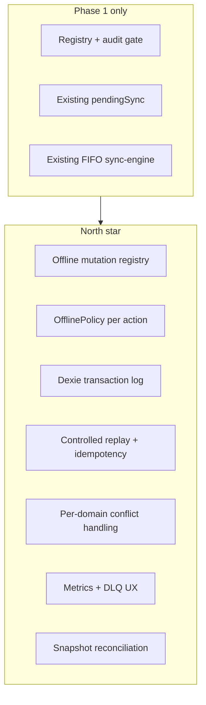

# VetTrack offline-first architecture — final planning document

**Status:** Approved architecture and implementation sequencing (see §13).  
**Audience:** Engineering, reviewers, Composer agents.  
**Principle:** Offline is a **local transaction log with controlled replay**, not a cache.

---

## 1. Purpose and scope

### 1.1 Strategic goal

Every local action should eventually satisfy:

1. Safe to execute offline, **or**
2. Intentionally blocked, **or**
3. Synchronized in correct order, **or**
4. Recoverable, **or**
5. Observable, **or**
6. Unable to break critical clinical state

VetTrack partially meets this today for **equipment** (Dexie queue + FIFO replay). The full vision adds policy, idempotency, conflicts, observability, and reconciliation — **in phases**.

### 1.2 What this document is

- Strategic architecture **narrowed** into implementation sequencing.
- Phase map with acceptance criteria and explicit non-goals.
- The authoritative order for PRs and agent prompts.

### 1.3 What this document is not

- Permission to implement the full vision in **one PR** or one agent session.
- A code spec (no schemas, APIs, or implementation snippets as tasks).
- A mandate for `dependsOn` DAG, batch ingestion, or server idempotency in early phases.

### 1.4 Composer safety note

**The full plan must not be implemented in one PR.**

Every implementation prompt must:

1. Target **exactly one phase** (or one named tracer slice within a phase).
2. Include **explicit non-goals** (files/subsystems that must not change).
3. Respect **Phase 9 frozen surfaces** (§9).
4. Exit only when that phase’s **acceptance criteria** are met.

**Eventual production rule (north star):**

> No offline mutation without policy, idempotency (on replay), conflict strategy, and observability.

Delivered **incrementally**. Phase 1 adds policy **documentation and audit gate** only — no replay or storage changes.

---

## 2. Current baseline (VetTrack)

### 2.1 Client

| Component | Role |
|-----------|------|
| `src/lib/offline-db.ts` | Dexie caches + `pendingSync` (`PendingSyncType`, statuses `pending` \| `synced` \| `failed`) |
| `src/lib/sync-engine.ts` | FIFO replay via raw `fetch`; retries; circuit breaker; 409 → conflict flow |
| `src/lib/api.ts` | `request()` with optional `offline`; `handleOptimisticMutation`; **all** `addPendingSync` call sites |
| `src/lib/offline-emergency-block.ts` | `classifyEmergencyEndpoint` — Code Blue must not queue offline |
| `src/lib/conflict-store.ts` | In-memory conflicts (lost on reload) |
| `src/hooks/use-sync.tsx`, `sync-queue-sheet.tsx` | Operator visibility, retry, discard |

**Enqueue dedup:** `checkout`, `return`, `return_with_charge` overwrite pending row for same endpoint (transactional in Dexie). **Scans** are append-only — each event is replayed individually.

**Enqueue producers today (via `addPendingSync`):**

- `request()` offline fallback: `create`, `update`, `delete`
- `handleOptimisticMutation`: `checkout`, `return`, `return_with_charge`
- Inline network fallback: `scan`, `seen`

**Not enqueued:** Code Blue (`vt_cb_queue` removed; `useCodeBlueSession` uses classifier + loud fail). Medication complete, billing, dispense use online paths without offline queue.

### 2.2 Server (relevant to later phases)

- Equipment optimistic concurrency and **409** (`server/routes/equipment.ts`).
- Billing/idempotency on some paths (`vt_billing_ledger.idempotency_key`, `server/lib/idempotency.ts`) — **not** wired to offline replay today.

### 2.3 Pre-existing codebase notes

- `PendingSyncType` includes `shift_session` and `restock` with **no** `addPendingSync` producer — violates `.cursorrules` dead-code expectation; resolve in Phase 2.
- `docs/validation/phase-10-stabilization-report.md` P0-1 (`vt_cb_queue`) is **obsolete** — current code matches Phase 9 doctrine.
- Code Blue UI still uses `authFetch` for some mutations; they do **not** call `addPendingSync`. Phase 1 gate is on the enqueue choke point, not a global `authFetch` wrapper.

---

## 3. Target architecture (strategic reference)

---

## 4. Policy model (target state)

### 4.1 `OfflinePolicy`

| Value | Meaning |
|-------|---------|
| `allow` | May enqueue and replay when offline |
| `block` | Must not enqueue (Phase 2+ hard fail for unknown) |
| `draft-only` | Local draft only; server sync is reconciliation |
| `online-required` | Must not be authoritative offline |

### 4.2 Domain matrix

| Policy | VetTrack examples |
|--------|-------------------|
| `allow` | Equipment scan, checkout, return, CRUD on cached equipment, seen |
| `draft-only` | Task notes, offline inventory count (product-defined) |
| `online-required` | Medication complete, billing finalization, dispense, authority, Code Blue mutations |
| `block` | Unlisted paths (Phase 2+ hard fail) |

**Code Blue:** Listed as `online-required` in the registry for **audit**. **Phase 1–2 enqueue blocking** for emergencies uses **`classifyEmergencyEndpoint` only** — not registry policy alone.

### 4.3 Conflict strategies (registry labels; enforced per phase)

| Domain | Strategy |
|--------|----------|
| Scan logs | Append-only |
| Equipment checkout/return/PATCH | Version check → 409, user-visible conflict |
| Inventory count | Draft → reconciliation |
| Medication | Online-required — no queue |

### 4.4 Deferred: `dependsOn` DAG

**Not in Phases 1–4.** Prefer FIFO, existing checkout/return dedup, and server 409. Revisit only if idempotency + conflict UX still allow ordering bugs.

---

## 5. Risk assessment

| Risk | Severity | Mitigation |
|------|----------|------------|
| Single large PR breaks equipment offline | Critical | Phase 1 client-only; no replay/schema changes |
| Code Blue queued offline | Critical | `classifyEmergencyEndpoint`; frozen tests |
| Phase 9 SW/realtime regression | Critical | Non-goals on SW/SSE every early phase |
| Unknown mutations queued silently | High | Phase 1 warn; Phase 2 hard fail |
| Double-apply on replay | High | Phase 4; document gap until then |
| Operators trust optimistic UI | Medium | Phase 6; document interim risk |
| FIFO wrong for multi-step flows | Medium | Defer DAG; server 409 + UX |
| Failed rows deleted after 7 days | Medium | Phase 5 retention/DLQ |
| Orphan `PendingSyncType` | Low | Phase 1 inventory; Phase 2 cleanup |
| Phase 1 gate bypass via future `addPendingSync` callers | Low | Implement gate **inside** `addPendingSync` (single choke point) |

---

## 6. Phase order

### Phase 1 — Client policy registry and audit gate

**Goal:** Make offline behavior **explicit and auditable** without changing replay semantics.

**New files (client-local only):**

- `src/lib/offline-policy.ts`
- `src/lib/offline-mutation-registry.ts`

Do **not** move to `shared/` until a later phase needs server or CI consumption.

**Registry contents:**

- One entry per **production enqueue producer** (`allow`, `PendingSyncType`, method, path pattern, conflict strategy label).
- `online-required` entries for audit (Code Blue, medication, billing, authority, etc.).
- Orphan `PendingSyncType` values documented for Phase 2.

**Policy gate (recommended: inside `addPendingSync` in `offline-db.ts`):**

| Condition | Phase 1 behavior |
|-----------|------------------|
| `classifyEmergencyEndpoint(url, method)` matches | **Reject enqueue** (existing errors — no new classifier) |
| Registry `allow` for resolved producer | Enqueue **unchanged** (same Dexie shape) |
| Registry `online-required` (non-emergency) | **Documentation only** — no new reject |
| Unknown / unregistered | **Structured warn**, **still enqueue** |

**Explicitly out of scope:**

- Dexie schema migration (any version bump).
- `clientMutationId`, `idempotencyKey`, `clinicId`, `userId`, `dependsOn`.
- Server changes, idempotency headers, new routes.
- `sync-engine.ts` replay logic changes.
- UI, i18n, DLQ, optimistic badges.
- `public/sw.js` / service worker.
- `POST /api/sync/mutations`.
- Emergency CI gate script.
- Playwright offline drills.
- Metrics, reconnect reconciliation.
- Hard-block unknown mutations.
- Rejecting non-emergency `online-required` registry entries.

**Acceptance criteria:**

1. **100% of production enqueue producers reachable through `addPendingSync` must resolve to a registry entry during tests** (behavioral coverage, not a brittle “grep every call site” rule).
2. Code Blue **emergency** paths cannot enqueue offline; enforced **only** via `classifyEmergencyEndpoint`; `tests/offline-emergency-block.test.ts` and `tests/code-blue-offline-queue-removed.test.ts` pass unchanged.
3. Registered equipment producers produce **identical** Dexie rows and sync behavior as before Phase 1.
4. Unregistered enqueue emits stable structured warn; enqueue still succeeds.
5. Tests assert `online-required` registry entries have **no** enqueue producer unless explicitly listed as producers.
6. `npx tsc --noEmit` clean; no edits under `server/`, `public/sw.js`, sync-engine replay, UI, locales.
7. PR states phase number and copies non-goals.

---

### Phase 2 — Registry hardening (client-only)

- Unknown offline enqueue: **warn → hard fail** (typed error; no queue).
- Remove or wire orphan `PendingSyncType` (`shift_session`, `restock`, etc.).
- Optional: move policy to `shared/` **only if** same PR adds server audit or CI consumer.

**Non-goals:** Dexie migration, idempotency, UI, SW, server.

---

### Phase 3 — Dexie queue model extension

- Schema migration: `clientMutationId`, `idempotencyKey`, `clinicId`, `userId`, `schemaVersion`, `updatedAt`, structured errors.
- Generate and store at enqueue; replay remains **FIFO** (no `dependsOn`).

**Non-goals:** server idempotency, DAG, batch ingest.

---

### Phase 4 — Replay idempotency (equipment)

- Client: send `Idempotency-Key` and client mutation id on replay.
- **Server: idempotent replay support for checkout/return and other mutable equipment actions.**
- **Scan events remain append-only audit events:** replay protection should prevent accidental transport duplicates **without** collapsing legitimate repeated scans.
- Tests: duplicate replay of mutable actions → single side effect; repeated scans with distinct keys → distinct audit rows.

**Non-goals:** `dependsOn`, DLQ UI, `POST /api/sync/mutations`.

---

### Phase 5 — State machine and durable conflicts

- Statuses: `pending` → `processing` → `synced`; `failed` with retry → `dead`; `conflict` for 409.
- Persist conflicts in Dexie (survive reload).
- Revise `runStartupCleanup`: no silent purge of `dead`/`conflict` without policy.

**Non-goals:** full operator DLQ UX (minimal retry acceptable).

---

### Phase 6 — Operator UX and DLQ

- `LocalEntityState`: `synced` \| `pending_sync` \| `sync_failed` \| `conflict`.
- Honest copy (e.g. “Returned locally · waiting to sync”).
- Sync sheet: dead-letter section, retry, discard with role + confirmation.
- i18n `locales/en.json` + `locales/he.json` paired.

**Non-goals:** batch ingest, metrics dashboard.

---

### Phase 7 — Emergency surfaces CI gate

- Canonical list: `classifyEmergencyEndpoint` paths + SW `EMERGENCY_BYPASS_PATHS` + related live reads.
- CI fails when new Code Blue / realtime / display snapshot routes are unclassified.
- **Do not** change SW caching behavior.

**Non-goals:** weakening Phase 9 tests.

---

### Phase 8 — Observability

Bounded metrics (closed unions per project rules), e.g.:

- `pending_sync_count` (aggregated, no PII)
- **`oldest_pending_sync_age_seconds`** (primary SLO)
- `sync_success_rate`, `sync_conflict_rate`, `sync_dead_letter_count`
- `offline_emergency_mutation_blocked_*`
- `idempotency_replay_count`
- `average_sync_lag_seconds`

Client throttled reporter; admin/stability surfacing.

---

### Phase 9 — Reconnect reconciliation

Reconciliation has **two trigger families** (no new transport):

| Trigger family | When | Implementation |
|----------------|------|----------------|
| **Realtime / lifecycle** | Tab visible, BFCache restore, `online`, Page Lifecycle `resume`, SSE gap / peer cursor | `src/hooks/useRealtimeReconciliation.ts` → `replayHttpCatchUpAfter` (optional ingestor) + `forceResyncWardErCaches` |
| **Post-sync queue idle** | FIFO replay finished and queue snapshot is idle | `evaluateSyncQueueIdle` in `src/lib/sync-queue-idle.ts` → `runOfflinePhase9PostSyncReconciliation` in `src/lib/offline-post-sync-reconciliation.ts` (called from `sync-engine` `finally`; **flag default off**: `VITE_OFFLINE_PHASE9_POST_SYNC_RECONCILIATION`) |

#### Checkpoint order (post-sync path)

Run only when `evaluateSyncQueueIdle` returns `{ isIdle: true, reason: "idle" }`:

| Step | Checkpoint | Action (current / sketch) |
|------|------------|---------------------------|
| 1 | **Replay complete** | `processQueue` finished; no `pending` rows; not syncing; no scheduled burst; circuit closed; queue not halted |
| 2 | **Authoritative fetch** | Invalidate equipment list/detail/log TanStack keys (refetch on next subscribe) |
| 3 | **Dexie repair** | *Not in Stretch-A sketch* — server wins over stale optimistic fields (future) |
| 4 | **Ward / ER / display** | `forceResyncWardErCaches` (same helper as realtime reconciliation) |

**Idle is not** “mutation responses alone suffice.” **Idle is** “nothing left to replay in this session pass.”

**No** new polling transport. **No** Dexie schema bump in Stretch-A.

---

### Phase 10 — Playwright offline drills

1. Checkout offline → close tab → reopen → sync → no duplicates (post–Phase 4).
2. Scan offline → mid-sync network drop → retry → transport duplicate handled without losing distinct scans.
3. Return offline + concurrent server transfer → 409 → conflict UI.
4. Code Blue active → offline end session → blocked → **empty** `pendingSync`.

Requires running app + DB; not a gate for Phases 1–4.

---

### Phase 11 — Optional batch sync ingestion

- `POST /api/sync/mutations` (auth, `clinicId`, rate limit, batch cap).
- Partial per-item results; unified audit/telemetry.
- Behind flag; dispatches to existing domain services.
- **Only after** Phase 4 proven on equipment.

---

### Backlog (post–Phase 11 or product-driven)

| Item | Notes |
|------|--------|
| `dependsOn` DAG | Deferred complexity |
| Inventory `draft-only` reconciliation | Product + server rules |
| Medication offline | **Out of scope** — remain online-required |
| `authFetch` policy hook for non-enqueue mutations | Optional hardening; not required if doctrine holds |

---

## 7. Later-phase backlog (summary)

| Phase | Deliverable |
|-------|-------------|
| 1 | Policy registry + audit gate (client-only) |
| 2 | Hard-fail unknown enqueues; orphan type cleanup |
| 3 | Dexie extended queue fields |
| 4 | Replay idempotency (mutable equipment + append-only scan transport guard) |
| 5 | processing/dead/conflict + Dexie conflicts |
| 6 | Pending/conflict UI + DLQ |
| 7 | Emergency path CI gate |
| 8 | Sync metrics / SLOs |
| 9 | Post-sync snapshot reconciliation |
| 10 | Playwright offline drills |
| 11 | Batch `POST /api/sync/mutations` |
| — | `dependsOn` DAG (deferred) |

---

## 8. Non-goals (global)

- Implementing the full strategic plan in **one PR**.
- Offline queue for **Code Blue** (start, end, log, presence).
- SW cache of `/api/display/snapshot`, `/api/code-blue/sessions/active`, `/api/realtime/*`, or other emergency denylist paths.
- WebSockets or parallel realtime instead of SSE/outbox.
- Weakening or removing Phase 9 emergency/offline tests.
- Dexie cache as source of truth without server reconciliation (until Phase 9).
- Generic clinical “merge” conflict resolver.
- `dependsOn` in Phases 1–4.
- **Phase 1: do not reject non-emergency `online-required` registry entries. Only `classifyEmergencyEndpoint` continues to reject enqueue behavior.**
- Phase 1: `shared/` policy module, server changes, UI, SW, sync-engine replay changes.

---

## 9. Phase 9 frozen surfaces (invariant)

| Surface | Rule |
|---------|------|
| Code Blue mutations | Never `pendingSync`; block via `classifyEmergencyEndpoint` + loud UX |
| Service worker | Never read/write Cache Storage for emergency/live API paths |
| Realtime | SSE `/api/realtime/stream` + outbox — no transport replacement |
| Emergency tests | `tests/offline-emergency-block.test.ts`, `tests/code-blue-offline-queue-removed.test.ts`, Phase 9 drills — must pass |
| Telemetry | New counters only as **bounded enums** (no PII, no free-form labels) |
| Offline emergency buffer | sessionStorage, tab-scoped, never posted as mutations |

---

## 10. PR / review checklist (offline-touching PRs)

1. **Which phase?** Single phase only.
2. **Policy:** Registry key? Phase-appropriate enforcement?
3. **Emergency:** Still impossible to queue Code Blue via `pendingSync`?
4. **Behavior change:** Intentional? Documented?
5. **Frozen surfaces:** SW, SSE, emergency tests untouched?
6. **Clinical honesty:** UI imply server truth while queue pending? (Allowed Phase 6+ only.)
7. **Tests:** Phase acceptance criteria met?
8. **Non-goals:** Copied from this doc into PR description?

---

## 11. Recommended first Composer prompt (Phase 1 outline)

**Title:** Phase 1 — Offline mutation policy registry and audit gate (client-only)

**Goal:** Add `src/lib/offline-policy.ts` and `src/lib/offline-mutation-registry.ts`; implement gate at `addPendingSync` choke point; behavioral tests for producer coverage; emergency block unchanged.

**Must do:**

- Register all production enqueue producers under `allow`.
- Register `online-required` domains for documentation; test they do not enqueue unless listed as producers.
- Gate: (1) `classifyEmergencyEndpoint` → reject; (2) registry `allow` → enqueue unchanged; (3) else → warn + enqueue.
- Do **not** add `if (policy === "online-required") reject` for non-emergency paths.

**Non-goals:** Dexie bump; sync-engine; server; UI; locales; SW; hard-block unknown; idempotency; DAG; batch ingest; reject non-emergency online-required.

**Verify:** `npx tsc --noEmit`; `pnpm test` including offline-emergency and code-blue-offline-queue-removed tests; manual smoke offline equipment checkout still queues and syncs.

---

## 12. Bottom line

The north star — **local transaction log, policy, idempotency, conflicts, observability, reconciliation** — stays the direction.

**Execution rule:** Ship **Phase 1** first: registry + audit gate, emergency reject via **`classifyEmergencyEndpoint` only**, no storage or replay changes, no user-visible behavior change except dev warnings. Each later phase adds one reliability layer until the system is safe under real hospital connectivity.

---

## 13. Sign-off decision

**Approved** as architecture and implementation sequencing document.

**Approval conditions:**

- No phase may expand scope beyond its listed acceptance criteria.
- Composer implementation prompts must target **one phase only**.
- Phase 9 frozen surfaces remain invariant (§9).
- Any cross-cutting refactor requires a **separate architecture review**.
