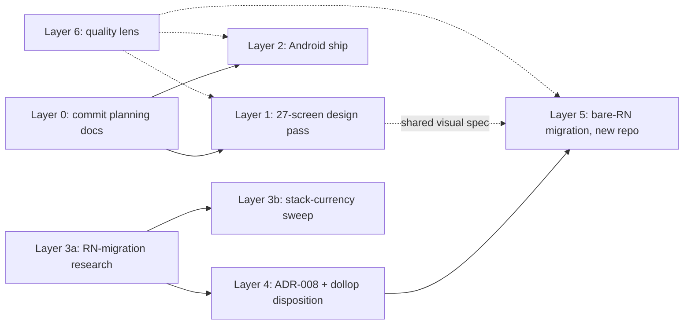

# VetTrack Master Plan — July 2026 (6 layers)

> **Status:** approved by the owner 2026-07-22 (remote planning session). This is the operative
> cross-layer sequencing doc. Per-layer scope docs are cited below; where a cited doc is not yet
> committed, Layer 0 tracks committing it.

## Owner decisions (binding)

1. **Bare React Native CLI, not Expo**, for the future native rewrite — contingent only on Layer 3a's
   research surfacing no hard blocker (see `docs/design/react-native-migration-research.md`).
2. **`literate-dollop` (the Expo sibling repo) will be retired and a fresh repo started** for the
   bare-RN app. The delete/archive action itself requires its own explicit owner confirmation at
   execution time — it is NOT authorized by this plan. Archive (reversible) is the recommended
   alternative to hard delete; owner's call at that moment.
3. **Research order:** RN-migration-safety research (3a) first, whole-stack currency (3b) second.

## Standing framings

- **Layer 1 is the shared visual/UX spec for both** the current React+Capacitor app and the future
  bare-RN app — not throwaway work ahead of the migration.
- **Layer 6 (platform-wide quality) runs as a standing lens** inside Layers 1/2/5, not as a 7th
  open-ended initiative. Product Strategist scopes it as tracked work later only if the owner asks.

## Dependency shape

Layers 0→1, 0→2, and 3a run in parallel. Nothing in 4–5 starts before 3a lands and is reviewed.

## Layer 0 — Commit the planning corpus (small; first)

The following docs are cited by this plan and by `.claude/skills/vettrack-team/references/product-strategist.md`
but exist only on the owner's local machine — they are **not in the pushed repo** (verified 2026-07-22):

- `docs/vettrack-2.0-roadmap.md`
- `docs/plans/2.0/task-2.3-who-on-floor.md`
- the 27-screen design-pass scope (suggested landing spot: `docs/plans/design-pass-27-screens.md`)

**Action (owner's local machine):** commit + push them. Until then, fresh/remote sessions cannot execute
Layer 1's screen list or Layer 2's roadmap task as scoped. This file itself is the first Layer 0 item
(committed from the remote session that produced it).

**Lead:** The Documentarian.

## Layer 1 — Claude Design pass (27 screens)

17 screens = from-scratch visual refresh of every existing app screen (Home, Equipment List/Detail,
Code Blue, Alerts, Crash-Cart, Scan, My Equipment, Rooms, Tasks, Settings, Profile, 3 iPad workspace
variants, TV Board, Web console) — greenlit screen-by-screen, non-frozen screens first, Code Blue/TV
Board last, cosmetic-only on frozen surfaces. 10 screens = the VetTrack 2.0 feature set mapped onto
roadmap tasks 1.1–2.5 + 1.4 (Task 2.3 "Who's on the floor" already architecture-resolved in its plan doc).

Every screen establishes the visual language both the current app and the future RN app share.

**Lead:** UI Master + Claude Design Master · consulting: Frontend Master, Hebrew & i18n Master ·
standing veto: Clinical Safety Officer on Code Blue / TV Board screens.

## Layer 2 — Ship the Android app (Google Play Console)

Roadmap Task 1.3 (P0 · M): the existing Capacitor Android shell (`android/` — built; FCM
`google-services.json` already present) becomes a shipped Play Store app — signing (upload keystore +
Play App Signing), Clerk OAuth + deep links on Android, FCM push, NFC/haptics/camera verified on real
hardware, Play Console listing + Data-safety form + content rating, internal-testing track → production.
Builds only via `scripts/build-native-shell.sh` (`pnpm cap:build:native:android`).

**Independent of the RN decision** — the Capacitor kill-switch was always a separate later gate
(literate-dollop Phase 6), so shipping Android on Capacitor now does not conflict with a future RN
cutover. Proceed now, in parallel with Layer 3a.

**Lead:** Mobile Master · consulting: Release Captain, Clerk Master (Android OAuth/deep links),
Marketing Master (listing copy).

## Layer 3 — Deep research

**Lead:** The Researcher. Real, current sources — not assumptions.

- **3a — bare-RN migration safety** (blocks Layers 4–5). Deliverable:
  `docs/design/react-native-migration-research.md`. Topics: New Architecture status, Clerk on non-Expo
  RN, offline storage (Dexie replacement), NFC native modules, SSE client parity with the frozen
  realtime contract, build/release without EAS, real migration case studies.
  Note: the `@vettrack/contracts` Expo-dependency question was already resolved 2026-07-22 — the
  package is verifiably framework-free (zero deps, zero non-relative imports).
- **3b — whole-stack currency sweep** (after 3a). Deliverable: `docs/audit/stack-currency-2026.md`.
  React 18→19, Vite/Express/Drizzle/Clerk-web/Capacitor-8 currency, breaking changes on the horizon.

## Layer 4 — Record the decision (ADR-008) + literate-dollop disposition

**Lead:** The Architect. After 3a is reviewed:

1. **ADR-008** in `docs/architecture/adr/` (copy `template.md`; per `TRIGGERS.md`): records bare-RN-CLI,
   cites 3a, explicitly supersedes the Expo/literate-dollop direction — and explicitly addresses 3a's
   Clerk-on-bare-RN finding (the one blocker-adjacent risk).
2. **Doc-drift cleanup** (21 files reference literate-dollop). Update the load-bearing forward-looking
   ones: `CLAUDE.md`, `docs/MAINTENANCE_MODE.md`, `docs/design/native-migration-roadmap.md`,
   `docs/design/program-plan.md`, `docs/mobile/README.md`,
   `docs/mobile/native-mobile-implementation-manual.md`, `docs/governance/EXPO_AGENT_BRIEF.md`,
   `CONTRIBUTING.md`, `.claude/skills/vettrack-team/references/mobile-master.md`. Point-in-time reports
   (parity report, governance audits, `PLAN.md` history) get a one-line "superseded by ADR-008" banner,
   not rewrites. The owner's user-level `vettrack-expo-migration` skill should be retired locally.
3. **Lessons-from-literate-dollop note** (before any delete): what Phase 1's exit criteria proved
   (contracts portability, PendingSyncStore pattern, Clerk-native auth) and what Phase 3's NFC slice
   revealed.
4. **The delete/archive itself:** owner-confirmed at execution time, separately (see Owner decisions §2).

## Layer 5 — Migrate to bare React Native (new repo)

Gated on 3a + ADR-008.

- New repo (owner names it), scaffolded with the RN Community CLI, New Architecture per 3a.
- **Reuse `@vettrack/contracts`** from `packages/contracts/` (canonical in this repo since 2026-07-11;
  verified dependency-free). Re-check at consume time: `bash scripts/ci/contracts-gate.sh`.
- **Reuse the portability layer** cataloged in `docs/design/native-migration-roadmap.md` — especially
  `src/lib/roles/experience-model.ts` (pure TS role→experience contract) and the typed API surface.
  Written against an Expo target, but the de-tangling from web DOM is not Expo-specific.
- Staged port mirroring literate-dollop's proven phase shape: contracts + auth first → one vertical
  slice end-to-end (equipment scan) → broaden. Server stays the enforcement boundary (role from
  `vt_users.role`, never JWT claims).
- Layer 1's design language is the visual spec.

**Lead:** The Architect (scaffold/handoff) → Mobile Master + Frontend Master (execution) · standing
vetoes per surface (Clinical Safety Officer on any Code Blue port; Security Master on auth/tenancy).

## Layer 6 — Platform-wide quality upgrade

Standing lens inside Layers 1/2/5: each lead reviews efficiency / friendliness / visual quality of
whatever they touch. 3b's currency report feeds targeted backend upgrades. Scoped as tracked work later
only on owner request (Product Strategist: PRD + sized slices).

## Verification (per layer)

- **Layer 0:** cited paths resolve in a fresh clone (`git ls-files | grep`).
- **Layers 1–2:** `pnpm typecheck`, `pnpm test`, `pnpm i18n:check`, `pnpm cap:build:native:android`,
  real-device install via Play internal track, PROOF_ALIGNMENT_LOG entries.
- **Layer 3:** reports cite primary sources; reviewed before Layer 4 proceeds.
- **Layer 4:** ADR-008 merged; `grep -rl literate-dollop` shows only banner-annotated historical docs;
  lessons note exists before any delete.
- **Layer 5:** new repo CI green; contracts parity check; real-device verification per milestone.
