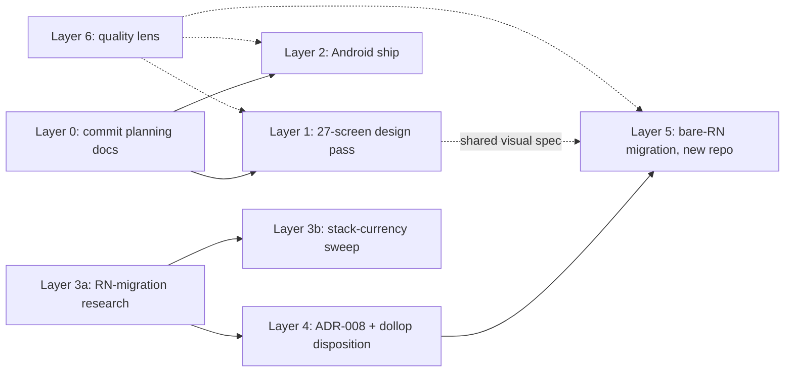

# VetTrack Master Plan — 6 layers, refined against the repo

Lead: Product Strategist · consulting: The Architect, The Researcher. (Planning-only session; no standing-veto surfaces touched. Execution-time leads per layer are named below.)

## Context

Six-layer master plan for VetTrack's future: (1) the Claude Design 27-screen pass, (2) ship Android via
Google Play Console, (3) deep real-world research, (4) React Native vs Expo decision, (5) migration to
the chosen stack, (6) platform-wide quality upgrade.

**Binding owner decisions (from this conversation):**
1. **Bare React Native CLI, not Expo** — after deep research on how to do it right and safely, before any migration code.
2. **Delete `literate-dollop`; start a fresh repo** for the bare-RN app.
3. **Research order:** RN-migration-safety research first, whole-stack currency second.

**What this refinement verified against the actual repo (this session):**
- `docs/MAINTENANCE_MODE.md` — confirmed: reframed 2026-07-08 as scope-boundaries (not a freeze); documents the literate-dollop lane and the Phase-6 kill-switch porting rule.
- `docs/governance/LITERATE_DOLLOP_PARITY_REPORT.md` (2026-06-18) — confirmed: CI green, 59 tests, Phase 1 exit-met (contracts + PendingSyncStore + Clerk-Expo), Phase 3 NFC in progress, Phase 6 = Capacitor kill-switch decision gate.
- **`@vettrack/contracts` is verifiably framework-free TODAY**: `packages/contracts/` has zero dependencies in `package.json` and zero non-relative imports across its 3 source files (`emergency.ts`, `pending-sync.ts`, `index.ts`). This closes one of Layer 3a's open research questions — moved to a one-line re-check in Layer 5.
- ADR process real: `docs/architecture/adr/` has ADR-001…007 + `TRIGGERS.md` + `template.md`. **Next number: ADR-008.**
- Android shell exists (`android/` with `google-services.json` already present — FCM config in place), `scripts/ci/contracts-gate.sh` exists.
- Portability groundwork real: `docs/design/native-migration-roadmap.md` names portable assets incl. `src/lib/roles/experience-model.ts` (pure TS, no React/DOM/wouter).

**⚠️ New finding — Layer 0 prerequisite (blocks remote execution of Layers 1–2):**
The draft (and the team-roster reference `product-strategist.md`) cite **`docs/vettrack-2.0-roadmap.md`**,
**`docs/plans/2.0/task-2.3-who-on-floor.md`**, and `.claude/docs/ai/vettrack/10x/session-2.md` — **none of
these exist in the pushed repo** (verified by find/grep on `claude/refine-local-plan-42a7o6`, which is even
with `main`). They live only on the owner's local machine / local session. Until they're committed and
pushed, no fresh or remote session can execute Layer 1's screen list or Layer 2's Task 1.3 as scoped.
**Layer 0 below fixes this first.**

**Flagged, not silently decided (unchanged from draft, still binding):**
- **Deleting `literate-dollop` is destructive and outside this repo's scope** — it gets its own explicit confirmation at execution time, never bundled into this plan's approval. Recommendation to weigh (not a substitution): GitHub **archive** instead of hard delete — reversible, declutters, preserves the ~5 weeks of real Phase 1/3 work as reference.
- **Layer 6 has no bounded scope as stated** — run it as a standing lens inside Layers 1/2/5, with an optional Product-Strategist-led scoping pass later if the owner wants it tracked separately.
- **Layer 1 is the shared visual/UX spec for both** the current React+Capacitor app and the future bare-RN app — not throwaway work ahead of the migration.

## Dependency shape

Layers 0→1, 0→2, and 3a start immediately and run in parallel. Nothing in 4–5 starts before 3a lands.

## Layer 0 — Commit the planning corpus (new; small; do first)

From the owner's **local** machine: commit + push `docs/vettrack-2.0-roadmap.md`,
`docs/plans/2.0/task-2.3-who-on-floor.md`, and the 27-screen design-pass scope (as a plan doc, e.g.
`docs/plans/design-pass-27-screens.md`) — plus this master plan itself (e.g. `docs/plans/master-plan-2026-07.md`).
Rationale: every later layer cites them; remote/CI sessions currently can't see them. Also fixes the
dangling references in `.claude/skills/vettrack-team/references/product-strategist.md`.
**Lead:** The Documentarian.

## Layer 1 — Implement the Claude Design pass (27 screens)

As scoped in the local session: 17 screens = from-scratch visual refresh of every existing app screen
(Home, Equipment List/Detail, Code Blue, Alerts, Crash-Cart, Scan, My Equipment, Rooms, Tasks, Settings,
Profile, 3 iPad workspace variants, TV Board, Web console) — greenlit screen-by-screen, non-frozen screens
first, Code Blue/TV Board last, cosmetic-only on frozen surfaces; 10 screens = the VetTrack 2.0 feature
set mapped onto roadmap tasks 1.1–2.5 + 1.4 (Task 2.3 "Who's on the floor" already architecture-resolved
per its plan doc — committed in Layer 0).

Frame every screen as establishing the visual language **both** the current app and the future RN app share.
**Lead:** UI Master + Claude Design Master · consulting: Frontend Master, Hebrew & i18n Master ·
**standing veto:** Clinical Safety Officer on the Code Blue / TV Board screens.

## Layer 2 — Ship the Android app (Google Play Console)

Roadmap Task 1.3 (P0 · M): the existing Capacitor Android shell (`android/` — built, FCM `google-services.json`
already present) becomes a shipped Play Store app — signing (upload keystore + Play App Signing), Clerk
OAuth + deep links on Android, FCM push, NFC/haptics/camera verified on real hardware, Play Console
listing + Data-safety form + content rating, internal-testing track → production. Builds only via
`scripts/build-native-shell.sh` (`pnpm cap:build:native:android`), per the CLAUDE.md native-shell rule.

**Independent of the RN decision** — literate-dollop's own plan treats the Capacitor kill-switch as a
separate later gate (Phase 6), so shipping Android on Capacitor now doesn't conflict with a future RN
cutover. **Proceed now, in parallel with Layer 3a** — low-risk, mostly packaging/store work, real Android
users sooner.
**Lead:** Mobile Master · consulting: Release Captain, Clerk Master (Android OAuth/deep links), Marketing
Master (listing copy). No dedicated Play-Console personality — Mobile Master owns Android shipping.

## Layer 3 — Deep research (RN-migration safety first, then stack currency)

**Lead:** The Researcher (deep-research skill, Context7, `gh search`, WebSearch — real 2026 sources, not
assumptions; note: `gh` CLI is unavailable in remote sessions, use GitHub MCP search there).

**3a — bare-RN migration research (first; blocks Layers 4–5):**
- New Architecture (Fabric/TurboModules): default-on for a new bare-RN app today? Known sharp edges?
- Clerk on **bare** RN — the `@clerk/clerk-expo` pattern literate-dollop Phase 1 used does NOT apply; find Clerk's supported non-Expo RN path and its maturity (this repo has 20 vendored Clerk skills incl. `clerk-android`/`clerk-swift` — check whether Clerk's guidance pushes custom-native or RN-JS integration).
- Offline storage replacing Dexie/expo-sqlite: `op-sqlite`, `react-native-sqlite-storage`, MMKV, WatermelonDB — what real teams ship in 2026 and why; must support the PendingSyncStore pattern Phase 1 proved.
- NFC/RFID native-module story in bare RN vs `@capgo/capacitor-nfc` + literate-dollop's `nfc-platform.ts` — what's mature, what needs custom native modules.
- Realtime parity: SSE client in bare RN (no browser `EventSource` — polyfill vs native), Socket.io-client behavior, keeping the frozen SSE/outbox contract's client behavior intact.
- Build/release without EAS: Xcode + Gradle direct, Fastlane, CI shape.
- Case studies / post-mortems of hybrid→bare-RN migrations: what broke, real timelines, common regrets.
- ~~contracts Expo-dependency check~~ — **resolved this session** (framework-free, verified above).

**3b — whole-stack currency sweep (second):** React 18→19, Vite 7 / Express 4 / Drizzle / Clerk web SDKs /
Capacitor 8 currency, aging deps, breaking changes on the horizon. Feeds Layer 6.

**Deliverables:** `docs/design/react-native-migration-research.md` (3a) and
`docs/audit/stack-currency-2026.md` (3b) — sourced, written BEFORE any new repo or migration code exists.

### Layer 3 update (2026-07-22) — deepened via a second Ultraplan research pass

**3a corroborated, not just claimed:** New Architecture confirmed default since 0.76, and sharpened —
0.82 (Oct 2025) actually **deleted** the legacy Bridge, so `newArchEnabled=false` is now silently
ignored. Clerk-on-bare-RN gap independently confirmed (no official SDK, `@clerk/expo`-only); found that
`install-expo-modules` is Expo's own **first-party documented path for bare-RN-CLI projects** — raises
confidence in the spike approach above (Clerk + `install-expo-modules`) without removing the need to
spike it before committing. Offline-storage consensus (MMKV's JSI-synchronous design specifically cited
as the New-Architecture-native pattern) confirmed. `@vettrack/contracts` framework-free status:
independently reconfirmed (zero deps, zero non-relative imports across its 3 source files).

**3b now has real numbers** (previously just named as a category):

| Dep | Installed | 2026 finding | Action |
|---|---|---|---|
| React | 18.3.1 | React 19 now default in every major starter | Non-urgent, size separately |
| Express | 4.22.1 | Express 5 now production-recommended; 4.x sunset 6–18mo out, no formal EOL; `path-to-regexp` 0.x→8.x closes real ReDoS classes | Worth scheduling, not urgent |
| Drizzle ORM | 0.45.2 | Current stable; active v1.0.0-beta track (beta.22) with a **breaking** RQBv1→RQBv2 migration | **Do not upgrade yet** — note only |
| TypeScript | 5.9.3 | Current | No action |
| Vite | 7.3.2 | Current, React-19-ready | No action |
| Capacitor | 8.4.0 | Re-verify via `pnpm outdated` at spike time, not search (search results lag real patch releases) | Low priority |

**New — indoor positioning (RFID/BLE/geo-location merged into one question, not three):** these aren't
separate research topics — "geo-location" for an indoor hospital app is meaningless as GPS (doesn't work
indoors) and reduces to the same BLE/RFID/UWB choice. A real business-case doc already exists comparing
them: `docs/business-case/2026-07-12-massive-01-passive-tracking-cost-benefit.md` (RFID-gate pilot
recommended first — $13k–37k one-time vs BLE/RTLS's lower one-time but $6k–30k/yr recurring at 250 tags)
— **defer to that doc as the live decision-in-progress**, don't re-litigate it. External corroboration:
BLE RTLS gives continuous indoor positioning where RFID-gate gives checkpoint identification (0.3–1m
accuracy, sub-second refresh); device-free positioning (passive tags/computer vision, no app interaction)
is a growing 2026 pattern relevant to Task 2.3's "Who's on the floor" as a future alternative to the
record-open-screen presence proxy already flagged as a real gap in that task's own plan doc. **Spike
risk for Layer 5:** `react-native-ble-plx` has an open, unresolved New Architecture compatibility issue
(GitHub #1277) — same risk class as the Clerk gap, needs its own verification spike before any BLE work
is scheduled. Handheld/mobile RFID readers (Android-powered, 15–20m range, 1000+ tags/sec — Zebra/UROVO/
RFIDLabel) are a **distinct hardware category** from the existing fixed-gate system (ADR-004) — a
separate future research question, not an extension of it.

**Corrected finding (verified 2026-07-22, don't repeat the error):** a research pass claimed ADR-006's
M1.0 ("RFID can override a human-confirmed room") was a **live, currently-known bug**. Checked directly
against code, not relayed: `server/lib/rfid-ingest.ts`'s every `equipment` update writes only
`lastRfidRoomId`/`lastRfidSeenAt`/`lastRfidGatewayCode`, never `roomId`; conflicts surface only as
`server/services/equipment-command-board.service.ts`'s board-alert types
(`rfid_location_conflict`/`ambiguous_rfid_location`), never as a silent overwrite; and
`tests/rfid-resolver-precedence.test.ts` — whose own docstring says the resolver **"historically"** had
this bug — passes 5/5. **M1.0 is already fixed and regression-tested; ADR-006's checklist checkbox is
just stale (never ticked after the fix shipped), not a live safety gap.** Corrected in ADR-006 directly
(checkbox ticked, test cited) in the same pass that added this section.

**Also verified this pass (unrelated to RN, surfaced because it was asked for):** the "gated
role-onboarding" pilot fix (commit `3318246`, `feat(auth): gated role-onboarding`) — manager-only,
`clinicId`-scoped, DB-sourced role, optimistic-concurrency-safe, audited, and its self-selected-role path
is double-fenced against privilege escalation. Real gap: no route-level test for `PATCH /:id/status`
itself (403 non-admin / 404 cross-tenant / 409 concurrent-approval) — only the pure `resolveApprovalRole()`
function is unit-tested. Tracked as a small follow-up TDD task, not blocking this plan.

## Layer 4 — Record the decision (ADR-008) + literate-dollop disposition

**Decision already made by owner:** bare React Native CLI — contingent only on 3a surfacing no hard blocker.
**Lead:** The Architect.

1. **ADR-008** in `docs/architecture/adr/` (copy `template.md`, per `TRIGGERS.md`): records bare-RN-CLI,
   cites 3a, **explicitly supersedes the Expo/literate-dollop direction**.
2. **Doc-drift cleanup** (grep-verified list — 21 files reference literate-dollop). Update the load-bearing
   forward-looking ones: `CLAUDE.md` (companion-repo + cross-repo-PR notes), `docs/MAINTENANCE_MODE.md`,
   `docs/design/native-migration-roadmap.md`, `docs/design/program-plan.md`, `docs/mobile/README.md`,
   `docs/mobile/native-mobile-implementation-manual.md`, `docs/governance/EXPO_AGENT_BRIEF.md`,
   `CONTRIBUTING.md`, `.claude/skills/vettrack-team/references/mobile-master.md`. Point-in-time reports
   (parity report, governance audits, PLAN.md history) get a one-line "superseded by ADR-008" banner, not
   rewrites. The user-level **`vettrack-expo-migration` skill** (owner's machine, not in repo) should be
   retired/updated by the owner.
3. **Lessons-from-literate-dollop note** (before any delete): what Phase 1's exit criteria proved
   (contracts portability, PendingSyncStore pattern, Clerk-native auth) and what Phase 3's NFC slice
   revealed — so the work leaves a trace.
4. **The delete itself**: owner-confirmed at execution time, separately from this plan's approval
   (archive recommended as the reversible alternative — owner's call).

## Layer 5 — Migrate to bare React Native (new repo)

Gated on 3a + ADR-008.
- New repo (owner names it), scaffolded with RN CLI, New Architecture per 3a's finding.
- **Reuse `@vettrack/contracts`** from this repo's `packages/contracts/` (canonical since 2026-07-11;
  verified dependency-free). One-line re-check at consume time: `bash scripts/ci/contracts-gate.sh`.
- **Reuse the portability layer** `docs/design/native-migration-roadmap.md` catalogs — especially
  `src/lib/roles/experience-model.ts` (role→experience contract, pure TS) and the typed API surface.
  Written against an Expo target, but the de-tangling from web DOM is not Expo-specific.
- Staged port mirroring literate-dollop's proven phase shape: contracts + auth first → one vertical slice
  end-to-end (equipment scan) → broaden. Server stays the enforcement boundary (role from `vt_users.role`,
  never JWT claims) — the contract that made Stage N1 low-risk.
- Layer 1's design language is the visual spec.

**Lead:** The Architect (scaffold/handoff) → Mobile Master + Frontend Master (execution) · standing vetoes
apply per surface (Clinical Safety Officer on any Code Blue port, Security Master on auth/tenancy).

## Layer 6 — Platform-wide quality upgrade

Not a 7th open-ended initiative. Standing lens inside Layers 1/2/5: each lead reviews efficiency /
friendliness / visual quality of whatever they touch (Layer 1 carries most UI intent; Layer 5 fixes UX
and client-architecture friction rather than porting pixel-for-pixel; 3b's currency report feeds targeted
backend upgrades). If the owner later wants it as tracked work, Product Strategist scopes it (PRD, sized
slices) once Layers 1–5 are further along.

## Sequencing

1. **Layer 0** — commit the planning corpus (local machine; minutes, not days).
2. **Layer 2** (Android ship) + **Layer 1** (design pass, screen-by-screen) + **Layer 3a** (RN research) — all in parallel.
3. **Layer 3b** after 3a.
4. **Layer 4** (ADR-008 + doc supersession + dollop disposition) after 3a lands.
5. **Layer 5** after Layer 4.
6. **Layer 6** — ongoing lens throughout.

## Verification (per layer)

- **Layer 0:** cited paths resolve in a fresh clone (`git ls-files | grep` the three docs).
- **Layers 1–2:** existing gates — `pnpm typecheck`, `pnpm test`, `pnpm i18n:check`,
  `pnpm cap:build:native:android`, real-device install via Play internal track, PROOF_ALIGNMENT_LOG
  entries per the repo convention.
- **Layer 3:** reports cite primary sources (docs, changelogs, case studies with links); reviewed before Layer 4 proceeds.
- **Layer 4:** ADR-008 merged; `grep -rl literate-dollop` shows only banner-annotated historical docs; lessons note exists before any delete.
- **Layer 5:** new repo CI (typecheck + tests) green; `contracts-gate.sh`-equivalent parity check; real-device verification per milestone.

## Immediate next step

Layer 0 (owner's local machine, quick), then Layers 1/2/3a in parallel. If starting from this remote
session: Layer 3a's research is the one fully unblocked remote-executable item today.
