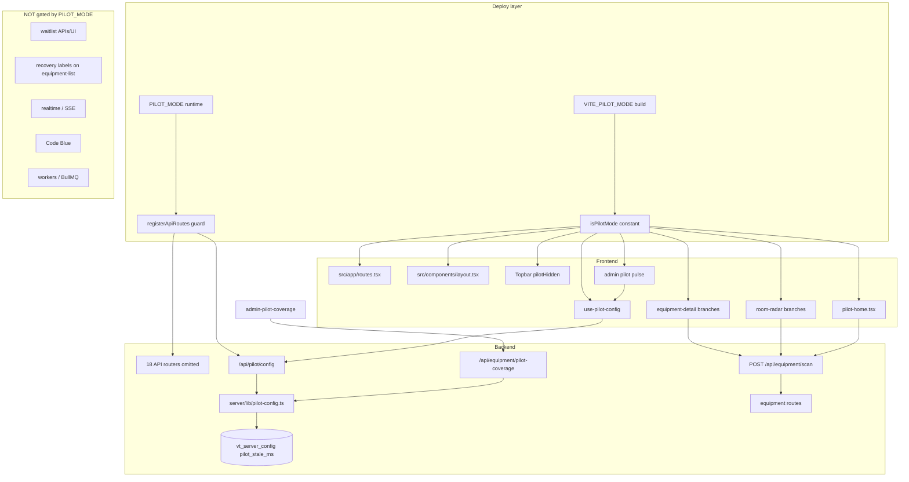

# Pilot Mode decommission — Phase P0 inventory & plan

**Status:** Review-only (no removals in this document)  
**Decision:** Retire global `PILOT_MODE` / `VITE_PILOT_MODE` as the production gating model.  
**Baseline target:** Full VetTrack stack on all mainline hosts; future rollouts use granular feature flags.  
**Related deploy fix:** PR [#496](https://github.com/dboy3156/VetTrack/pull/496) (forces mainline builds off pilot; blocks prod startup on stray `PILOT_MODE=true`).

---

## 0. Disambiguation — two different “pilot” concepts

| Concept | Mechanism | Purpose today |
|--------|-----------|----------------|
| **A. Equipment-only pilot mode (legacy)** | `VITE_PILOT_MODE` + `PILOT_MODE` compile/runtime split | Shrinks UI + API to equipment/safety surfaces only |
| **B. Mainline hospital pilot readiness** | Docs (`docs/pilot.md` mainline section), operator checklists, release gate | Operational go-live of **full** stack at a clinic — **not** env flags |

**This decommission applies only to concept A.** Concept B docs should be renamed over time (e.g. “hospital go-live runbook”) to avoid confusion.

**Unrelated naming:** `server/jobs/runtime.ts` uses “pilot” for **Phase 1b job-runtime** workers (`startPilotWorker`) — not `PILOT_MODE`. Do not delete job-runtime code in this effort.

---

## 1. Pilot architecture inventory

Legend for **Can remove now?**

| Value | Meaning |
|-------|---------|
| **No** | Still required for production baseline or has active consumers |
| **After baseline** | Safe only once full app is default and replacements exist |
| **Yes (dead)** | Only referenced when `isPilotMode` / `PILOT_MODE` true |
| **Keep (rename)** | Behavior stays; rename APIs/keys away from “pilot” |

### 1.1 Environment & deploy gates

| File | Purpose | Runtime impact | Can remove now? | Needs replacement? |
|------|---------|----------------|-----------------|---------------------|
| `src/lib/pilot-mode.ts` | `isPilotMode = VITE_PILOT_MODE === "true"` | Compile-time branch across UI | After baseline | Delete file; constant `false` or remove branches |
| `server/app/routes.ts` | `isPilotMode = PILOT_MODE === "true"` | Skips 18 API mount groups | After baseline | Unconditional registration |
| `.env.example` | Documents pilot env + `ALLOW_EQUIPMENT_PILOT_MODE` | Onboarding | After baseline | Equipment feature flags doc |
| `railway.json` | Forces `VITE_PILOT_MODE=false` on build | Build-time | **Keep** until architecture removed | N/A (becomes redundant) |
| `nixpacks.toml` | Same | Build-time | **Keep** until removed | N/A |
| `Dockerfile` | `ARG VITE_PILOT_MODE` / `ALLOW_EQUIPMENT_PILOT_MODE` | Docker builds | After baseline | Default false only |
| `vite.config.ts` | `deployBuildInfo` + pilot build guard | Fails build if pilot on without opt-in | **Keep** through P1 | `build-info.json` stays |
| `server/lib/envValidation.ts` | Blocks `PILOT_MODE=true` in prod without opt-in | Startup guard | **Keep** through P1 | Remove when env retired |
| `deploy.sh` | Pre-flight pilot env checks | CI/deploy script | After baseline | Optional flag checks |
| `server/lib/build-info.ts` | Reads `vitePilotMode` from artifact | `/api/version` | **Keep** | Rename fields post-decommission |
| `server/index.ts` | `/api/version` `pilotMode.*` | Observability | **Keep** through P4 | `deploymentMode: "full"` |
| `tests/build-info.test.ts` | Contract tests | CI | After baseline | Update assertions |

### 1.2 Frontend routing & navigation

| File | Purpose | Runtime impact | Can remove now? | Needs replacement? |
|------|---------|----------------|-----------------|---------------------|
| `src/app/routes.tsx` | `isPilotMode ? PilotHomePage : HomePage`; 30+ routes wrapped in `{!isPilotMode && ...}`; pilot-only `/admin/pilot-coverage`, `/admin/equipment/print-qr` | **High** — entire app shape | After baseline | Unconditional routes only |
| `src/components/layout.tsx` | Pilot nav allowlist (`pilotHrefs` Set) | Hides most sidebar/top nav | After baseline | Full `allItems` always |
| `src/components/layout/Topbar.tsx` | `pilotHidden` on nav items; filter when `isPilotMode` | Hides Patients/Pharmacy/Shifts links | After baseline | Remove `pilotHidden` property |
| `src/pages/pilot-home.tsx` | Equipment radar home | Replaces shift dashboard at `/home` | **Yes (dead)** after baseline | None (use `home.tsx`) |
| `src/pages/pilot-home-recovery-labels.ts` | Recovery badge copy for pilot home | Pilot home only | **Yes (dead)** | Already have `equipment-list-recovery-labels.ts` |
| `src/pages/admin-pilot-coverage.tsx` | Admin coverage dashboard | Route only in pilot mode | After baseline | Optional admin feature flag |
| `src/app/routes.tsx` | `/admin/equipment/print-qr` duplicate of `/print` | Pilot-only path | After baseline | Use `/print` only |

**Routes always registered (not gated by `isPilotMode`):** equipment CRUD, rooms, alerts, code-blue, display, crash-cart, ER, admin shell, settings, help, `/print`, whats-new.

**Routes hidden when `isPilotMode` (frontend):**

- `/shift-handover`, `/inventory`, `/analytics/*`, `/dashboard`
- `/admin/shifts`, `/admin/medication-integrity`, `/admin/ops-dashboard`, `/admin/asset-types`, `/admin/docks`, `/admin/metrics`
- `/appointments`, `/meds`, `/pharmacy-forecast`, `/stability`, `/audit-log`
- `/billing/*`, `/patients/*`, `/pending`, `/inventory-items`, `/procurement`, `/pending-emergencies`, `/shift-chat/:shiftId`, `/app-tour`

### 1.3 Frontend feature branches (conditional UI)

| File | Purpose | Runtime impact | Can remove now? | Needs replacement? |
|------|---------|----------------|-----------------|---------------------|
| `src/pages/equipment-detail.tsx` | “Confirm here” vs checkout/return; admin Scan Log tab; pilot-gated queries | **High** on equipment UX | After baseline | Full checkout/return always; optional admin scan-log flag |
| `src/pages/room-radar.tsx` | Pilot quick confirm vs standard quick action; staleness badges | Room cards UX | After baseline | Standard actions only; optional staleness config |
| `src/pages/equipment-list.tsx` | Reduced `EQUIPMENT_SIDEBAR` in pilot | Hides scan log / maintenance sidebar | After baseline | Full sidebar always |
| `src/pages/qr-print.tsx` | Pilot filters/sorts (never-seen, etc.) | QR sheet UX | After baseline | Merge useful bits into main print or flag |
| `src/pages/admin.tsx` | Pilot pulse strip + stale threshold editor | Admin landing | After baseline | Move to ops/equipment admin flags |
| `src/hooks/use-pilot-config.ts` | Fetches `/api/pilot/config` when pilot | Staleness threshold for badges | After baseline | `useEquipmentStalenessConfig` (clinic config) |
| `src/lib/api.ts` | `api.pilot.*`, `api.equipment.pilotCoverage` | API client | After baseline | Renamed endpoints |
| `src/types/index.ts` | `PilotConfig`, `PilotCoverage*` types | Types | After baseline | Rename types |

### 1.4 Backend API

| File | Purpose | Runtime impact | Can remove now? | Needs replacement? |
|------|---------|----------------|-----------------|---------------------|
| `server/app/routes.ts` | `if (!isPilotMode) { ... }` block | **Critical** — 18 routers absent when pilot | After baseline | Always mount (see §1.6) |
| `server/routes/pilot.ts` | `GET/PATCH /api/pilot/config` | `pilot_stale_ms` in `vt_server_config` | **No** | Rename to `/api/equipment/config` or `/api/admin/equipment-staleness` |
| `server/lib/pilot-config.ts` | get/set `pilot_stale_ms` | Used by coverage + badges | **No** | Rename key to `equipment_stale_ms` (migration) |
| `server/routes/equipment.ts` | `GET /pilot-coverage`; `POST /scan` comment “pilot/demo” | Coverage admin; quick scan | **No** for scan; coverage optional | Rename coverage route; scan stays |
| `server/lib/audit.ts` | `pilot_config_updated` audit kind | Audit trail | **No** | Rename audit kind in union |

**API routers unmounted when `PILOT_MODE=true` (backend):**

`/api/analytics`, `/api/shifts`, `/api/appointments`, `/api/tasks`, `/api/shift-handover` (+ patient-handoffs), `/api/containers`, `/api/restock`, `/api/medication-tasks`, `/api/billing`, `/api/inventory-items`, `/api/procurement`, `/api/animals`, `/api/patients`, `/api/clinical`, `/api/dispense`, `/api/shift-chat`, `/api/whatsapp`

**Always mounted (even in pilot mode):** equipment, rooms, returns, code-blue, ER, display, realtime, home dashboard, pilot config, admin outbox/DLQ, formulary, forecast, integrations, etc.

### 1.5 Tests & tooling

| File | Purpose | Can remove now? | Needs replacement? |
|------|---------|-----------------|---------------------|
| `tests/pilot-stale-config.test.ts` | PATCH schema + coverage summary logic | No | Rename when API renamed |
| `tests/pilot-home-recovery-ui.test.ts` | Pilot home recovery labels | After baseline | Drop or merge with equipment-list recovery tests |
| `tests/route-registration.test.js` | Asserts `/api/pilot` mounted | No | Update when route renamed |
| `scripts/seed-pilot.ts` | Demo equipment seed | No (dev tool) | Rename `seed-equipment-demo.ts` |
| `package.json` | `seed:pilot` script | No | Rename script |

### 1.6 Documentation (concept B vs A)

| File | Purpose | Action |
|------|---------|--------|
| `docs/pilot.md` | Mixed: mainline runbook + equipment pilot v1 | Split: keep go-live runbook; archive equipment-mode section |
| `docs/pilot-operator-checklist.md` | Mainline ops | Rename; remove PILOT_MODE references |
| `docs/pilot-go-no-go-report.md` | Historical | Archive |
| `docs/pilot-dry-run-report.md` | Historical | Archive |
| `docs/pilot-step8-debug-pass.md` | Historical | Archive |
| `docs/release-runbook.md` | `pilotMode` version checks | Keep checks until fields renamed |

### 1.7 i18n (18 keys in `locales/en.json` under pilot namespaces)

| Namespace | Purpose | Can remove now? |
|-----------|---------|-----------------|
| `adminPage.pilotPulse*` / `pilotSettings*` / `pilotStale*` | Admin pilot UI | After baseline |
| `adminPilotCoverage.*` | Coverage page | After baseline or flag |
| `roomRadarPage.pilotConfirm*` / `pilotNever*` / `pilotStale*` / `pilotRecent` | Confirm-here UX | After baseline |
| `equipmentDetail.confirmHere` / `confirmedHere` | Shared with pilot confirm | **Keep** copy; rename keys optional |

---

## 2. Dependency graph

**Critical mismatch path (production incident):**

`VITE_PILOT_MODE=true` (UI thinks pilot) + `PILOT_MODE=false` → full APIs, pilot UI.  
`PILOT_MODE=true` + `VITE_PILOT_MODE=false` → APIs missing, UI routes present → 404/HTML fallthrough.  
**Both must be retired together** after P1 baseline.

---

## 3. Hidden / adjacent systems (not pilot-gated)

These are **not** behind `PILOT_MODE` but are often discussed alongside pilot decommission:

| System | Gated by pilot? | Notes |
|--------|-----------------|-------|
| **SSE / realtime** | No | Always mounted (`/api/realtime`) |
| **BullMQ workers** | No | `start-schedulers.ts` independent |
| **Waitlist** | No | `equipment-detail` + `/api/equipment/:id/waitlist` always available |
| **Recovery UI labels** | Partial | `equipment-list` recovery badges **not** pilot-gated; `pilot-home` recovery is pilot-only |
| **RFID ingest** | No | Not implemented; docs only — future **feature flag** |
| **Ops dashboards** | Frontend route only | `/admin/ops-dashboard` hidden in pilot **UI**; API admin routes still mounted |
| **Code Blue / ER / display** | No | Always on (intentional safety) |
| **POST /api/equipment/scan** | No | Used by “Confirm here”; works in full app too |
| **Job runtime “pilot”** | No | Separate meaning in `server/jobs/runtime.ts` |

---

## 4. Safe decommission plan (phased)

### Phase P1 — Production baseline (implement first; minimal deletion)

**Goal:** Live = full app; zero pilot env on mainline.

| Step | Action | Risk |
|------|--------|------|
| P1.1 | Merge/deploy PR #496; Railway: unset `PILOT_MODE`, `VITE_PILOT_MODE` | Low |
| P1.2 | Force rebuild; verify `/api/version` `pilotMode.{backend,frontend}` false | Low |
| P1.3 | Verify `/api/appointments` returns JSON 401 not HTML 200 | Low |
| P1.4 | Browser smoke: `/home` → HomePage, full nav, checkout/return on equipment | Medium (Clerk) |
| P1.5 | Keep `ALLOW_EQUIPMENT_PILOT_MODE` undocumented on mainline | Low |

**No code deletion in P1** — only env + deploy guards already in #496.

### Phase P2 — Feature flag extraction (before removing branches)

| Legacy behavior | Proposed flag | Scope |
|-----------------|---------------|--------|
| Equipment staleness threshold admin | `EQUIPMENT_STALE_MS` clinic config (rename key) | Admin + badges |
| Pilot coverage dashboard | `ENABLE_EQUIPMENT_COVERAGE_ADMIN` or always-on for admin | Admin page |
| “Confirm here” simplified UX | `ENABLE_EQUIPMENT_QUICK_CONFIRM` (default **off** in full prod) | equipment-detail, room-radar |
| QR print never-seen sort | `ENABLE_QR_PRINT_PILOT_SORT` or merge into main | qr-print |
| Admin pulse counters | Part of coverage dashboard or ops metrics | admin.tsx |

**Pattern:** follow `server/lib/feature-flags.ts` (`ENABLE_SERVICE_TASK_MODE` + percent) for user/cohort rollout; clinic-level flags in `vt_server_config` for admin toggles.

**Disallowed after P2:** new `if (isPilotMode)` branches.

### Phase P3 — Code decommission (delete in slices)

Ordered slices (each = 1 PR, green CI):

1. **Backend guard removal** — `server/app/routes.ts`: always register full routers; remove `isPilotMode` variable.
2. **Frontend routes** — `routes.tsx`: remove all `{!isPilotMode && ...}` / `{isPilotMode && ...}`; single `/home` → `HomePage`.
3. **Navigation** — `layout.tsx`, `Topbar.tsx`: remove allowlist and `pilotHidden`.
4. **Delete pages** — `pilot-home.tsx`, `pilot-home-recovery-labels.ts`, `admin-pilot-coverage.tsx` (if not flag-extracted).
5. **Equipment UI** — `equipment-detail`, `room-radar`, `equipment-list`, `qr-print`: remove `isPilotMode` branches; keep full flows.
6. **Admin** — remove pilot pulse/settings blocks or wire to new config API.
7. **API rename** — `/api/pilot` → equipment/admin config; `pilot-coverage` → `equipment-coverage`; audit kind rename; DB key migration `pilot_stale_ms` → `equipment_stale_ms`.
8. **Remove** `src/lib/pilot-mode.ts`, env vars, deploy guards (after no host uses them).
9. **Docs/i18n/tests** — archive equipment-pilot docs; knip + `tsc`; update `route-registration.test.js`.

### Phase P4 — Verification matrix

| Area | Check |
|------|--------|
| Frontend routes | All `routes.tsx` paths resolve; no orphan lazy imports |
| Backend | `tests/route-registration.test.js`; smoke all formerly blocked prefixes |
| SSE | Connect `/api/realtime/stream`; replay after disconnect |
| Workers | Redis queues start in `start-schedulers.ts` |
| Notifications | Push path unchanged |
| Waitlist | join/leave/promote on equipment |
| Recovery UI | `equipment-list` badges still render |
| Ops dashboards | `/admin/ops-dashboard` loads for admin |
| Offline sync | No change to Dexie/sync-engine |
| Admin tooling | Formulary, outbox DLQ, medication integrity |
| Build | No `pilot-home` in critical path bundle (lazy chunk OK until deleted) |
| Version | `/api/version` shows full deployment metadata |

---

## 5. Risks

| Risk | Severity | Mitigation |
|------|----------|------------|
| Frontend/backend flag mismatch during transition | **P0** | `/api/version` mismatch field; P1 env cleanup |
| Stale Railway build (old `VITE_PILOT_MODE` baked) | **P0** | Mandatory rebuild after env change |
| Removing `/api/pilot` while admin UI still calls it | High | P2 rename + dual-read period |
| `pilot_stale_ms` DB key orphaned | Low | Migration + read fallback |
| Confusing “pilot” in job-runtime logs | Low | Rename log strings separately |
| Deleting `POST /equipment/scan` used by demos | Medium | Keep endpoint; only remove pilot **UI** branch |
| Locale key removal without parity | Medium | Remove en/he pairs together |
| knip flags dead exports after slice 3 | Low | Run knip each PR |

---

## 6. Recommended migration order (implementation slices)

| Order | Slice | Depends on |
|-------|--------|------------|
| 1 | **P1 production baseline** (env + deploy #496) | — |
| 2 | **Observability** — version endpoint already in #496 | P1 |
| 3 | **P2a** — Rename `pilot-config` → equipment staleness API (dual-mount old path 1 release) | P1 |
| 4 | **P2b** — Extract quick-confirm + coverage to feature flags | P2a |
| 5 | **P3a** — Backend: remove `PILOT_MODE` route guard | P1 verified |
| 6 | **P3b** — Frontend: routes + nav (no page deletes yet) | P3a |
| 7 | **P3c** — Equipment/admin UI branch cleanup | P3b |
| 8 | **P3d** — Delete pilot-only pages + `pilot-mode.ts` | P3c |
| 9 | **P3e** — Env/deploy/doc removal | P3d |
| 10 | **P4** — Full verification + staging walkthrough | All |

---

## 7. Features that still need dedicated rollout flags (post-decommission)

| Feature | Current pilot coupling | Recommended flag |
|---------|------------------------|------------------|
| Equipment quick confirm (“Confirm here”) | `isPilotMode` only | `ENABLE_EQUIPMENT_QUICK_CONFIRM` (clinic or global, default off) |
| Equipment coverage admin page | Pilot-only route | `ENABLE_EQUIPMENT_COVERAGE_ADMIN` or ship to all admins |
| Staleness threshold (24h default) | `/api/pilot/config` | Clinic config `equipment_stale_ms` (always available to admin) |
| QR print “never scanned” emphasis | Pilot branch in `qr-print.tsx` | Minor UI flag or always-on |
| Service tasks | Already separate | `ENABLE_SERVICE_TASK_MODE` (existing) |
| Operational metrics | Already separate | `ENABLE_OPERATIONAL_METRICS` (existing) |
| Automation engine | Already separate | `ENABLE_AUTOMATION_ENGINE` (existing) |
| RFID (future) | N/A | New flag when built — never global pilot |
| Recovery banner density | Not pilot-gated | Optional UX flag if needed |
| Waitlist | Not pilot-gated | No flag needed for baseline |
| Future hospital “pilot program” access | Was global mode | **Per-clinic entitlements** in `vt_clinics` or Clerk org metadata — not compile-time |

---

## 8. Production snapshot (2026-05-27, pre-P1)

| Host | Frontend pilot | Backend pilot | Evidence |
|------|----------------|---------------|----------|
| `vettrack.uk` | **On** | **On** | `/home` → PilotHomePage; `/api/appointments` → HTML SPA fallback |
| `vettrack-staging.up.railway.app` | **Off** | **Off** | Full HomePage; `/api/appointments` → 401 JSON |

Staging is already the **target behavior** for mainline; production needs P1 env + rebuild.

---

## 9. Approval gate

**Do not start P3 deletions until:**

- [ ] P1 verified on production (`/api/version`, API smoke, browser checklist)
- [ ] Program Brain sign-off on P2 flag names and coverage/quick-confirm defaults
- [ ] Decision: keep coverage dashboard for all admins vs flag-gated

**Next deliverable after approval:** Implementation slice **P3a** (backend guard removal only) as a single PR.
