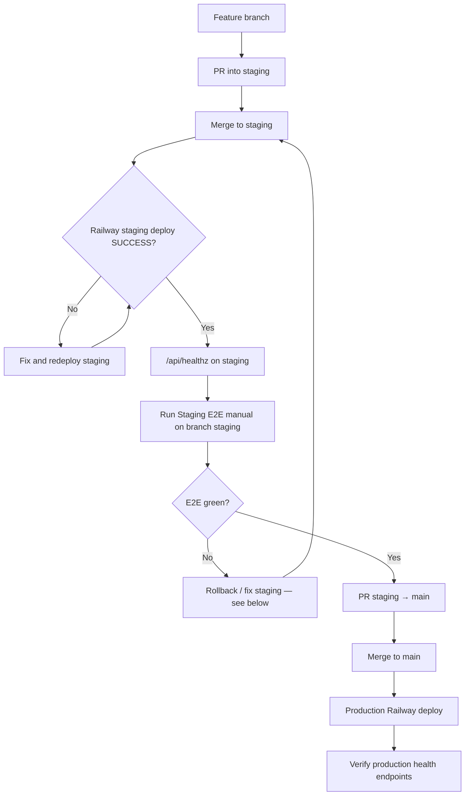

# Production release runbook

Safe promotion path for VetTrack: **feature branch → staging → production**. Staging E2E on Clerk test keys is the gate before any merge to `main`.

| Environment | App URL | Git branch | Railway service |
|-------------|---------|------------|-----------------|
| **Staging** | `https://vettrack-staging.up.railway.app` | `staging` | Staging (separate from production) |
| **Production** | `https://vettrack.uk` | `main` | Production |

**Related docs**

- [Staging E2E checklist](staging-e2e-runbook.md) — short pre-promotion checklist and workflow trigger steps
- [Staging E2E detail](staging-e2e-runbook.md) (full seed/spec/cleanup reference on the `staging` branch)
- [Release Gate workflow](../.github/workflows/release-gate.yml) — automated gates on merge to `main`
- [Clerk key rotation](runbooks/1.4-clerk-key-rotation.md) — emergency key rotation only

---

## Release flow (overview)



**Rule:** Do not open or merge a **staging → main** PR until staging deploy is green **and** **Staging E2E (manual)** has passed on branch `staging`.

---

## Phase 1 — Feature work → staging

### 1.1 Open a feature branch

```bash
git checkout staging
git pull origin staging
git checkout -b cursor/<short-description>-a0a4
```

Implement and validate locally (`pnpm test`, `npx tsc --noEmit`). Do not point Playwright or staging seed scripts at production (see [Forbidden actions](#forbidden-actions-never-do-these)).

### 1.2 Pull request into `staging`

1. Push the feature branch and open a **PR: `<feature>` → `staging`**.
2. Wait for PR CI (`.github/workflows/ci.yml`) — typecheck, tests, build.
3. Address review; merge when green.

### 1.3 Confirm Railway staging deploy

After merge to `staging`, Railway deploys the staging service automatically.

1. Open **Railway** → staging VetTrack service → **Deployments**.
2. Confirm the latest deployment status is **SUCCESS** (not building, failed, or crashed).
3. If deploy failed: read build/runtime logs, fix on a branch targeting `staging`, merge, and wait for a new **SUCCESS** before continuing.

---

## Phase 2 — Staging verification (required gate)

Complete these steps **in order** before opening **staging → main**.

### 2.1 Liveness: `/api/healthz`

From any machine with network access to staging:

```bash
curl -sfS -o /dev/null -w "%{http_code}\n" \
  https://vettrack-staging.up.railway.app/api/healthz
```

**Pass:** HTTP `200` and body `ok`.

If this fails, stop — do not run E2E or promote to production. Fix the staging deploy first.

### 2.2 Run **Staging E2E (manual)** on branch `staging`

The workflow file lives on `main` (so GitHub registers it), but the job **only runs** when you dispatch it **from branch `staging`**.

| Step | Action |
|------|--------|
| 1 | GitHub → **Actions** → **Staging E2E (manual)** |
| 2 | **Run workflow** |
| 3 | **Use workflow from:** branch **`staging`** (required — other refs fail the branch guard) |
| 4 | Run workflow |

The job runs: `pnpm staging:seed` → `pnpm test:staging:e2e` → `pnpm staging:cleanup` (cleanup always runs).

**Pass criteria**

- Workflow conclusion: **success** (all jobs green).
- No failed step in seed, Playwright, or cleanup.

**Secrets (repository, staging only):** `DATABASE_URL_STAGING`, `CLERK_SECRET_KEY_STAGING`, `VITE_CLERK_PUBLISHABLE_KEY_STAGING`, `STAGING_E2E_PASSWORD_STAGING`, `TEST_BASE_URL_STAGING` — must map to staging DB and `sk_test_*` / `pk_test_*` Clerk, never production values.

Details: [staging-e2e-runbook.md](staging-e2e-runbook.md).

### 2.3 Optional deeper staging checks

After E2E passes, optional manual smoke:

```bash
curl -sS https://vettrack-staging.up.railway.app/api/version | jq .
curl -sS https://vettrack-staging.up.railway.app/api/health/startup | jq .
```

`/api/health/startup` should return `200` with `databaseReachable: true` when `DATABASE_URL` is set on staging.

---

## Phase 3 — Promote staging → production

### 3.1 Pull request: `staging` → `main`

Only after **Phase 2** is complete:

1. Open **PR: `staging` → `main`**.
2. Confirm the PR description lists:
   - Staging Railway deploy **SUCCESS** (link or deployment ID)
   - Staging E2E workflow run URL (green)
   - Staging `/api/healthz` verified
3. Merge when reviewers approve and CI on the PR is green.

### 3.2 Production deploy

Merging to `main` triggers production deployment (Railway connected to `main`, and optionally `.github/workflows/ci.yml` deploy job when `RAILWAY_USE_CLI_DEPLOY` is enabled).

1. Watch Railway → **production** service → latest deployment → **SUCCESS**.
2. **Release Gate** (`.github/workflows/release-gate.yml`) also runs on push to `main` — all gates must pass; treat a failed gate as a release blocker even if Railway shows success.

### 3.3 Post-deploy production verification

Run against **production** (`https://vettrack.uk`):

```bash
PROD=https://vettrack.uk

# 1) Liveness (no auth)
curl -sfS -o /dev/null -w "healthz %{http_code}\n" "$PROD/api/healthz"

# 2) Build/version
curl -sfS "$PROD/api/version"

# 3) Startup / DB connectivity
curl -sfS "$PROD/api/health/startup"
```

| Endpoint | Pass |
|----------|------|
| `GET /api/healthz` | `200`, body `ok` |
| `GET /api/version` | `200`, JSON includes `version` matching expected release |
| `GET /api/health/startup` | `200`, `status: "ok"`, `checks.databaseReachable: true` |

Optional: `GET /api/health` (readiness) — may be `200` or `503` **degraded** if Clerk/VAPID/worker checks fail; investigate degraded checks but do not use readiness alone as the only release signal.

Sign in once in the browser and spot-check a critical path (dashboard or equipment list) if the release touched auth or UI shell.

---

## Rollback: staging E2E failed

**Do not** merge **staging → main** while E2E is red or staging health is failing.

### Immediate actions

1. **Block promotion** — close or mark the production PR as blocked; do not merge `staging` → `main`.
2. **Inspect the failed run** — GitHub Actions → failed **Staging E2E** run → logs for `staging:seed`, `test:staging:e2e`, or `staging:cleanup`.
3. **Confirm staging still serves traffic** — `curl` `/api/healthz` on staging. If deploy is down, fix Railway staging first.

### If seed ran but tests failed

- Re-run the workflow after a fix (cleanup runs `if: always()` on the failed run, but verify no orphaned `staging-e2e-*@vettrack-e2e.example.com` users in the **staging** Clerk dashboard).
- Locally (staging credentials only): `pnpm staging:cleanup` with the same env vars as CI — see [staging-e2e-runbook.md](staging-e2e-runbook.md).

### If the bad change is already on `staging`

1. Revert the merge commit on `staging` **or** ship a fix PR into `staging`.
2. Wait for Railway staging deploy **SUCCESS**.
3. Re-run `/api/healthz` and **Staging E2E (manual)** from branch `staging`.

### If staging deploy itself is bad

1. Railway → staging service → **Deployments** → **Rollback** to the last known-good deployment.
2. Verify `/api/healthz`.
3. Re-run E2E when ready.

---

## Rollback: production deploy failed

### Application rollback (preferred)

1. Railway → **production** service → **Deployments**.
2. Select the last deployment that passed [Phase 3.3](#33-post-deploy-production-verification).
3. **Rollback** / redeploy that artifact.
4. Re-run production health checks (`/api/healthz`, `/api/version`, `/api/health/startup`).

### Bad release already merged on `main`

1. Revert the merge commit on `main` (or hotfix forward on `staging`, then repeat the full staging gate before a new **staging → main** PR).
2. Wait for production Railway **SUCCESS**.
3. Re-verify all three production health endpoints.

### Database / migration issues

If the deploy failed during or after migrations:

- Do **not** run `pnpm staging:seed` or staging cleanup against production.
- Follow [migrations.md](migrations.md) and coordinate manual DB recovery with a repo owner.
- Roll back the **application** first to stop bad code paths; migration rollback is a separate, explicit decision.

### Clerk / secrets regression

If auth breaks after deploy (live keys only on production):

- Confirm production Railway variables use **`sk_live_*` / `pk_live_*`** (paired), not test keys.
- See [runbooks/1.4-clerk-key-rotation.md](runbooks/1.4-clerk-key-rotation.md) if keys were exposed or rotated.

---

## Forbidden actions (never do these)

| Forbidden | Why |
|-----------|-----|
| **`pnpm staging:seed` on production** | Creates Clerk test users and `vt_users` fixtures. Scripts live on branch **`staging`** only (`scripts/staging/*`); they call `scripts/staging/guard.ts` (requires `STAGING_E2E_CONFIRM=yes`, refuses `sk_live_*` / production DB hosts). There is **no** repo script guard on `main` today — prevention is operational: never point `DATABASE_URL` / Clerk env at production when seeding. Production **server** startup also rejects `sk_test_*` via `server/lib/envValidation.ts`. |
| **`pnpm staging:cleanup` on production** | Deletes users against the configured `DATABASE_URL` / Clerk — same staging-only scripts and guards as seed; never run with production env. |
| **`sk_test_*` / `pk_test_*` on production Railway** | `validateEnv()` in `server/lib/envValidation.ts` rejects Clerk key mismatch at process start; production must use **live** keys only. |
| **`sk_live_*` on staging E2E or staging Railway** | Staging GitHub secrets must use `*_STAGING` test keys; on the `staging` branch, `scripts/staging/guard.ts` refuses live keys before seed/cleanup runs. |
| **Production Clerk users in automated tests** | E2E personas are `staging-e2e-*@vettrack-e2e.example.com` on the **staging** Clerk app only. |
| **Default Playwright (`playwright.config.ts`) against production or staging URLs** | `TEST_BASE_URL` must be `http://127.0.0.1:3001` (CI) or localhost for default config; production URL is not a CI target. |
| **`pnpm test:staging:e2e` without prior staging seed** | Tests expect seeded personas and manifest. |
| **`signup-flow` / destructive Playwright against production** | Creates real users and DB rows. |
| **Merging `staging` → `main` without green Staging E2E** | Bypasses the only hosted Clerk E2E gate before production. |
| **Using production `DATABASE_URL` in `*_STAGING` GitHub secrets** | Cross-environment data corruption risk. |

**Allowed targets**

| Command / workflow | Target |
|--------------------|--------|
| `pnpm test` / PR CI | Ephemeral CI Postgres |
| `pnpm exec playwright test --project=chromium` | Local or [Playwright CI](../.github/workflows/playwright.yml): `TEST_BASE_URL=http://127.0.0.1:3001`, `PLAYWRIGHT_E2E=true` |
| `pnpm test:staging:e2e` | Branch **`staging`** only (`package.json` script); `https://vettrack-staging.up.railway.app` via `playwright.staging.config.ts` |
| **Staging E2E (manual)** | Branch `staging`, secrets `*_STAGING` |

---

## Quick reference checklist

Copy for PR comments or release tickets:

```
[ ] Feature PR merged to staging
[ ] Railway staging deploy: SUCCESS
[ ] curl staging /api/healthz → 200
[ ] GitHub Actions: Staging E2E (manual), branch staging → success
[ ] PR staging → main opened only after above
[ ] Railway production deploy: SUCCESS after merge
[ ] curl production /api/healthz → 200
[ ] curl production /api/version → 200, expected version
[ ] curl production /api/health/startup → 200, databaseReachable true
[ ] Release Gate on main: success (if applicable)
```

---

## Who does what

| Role | Responsibility |
|------|----------------|
| **Author** | Feature PR → `staging`, fix CI failures |
| **Release owner** | Railway staging SUCCESS, trigger Staging E2E, verify healthz |
| **Reviewer** | Block **staging → main** without E2E link + staging health |
| **On-call / owner** | Production rollback in Railway, migration incidents |

---

*Last updated for the staging E2E gate workflow (`.github/workflows/staging-e2e-manual.yml`). Workflow and script behavior on `staging` may evolve — if this doc and the branch diverge, prefer the `staging` branch copy of [staging-e2e-runbook.md](staging-e2e-runbook.md) for E2E specifics.*
