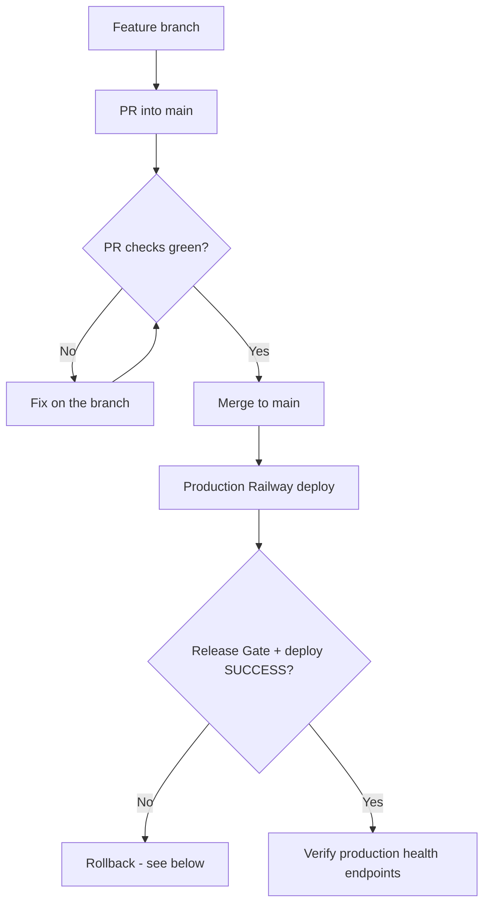

# Production release runbook

> **The staging lane was removed on 2026-08-19** — the Railway environment, the branch that
> never existed, the workflows, the seed/cleanup scripts and the specs are all gone. It was
> not a lane that broke; nothing ever ran in it. Releases go **feature branch → PR → `main`
> → production**, which is what has actually been happening. If a staging tier is wanted
> later it gets built deliberately, from scratch, and this runbook gains a phase back.

Promotion path: **feature branch → PR into `main` → production**.

## Release flow (overview)


```mermaid
flowchart TD
  A[Feature branch] --> B[PR into main]
  B --> C{PR checks green?}
  C -->|No| D[Fix on the branch]
  D --> C
  C -->|Yes| E[Merge to main]
  E --> F[Production Railway deploy]
  F --> G{Release Gate + deploy SUCCESS?}
  G -->|No| H[Rollback - see below]
  G -->|Yes| I[Verify production health endpoints]
```

**Rule:** the PR's own checks are the gate. There is no pre-production environment to verify
against, so a change is exercised locally and by CI before it reaches production — and the
production verification in Phase 2 below is not optional.

---

## Phase 2 — Production deploy

### 2.1 Pull request into `main`

1. Open the PR against `main`.
2. Confirm every required check is green — there is no staging run to cite in its place.
3. Merge when reviewers approve and CI on the PR is green.

### 2.2 Production deploy

Merging to `main` triggers production deployment. **Exactly one path should be live at a
time** — two would mean one merge starts two concurrent production deploys:

- **CI-driven (the active one):** the `deploy` job in `.github/workflows/ci.yml`, gated on
  `vars.RAILWAY_USE_CLI_DEPLOY == 'true'` (currently `true`) plus a push to `main`.
- **Railway auto-deploy from `main`:** disconnected since 2026-07-10 in favour of the above.
  If it is ever reconnected, turn `RAILWAY_USE_CLI_DEPLOY` off in the same change.

Confirm which is live before relying on either: `gh api repos/exposwifty31/vettrack/actions/variables`
for the flag, and the Railway service's source settings for the trigger.

1. Watch Railway → **production** service → latest deployment → **SUCCESS**.
2. **Release Gate** (`.github/workflows/release-gate.yml`) also runs on push to `main` — all gates must pass; treat a failed gate as a release blocker even if Railway shows success.

### 2.3 Post-deploy production verification

Run against **production** (`https://vettrack.uk`):

```bash
PROD=https://vettrack.uk

# 1) Liveness (no auth)
curl -sfS -o /dev/null -w "healthz %{http_code}\n" "$PROD/api/healthz"

# 2) Build/version (pilotMode.backend and pilotMode.frontend must both be false)
curl -sfS "$PROD/api/version"
# Expect: "pilotMode":{"backend":false,"frontend":false,"mismatch":false}

# 3) Startup / DB connectivity
curl -sfS "$PROD/api/health/startup"
```

| Endpoint | Pass |
|----------|------|
| `GET /api/healthz` | `200`, body `ok` |
| `GET /api/version` | `200`, JSON includes `version` matching expected release; `pilotMode.backend` and `pilotMode.frontend` are `false` |
| `GET /api/health/startup` | `200`, `status: "ok"`, `checks.databaseReachable: true` |

Optional: `GET /api/health` (readiness) — may be `200` or `503` **degraded** if Clerk/VAPID/worker checks fail; investigate degraded checks but do not use readiness alone as the only release signal.

Sign in once in the browser and spot-check a critical path (dashboard or equipment list) if the release touched auth or UI shell.

---

## Rollback: production deploy failed

### Application rollback (preferred)

1. Railway → **production** service → **Deployments**.
2. Select the last deployment that passed [Phase 2.3](#23-post-deploy-production-verification).
3. **Rollback** / redeploy that artifact.
4. Re-run production health checks (`/api/healthz`, `/api/version`, `/api/health/startup`).

### Bad release already merged on `main`

1. Revert the merge commit on `main`, or fix forward on a branch and re-open a PR against `main`.
2. Wait for production Railway **SUCCESS**.
3. Re-verify all three production health endpoints.

### Database / migration issues

If the deploy failed during or after migrations:

- The **staging** seed/cleanup scripts are gone with that lane, so nothing seeds Clerk fixtures
  on a schedule any more. That is **not** the same as "nothing creates users": `signup-flow`
  and the destructive Playwright suites still create real Clerk users and DB rows when pointed
  at a live environment — see the forbidden-actions table below. Never point them at production.
- Follow [migrations.md](migrations.md) and coordinate manual DB recovery with a repo owner.
- Roll back the **application** first to stop bad code paths; migration rollback is a separate, explicit decision.

### Clerk / secrets regression

If auth breaks after deploy (live keys only on production):

- Confirm production Railway variables use **`sk_live_*` / `pk_live_*`** (paired), not test keys.
- See [runbooks/1.4-clerk-key-rotation.md](runbooks/1.4-clerk-key-rotation.md) if keys were exposed or rotated.

---

## Forbidden actions (never do these)

| Forbidden | Why |
|-----------|-----|
| **`sk_test_*` / `pk_test_*` on production Railway** | `validateEnv()` in `server/lib/envValidation.ts` rejects Clerk key mismatch at process start; production must use **live** keys only. |
| **Default Playwright (`playwright.config.ts`) against a production URL** | `TEST_BASE_URL` must be `http://127.0.0.1:3001` (CI) or localhost for default config; production URL is not a CI target. |
| **`signup-flow` / destructive Playwright against production** | Creates real users and DB rows. |
| **Using production `DATABASE_URL` in `*_STAGING` GitHub secrets** | Cross-environment data corruption risk. |

**Allowed targets**

| Command / workflow | Target |
|--------------------|--------|
| `pnpm test` / PR CI | Ephemeral CI Postgres |
| `pnpm exec playwright test --project=chromium` | Local or [Playwright CI](../.github/workflows/playwright.yml): `TEST_BASE_URL=http://127.0.0.1:3001`, `PLAYWRIGHT_E2E=true` |

---

## Quick reference checklist

Copy for PR comments or release tickets:

```
[ ] Railway production deploy: SUCCESS after merge
[ ] curl production /api/healthz → 200
[ ] curl production /api/version → 200, expected version
[ ] curl production /api/health/startup → 200, databaseReachable true
[ ] Release Gate on main: success (if applicable)
```

---

## Who does what

| Role | Responsibility |
|------|----------------|
| **Author** | Feature PR → `main`, fix CI failures |
| **Release owner** | Production Railway deploy SUCCESS, Release Gate green, and **all three** post-deploy checks: `/api/healthz`, `/api/version`, `/api/health/startup` |
| **Reviewer** | Block a merge to `main` without green required checks |
| **On-call / owner** | Production rollback in Railway, migration incidents |

---

